\newcommand*\NewPage{\newpage\null\thispagestyle{empty}\newpage\thispagestyle{empty}}

\newpage

```{r child='frontespizio.Rmd'}
```

<!-- \newpage -->
<!-- \pagenumbering{Roman} -->

<!-- ```{r child='sintesi.rmd'} -->
<!-- ``` -->

\newpage
\tableofcontents


\newpage
ELENCO DEI COLLABORATORI

* **Dr. Tranquillo Vito** U.O. 1-Responsabile scientifico del progetto. Coordinamento delle U.O., Analisi statistica dei dati fenotipici. 
* **Dr. Fiocchi Alfredo** U.O. 1-Analisi microbiologiche e antibiogrammi.
* **Dr. Pongolini Stefano** U.O. 2-Coordinamento U.O. e attività di analisi metagenomiche
* **Dr. Bolzoni Luca** U.O. 2-Attività analisi metagenomiche 
* **Dr.ssa  Erika Scaltriti** U.O. 2-Attività analisi metagenomiche 
* **Dr.ssa  Bertoletti Irene** U.O. 3-Analisi Microbiologiche e antibiogrammi
* **Dr. Alessandro Bianchi** U.O. 3-Analisi Microbiologiche e antibiogrammi
* **Dr. Loris Alborali** U.O. 4-Analsi genomiche ceppi Ceftiofur resistenti
* **Dr. Prati Paola** U.O. 5- Attività di raccolta e invio campioni a U.O.1 per successive analisi
* **Dr. Gianni Sala** U.O. 6- Attività di raccolta e invio campioni a U.O.1 per successive analisi
* **Dr.ssa  Sacchi Cristina** U.O. 6- Attività di raccolta e invio campioni a U.O.1 per successive analisi
\newpage
\listoffigures
\newpage
\listoftables

\newpage

# INTRODUZIONE 
L'Antibiotico-Resistenza (AR) è una grave minaccia per la salute in quanto compromette la capacità di trattare le infezioni sia in medicina umana che veterinaria. La resistenza agli antibiotici si sviluppa sia attraverso complessi meccanismi come la mutazione sotto la pressione selettiva, derivante dall'uso/abuso di antibiotici,  sia attraverso scambi di DNA inter e intra-specifici, principalmente mediante il trasferimento orizzontale di geni di resistenza localizzati su plasmidi che rappresenta il più importante meccanismo all'origine dell'acquisizione della resistenza in batteri patogeni rilevanti per la salute umana [@carattoli2013plasmids]. 

La principale strategia per ridurre l'incidenza del fenomeno antibiotico-resistenza si basa sulla riduzione dell'uso degli antibiotici sia nell'uomo che negli animali domestici, considerando che risulta chiaro che entrambi i comparti sono strettamente collegati e co-partecipano al mantenimento e alla diffusione di batteri resistenti e di geni di resistenza [@angulo2004evidence]. Queste misure si basano sull'assunto che la resistenza antimicrobica è associata riduzione dell'efficienza riproduttiva (fitness cost). In assenza quindi di una pressione selettiva legata ai farmaci antimicrobici, si ha una riduzione dell'efficienza riproduttiva dei ceppi resistenti a vantaggio dei ceppi sensibili, anche se sembra che questi costi fitness  siano estremamente variabili [@andersson2010antibiotic] e possano essere ridotti o addirittura trasformati in benefici per il fitness da mutazioni compensative [@luo2005enhanced]. 

Va ricordato che batteri portatori di geni di resistenza si trovano naturalmente nei suoli in assenza di farmaci antimicrobici antropogenici a causa della produzione naturale di molecole antibiotiche da parte di alcuni batteri e funghi [@knapp2013patricia]. Il serbatoio di geni di resistenza nell'ambiente (resistoma ambientale) è quindi un mix di resistenza naturale e quella dovuta alle deiezioni di animali e uomini, a cui si possono aggiungere gli effetti selettivi di inquinanti, che possono co-selezionare elementi genetici mobili che trasportano più geni di resistenza. A questo proposito è stato stabilito che anche basse concentrazioni di antibiotici e metalli pesanti posso avere attività selettiva e indurre antibiotico-resistenza [@baker2006co; @gullberg2011selection; @kohanski2010sublethal].  La contaminazione ambientale  dei determinanti di antibiotico-resistenza,  può contribuire all'insorgenza e proliferazione di patogeni difficili o addirittura impossibili da trattare. In considerazione del potenziale impatto negativo sia sulla salute che economico della proliferazione ambientale di batteri antibiotico-resistenti, molti ricercatori, in linea con l'approccio One Health [@robinson2016antibiotic] includono nelle valutazioni dell'antibiotico resistenza, anche la contaminazione ambientale del suolo, dell'acqua e della fauna selvatica [@allen2010call]. 


I dati disponibili mostrano che numerose specie di animali selvatici sono portatori di  batteri antimicrobici resistenti  in una vasta gamma di habitat, il che solleva la questione del loro ruolo nelle dinamiche di diffusione e mantenimento all'interfaccia tra popolazioni umane, animali domestici ed ecosistemi naturali.
La presenza nella fauna selvatica, normalmente non sottoposta a trattamenti antibiotici, di ceppi batterici resistenti e in generale di geni di resistenza, è verosimilmente attribuibile a fenomeni di contaminazione ambientale. 
Per definire il ruolo della fauna selvatica nel complesso meccanismo di diffusione e mantenimento dell'antibiotico resistenza è necessario acquisire informazioni relativamente a: quali specie di batteri sono le più frequentemente trovate resistenti ai farmaci antimicrobici nei vertebrati selvatici e la loro caratterizzazione fenotipica e soprattutto genotipica;  in che modo le specie selvatiche vengono colonizzate da batteri antibiotico-resistenti e quali scambi di tali batteri avvengono tra l'uomo, gli animali domestici e la fauna selvatica;  cosa caratterizza gli habitat più contaminati da batteri antibiotico-resistenti e infine quali tratti ecologici favoriscono la colonizzazione e la potenziale infezione da batteri antibiotico-resistenti nella fauna selvatica [@vittecoq_antimicrobial_2016]. 

L'interesse per il ruolo della fauna selvatica nella diffusione e nel mantenimento dell'antibiotico-resistenza è aumentato nel corso degli ultimi 10 anni, con un costante aumento della produzione scientifica, come evidenziato in (Fig\ref{fig:figA}). La principale preoccupazione nasce dal timore che l'eventuale dimostrazione di un ruolo della fauna selvatica come "serbatoio" e "mantenimento" di batteri portatori di geni di resistenza, contribuendo alla contaminazione ambientale di batteri resistenti o materiale genetico di resistenza, possa compromettere gli sforzi messi in atto, soprattutto in questi ultimi anni, in campo medico e veterinario per ridurre la diffusione del fenomeno della resistenza agli antibiotici. 

Una scoping review  pubblicata nel 2015 [@greig_scoping_2015], ha evidenziato la presenza di 866 articoli di ricerca primaria; Oltre il 90% sono studi osservazionali; la maggioranza riportano i dati di prevalenza dell'antibiotico-resistenza nella fauna selvatica (551/866, 63.6%). Ci sono  176 di 866 (20,3%) studi  di genotipizzazione.   L'antibiotico-resistenza è  più frequentemente studiata in _Escherichia coli_ 150 di 866 (17,3%), Salmonella 83 di 866 (9,6%) e Enterococcus 48 di 866 (5,5%). I gruppi specie di fauna selvatica più frequentemente studiati sono uccelli 410 su 866 (47,3%), cervidi, 133 di 866 (15,4%) e roditori 91 di 866 (10,5%). Le modalità di trasmissione dell’antibiotico-resistenza è  riportata in 110 articoli (12,7%). Tra le caratteristiche ambientali che sono state segnalate come fattori di rischio per il trasferimento di batteri patogeni e/o antibiotico-resistenti vi sono: condivisione di ambienti  161 di 866 (18,6%), infestazione o mancanza di controllo degli uccelli selvatici 124 di 866 (14,3%) e delle fonti idriche condivise 98 di 866 (11,3%). Le pratiche di mitigazione, strategie o programmi per ridurre la trasmissione di batteri e/o antibiotico-resistenti sono stati discussi o studiati in 124 su 866 (14,3%) articoli. Sono state fornite informazioni circa i tassi di contatto tra fauna selvatica e animali domestici in 29 articoli (3,3%). È interessante notare che numerosi articoli di ricerca primaria (122/866, 14.1%) hanno riportato associazioni per i fattori di rischio di trasmissione di  batteri patogeni e/o antibiotico-resistenti dalla fauna selvatica agli animali cibo, fonti ambientali o umani. 

Uno dei primi lavori in Italia sull’antibiotico-resistenza nella  fauna selvatica è stato condotto da @pagano1985faecal in ruminanti selvatici e marmotte del parco Nazionale dello Stelvio, in cui su 121 campioni di feci esaminati furno individuati 17 ceppi di  _Escherichia coli_ antibiotico-resistenti. Nel 1991 [@caprioli1991antimicrobial] su 81 campioni di feci da mammiferi selvatici (ruminanti, marmotta) del Parco Nazionale dello Stelvio sono stati osservati complessivamente 18 ceppi di  _Escherichia coli_ antibiotico-resistenti. I ceppi isolati hanno mostrato un profilo di multiresistenza. Gli Autori hanno concluso che i ceppi di  _Escherichia coli_ in animali selvatici possono essere resistenti a diversi agenti antimicrobici e portatori di  plasmidi R, anche se il microbioma intestinale degli animali selvatici non è direttamente esposta agli antibiotici. Così una possibile fonte di antibiotico-resistenza in  _Escherichia coli_ potrebbero essere quegli esseri umani e animali domestici carrier di batteri antibiotic-resistenti che  condividono gli stessi habitat (turisti, animali domestici pascolo) di animali della fauna selvatica. 

Più recentemente sono stati pubblicati nuovi lavori che riguardano la presenza di antibiotico-resistenza in feci di animali selvatici in varie regioni d'Italia con particolare riferimento alle Enterobatteriacee e in particolare  _Escherichia coli_ come microrganismo target.

@giacopello_antimicrobial_2016 hanno condotto nel 2013 uno studio osservazionale su 55 tamponi cloacali di diverse specie di avifauna selvatica raccolti da animali ospitati per varie cause presso un centro di recupero per volatili feriti della provincia di Messina. 
Dai tamponi sono stati isolati 83 ceppi appartenenti alle _Enterobacteriaceae_ sottoposti a test di suscettibilità ad un pannello di 16 antibiotici. La resistenza a Trimethoprim/Sulfamethoxazolo è risultata la più frequente fino ad un massimo del 100% nel gruppo dei  passeriformi, del 94% nei volatili e dell'84% nei rapaci. Importanti livelli di resistenza sono stati osservati anche nei confronti di streptomicina, amoxicillina/clavulanico e ampicillina. I livelli di suscettibilità più elevati sono stati osservati verso antibiotici della famiglia  delle cefalosporine. Sono state osservate differenze nel profilo di resistenza dei diversi gruppi tasson0mici di avifauna indagata. 

@camarda_wild_2006 riportano i risultati di uno studio osservazionale su 48 ceppi di  _Escherichia coli_ isolati da tamponi cloacali,  raccolti nel 2002, in una colonia stanziale nella baia di Gallipoli (Lecce) di esemplari di Gabbiano corso ( _Larus audounii_ ). 
I test di suscettibilità hanno mostrato una resistenza mediamente scarsa con oltre il 50% dei ceppi suscettibili a tutto il panel di antibiotici testati, il 30% resistente ad un solo antibiotico e il restante 20% resistente a 2 o più antibiotici.

@foti_pathogenic_2011 hanno condotto uno studio osservazionale nel 2006 su campioni di uccelli migratori durante il loro passaggio sopra il territorio di Ustica in Sicilia. Sono stati raccolti 218 tamponi cloacali e 21 contenuti intestinali provenienti da soggetti rinvenuti morti. Sono stati isolati 183 ceppi di batteri appartenenti alla famiglia delle _Enterobacteriaceae_ e quasi tutti hanno mostrato un elevata frequenza di suscettibilità al panel di antibiotici utilizzato. Le maggiori resistenze sono stati osservate nei confronti di Ampicillina, Amoxicillina-Acido Clavulanico e Streptomicina.

Sempre @foti_antibiotic_2017 in uno studio osservazionale nel 2010 durante la migrazione annuale dei passeriformi nel territorio di Metaponto in Basilicata, hanno raccolto 121 tamponi cloacali di soggetti appartenenti all'ordine dei passeriformi  da cui sono stati isolati 122 ceppi di _Enterobacteriaceae_. Lo studio di suscettibilità agli antibiotici ha mostrato una rilevante frequenza (superiore al 50%) di fenotipi di resistenza in particolare nei confronti di Ampicillina, Amoxicillina, Rifampicina e  Amoxicillina-Acido Clavulanico. Rilevante è risultato di circa il 25% dei ceppi resistenti a Imipenam e circa il 7% di ceppi resistenti a Meropenem.

Uno studio osservazionale condotto nel territorio del Parco Nazionale dell'Aspromonte in Calabria nel periodo dal 2015-2017 da @foti_study_2018 ha permesso di studiare la diffusione dell'antibiotico-resistenza in ceppi di _Enterobacteriaceae_ da mammiferi selvatici (Volpe, Mustelidi, Gatto selvatico e Lupo) utilizzando campioni di feci raccolti direttamente dall'ambiente. Sono stati isolati 221 ceppi di _Enterobacteriaceae_ che hanno mostrato importanti frequenze di antibiotico-resistenza nei confronti di un panel di 20 antibiotici appartenti a 10 differenti classi. In particolare viene sottolineato l'alta frequenza di ceppi resistenti al gruppo delle penicillinasi (amoxicillina, ampicillina e amoxicillina-ac.clavulanico), alle tetracicline e agli aminoglicosidi.

@bonardi_detection_2018 nel 2017-18 hanno condotto uno studio con l'obiettivo di evidenziare la presenza di Escherichia coli ESBL produttori a partire da isolati di  _Escherichia coli_ da linfonodi meseraici di Cinghiali, abbattuti nella provincia di Parma. Un solo ceppo di  _Escherichia coli_ su 108 esaminati, è risultato ESBL produttore dal punto di vista fenotipico e confermato genotipicamente attraverso l'evidenzazione del gene *bla*$_{TEM}$. 

@turchi_antibiotic_2019  hanno condotto uno studio osservazionale nel Parco Regionale delle Alpi Apuane in Toscana, focalizzando l'attenzione suil profilo fenotipico e genotipico di 71 ceppi di  _Escherichia coli_ isolati da 85 campioni di feci di mammiferi selvatici di diverse specie tra cui ungulati, carnivori e lagomorfi. La più alta frequenza di antibiotico-resistenze è stata osservata fenotipicamente in cefalotina (39%) e ampicillina (34%). Il 39% dei ceppi sono risultati negativi ai test d'identificazione dei geni di resistenza.

L’attività routinaria nel periodo tra il 2002 e il 2016 (anno di presentazione di questo progetto di ricerca)  presso l'IZSLER mostra che sono stati eseguiti 404 antibiogrammi di ceppi di batteri isolati da animali selvatici. Tutti questi ceppi mostrano resistenza ad almeno un antibiotico. Nel 96% si è osservata multi-resistenza; 77% erano ceppi di _Salmonella spp_ isolati da oltre 300 cinghiali.  _Escherichia coli_ è stata la seconda specie  più analizzata (51). Tra le altre specie di fauna selvatica indagate ci sono: 27 ruminanti, 22 uccelli, 42 lepri, 2 volpi e un riccio. Questi dati sono indicativi della presenza e della circolazione di batteri antibiotico-resistenti  e geni di antibiotico-resistenza nella fauna selvatica della Lombardia.

Sulla base di questi dati è stato progettato un studio osservazionale con l'obiettivo  di raccogliere informazioni sulla presenza e diffusione dell'antibiotico-resistenza in ceppi batterici della famiglia delle _Enterobacteriaceae_ isolati da feci di un ampio spettro di specie di fauna selvatica, presente in varie province della Lombardia con differenti gradi di urbanizzazione;  la loro caratterizzazione fenotipica  di resistenza e quella genotipica utilizzando metodiche di analisi metagenomica su  pools di ceppi batterici di _Escherichia coli_. Nella seguente figura è riportato il timeline delle diverse attività svolte per la realizzazione degli obiettivi del progetto. 

```{r echo=FALSE, fig.align = "center",out.width = '90%', }
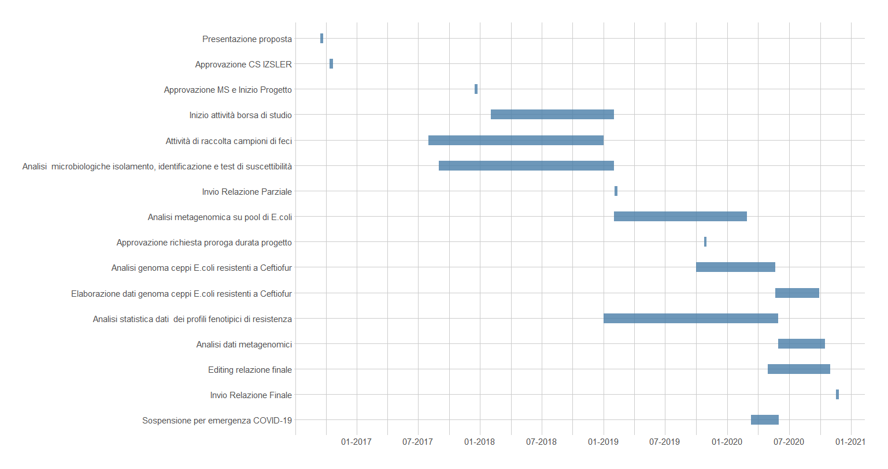
```

In particolare: 

L'U.O. 1  ha svolto regolarmente le attività  per quel che riguarda la parte analitica, su campioni di feci prelevati nella provincia di Bergamo e  sui campioni di feci inviati dalle U. O. 5 e 6. A Febbraio del 2019 a conclusione della parte analitica di isolamento,  identificazione,  test di suscettibilità dei ceppi e loro archiviazione si è proceduto all'invio dei pool di ceppi di Escherichia coli all'U.O.2 per le attività di analisi metagenomica. L'attività di analisi dei dati fenotipici si è conclusa a Maggio del 2020, mentre l'editing della relazione finale è iniziata a Giugno 2020 e si è conclusa a Novembre 2020, con l'invio della relazione finale in data  07/11/2020 alla Direzione Generale dell'IZSLER.

L'U.O. 2 ha ricevuto i campioni per le analisi metagenomiche a Febbraio 2019 e ha concluso le attività il 2/11/2020 con l'invio all'U.O. 1 di una relazione delle attività svolte.  A causa della scadenza prossima dell'invio della relazione finale alla Direzione Generale dell'IZLSER prevista per il 7/11/2020, non essendo stato possibile  procedere a una  valutazione, discussione ed eventuali integrazione dei risultati e considerazioni relative alle analisi metagenomiche il responsabile scientifico ha ritenuto opportuno inserire il contributo della U.O. come allegato alla relazione finale del progetto di ricerca.

L'U.O. 3 ha svolto regolarmente le attività di analisi previste e introduzione dei risultati nel database predisposto dall'U.O. 1. Inoltre ha proceduto a fine 2019 ad effettuare sui ceppi risultati resistenti al Ceftiofur i test di screening per l'individuazione fenotipica di ceppi ESBL. 

L.U.O. 4 ha effettuato sui ceppi ceftiofur resistenti la caratterizzazione genomica.

L.U.O. 5 e 6 hanno svolto regolarmente la loro attività di collezione dei campioni di feci, stoccaggio e invio all'U.O.1. 

A Ottobre del 2019 è stata chiesta e ottenuta  una proroga del progetto sulla base dei primi risultati ottenuti dall'U.O.2 impegnata nelle analisi metagenomiche. Si è colta l'occasione della proroga dei tempi per integrare i risultati indagando nello specifico i profili genetici di ceppi di Escherichia coli risultati resistenti a Ceftiofur per evidenziare la presenza di geni di resistenza ESBL. 

Nel marzo 2020 a seguito dell'emergenza COVID le attività del progetto ancora in corso sono state sospese e riprese a partire dalla fine di maggio 2020, con un ulteriore proroga della scadenzadel progetto stabilita al 14/11/2020. 


\newpage
# MATERIALE E METODI

## Campionamento
Si è proceduto ad un campionamento non probabilistico per convenienza  [@dohoo2003veterinary] utilizzando sia i campioni raccolti durante le attività di sorveglianza del piano regionale fauna selvatica della Lombardia (https://archive.izsler.it/izs_bs/allegati/3097/piano%20monitoraggio%20regionale.pdf) (cinghiali, ruminanti selvatici, lagomorfi, volatili) , sia i campioni provenienti da attività di sorveglianza del piano Chronic Wasting Disease in essere nel 2018 (https://www.resolveveneto.it/wp-content/uploads/2016/06/Piano-conoscitivo-CWD-2016_nota-MS-24007_191016.pdf)  (cervi e caprioli) e del piano West Nile Disease in essere nel 2018 (https://westnile.izs.it/j6_wnd/docMinisteriale?annoDocumento=2018) (Cornacchie, Gazze). I campioni di feci raccolti dall'intestino degli animali, direttamente in campo per i mammiferi abbattuti durante la stagione venatoria ( prevalentemente cinghiali), o durante la necroscopia per gli animali rinvenuti morti o volatili abbattuti nell'ambito dei piani di  monitoraggio,  sono stati stoccati a temperatura di congelamento in attesa di essere processati.

## Esami microbiologici
L’esame batteriologico è stato eseguito seguendo le indicazioni riportate nel metodo di prova interno IZSLER (MP 01/181 rev.0 ) che descrive la tecnica microbiologica per la categorizzazione di isolati batterici aerobi/anaerobi facoltativi. I campioni di feci confezionati in sacchetti o barattoli o prelevati direttamente in sede necroscopica dall'intestino, sono stati disciolti in brodo di pre-arricchimento APT (acqua peptonata) e, dopo l’allestimento di tamponi, sono stati seminati su MC-Conkey Agar (terreno selettivo per enterobatteriacee) e incubati per 24-48 ore a 37°C in aerobiosi al fine di ottenere colonie isolate. Da una colonia isolata sono state realizzate colture su terreno solido Klieger Iron Agar (KIA) da utilizzare nelle successive prove di caratterizzazione (morfologica, colturale, biochimica). Il KIA costituisce un terreno differenziale impiegato principalmente come ausilio nell’identificazione di alcuni membri della famiglia delle _Enterobacteriaceae_. La differenziazione degli enterobatteri avviene in base alla loro capacità di fermentare il destrosio ed il lattosio e di produrre idrogeno solforato.  Tutti i campioni sono stati successivamente sottoposti alla prova della citocromo ossidasi. Quelli risultanti ossidativi e fermentativi alla coltura su terreno Klieger sono stati testati per confermare fossero _Escherichia coli_ (ossidasi negativo). I campioni risultati ossidasi positivi sono stati invece identificati con analisi biochimica mediante gallerie utilizzando il kit Microgen TM GnA + B-ID System.

## Antibiogrammi
Tutti i ceppi isolati sono stati sottoposti al test di sensibilità agli antibiotici  mediante la tecnica di diffusione in agar gel descritta nel metodo di prova interno per l’esecuzione dell’antibiogramma dell’IZSLER (MP 01/068 rev 1), redatto in conformità con le linee guida nazionali del Centro di Referenza per l’Antibiotico Resistenza (CRAB) e le linee guida internazionali del Clinical and Laboratory Standards Institute (CLSI).  E' stato utilizzato un panel di 7 antibiotici scelti sulla base  delle linee Guida per l'interpretazione delle prove di sensibilità ai chemioantibiotici del Centro di Referenza Nazionale per l'Antibiotico-resistenza (http://www.izslt.it/crab/wp-content/uploads/sites/8/2017/03/Molecole-prototipo-e-loro-equivalenti-in-vitro-rev-3-2015.pdf). Le molecole selezionate sono indicate come molecole prototipo rappresentative delle diverse classi farmacologiche:
 
**Ampicillina (AMP)**. Molecola prototipo di  Beta-lattamici tipo Amoxicillina, Etacillina. Antibiotico classificato dal WHO [@world2019critically] come **Critically Important Antimicrobial** e **High priority** in quanto incontra i criteri C1 e C2 dei criteri di categorizazzione e i criteri P2, e P3 dei criteri di prioritizzazione. Antibiotico a largo spettro di azione, usato in medicina umana e veterinaria sin dal 1961. L'Ampicillina impedisce la formazione dei legami crociati tra le varie molecole di peptidoglicano (mureina), un componente fondamentale della parete cellulare batterica, e ne compromette la stabilità, rendendo così i batteri suscettibili allo shock osmotico. Alcuni batteri produttori dell'enzima beta-lattamasi (penicillinasi) possono inattivare l'antibiotico rendendo così il trattamento inefficace. E' uno dei pochi antibiotici attivo contro i ceppi multiresistenti di *_Enterococcus faecalis_* e *_E.faecium_*. 

**Tetraciclina (TET)**. Molecola prototipo di Clortetraciclina, Doxyciclina, Minociclina, Oxytetraciclina, classificato dal WHO come  **Highly important** antimicrobial, in quanto incontra solo il criterio C2 di classificazione. Antibiotico a largo spettro d'azione in uso dal 1978 sia in medicina umana che veterinaria.
Batteriostatico, penetra nella cellula complessata a Mg 2+ . Lega la sub-unità
30S impedendo l’accesso degli aminoacil-tRNA al sito recettoriale A del ribosoma;I batteri di solito acquisiscono resistenza alla tetraciclina dal trasferimento orizzontale di un gene che codifica per una pompa di efflusso o una proteina di protezione ribosomiale. Le pompe Efflux espellono attivamente la tetraciclina dalla cellula, impedendo l'accumulo di una concentrazione inibente della tetraciclina nel citoplasma [@chopra2001tetracycline].  Le proteine di protezione ribosomiale interagiscono con il ribosoma e rimuovono la tetraciclina dal ribosoma, consentendo di continuare la traduzione [@connell2003ribosomal]. 

    
**Ceftiofur (CFT)**. Molecola prototipo di Cefalosporine a spettro esteso di 3^, 4^ e 5^ generazione come Cefoperazone, Cefpodoxime e Cefquinome, classificate dal WHO come  **Critically Important Antimicrobial**, perchè incontrano i creteri C1, C2 e C3 e **Highest Priority** perchè soddisfano i criteri di priorità P1, P2 e P3. In particolare  le  cefalosporine di 3^ e più alte generazioni sono conosciute come in grado di selezionare ceppi resistenti di Salmonella spp e di Escherichia coli negli animali, e allo stesso tempo sono uno dei pochi strumenti terapeutici a disposizione per forme gravi di Salmonellosi  e infezioni da E.coli nell'uomo e in particolare nei bambini. 

    
**Colistina (COL)**. Molecole non appartenente al panel consigliato dalla linee guida in quanto particolarmente critico per l'utilizzo in umana. E' classificata dal WHO come **Critically Important Antimicrobial** e **Highest Priority**. Le polymixine, gruppo farmacologico a cui appartiene la colistina,  sono conosciute per selezionare E.coli polymixin-resistenti mediate da plasmidi. La somministrazione intravenosa di polymixina è uno dei pochi strumenti terapeutici efficaci per gravi forme di infezioni nosocomiali  da E.coli e Pseudomonas aeruginosa multi-resistenti in molti paesi, soprattutto nei pazienti in condizioni critiche.   E' stato inserito nel panel per verificare la presenza di resistenza a questo importante antibiotico in ceppi provenienti dalla fauna selvatica come misura del grado di contaminazione degli ambienti selvatici da parte di ceppi portatori di resistenza alle polymixine.
 
**Kanamicina (KAN)**. Molecola prototipo degli Aminoglicosidi tra cui le streptomicine (isolate da attinomiceti del genere _Streptomyces_) quali Neomicina e Framicetina.  Classificate dal WHO  **Critically Important Antimicrobial** in quanto soddisfa i criteri C1 e C2 e **Highly important** in quanto soddisfa solo P2 e P3 tra i fattori di prioritizzazione. 

**Gentamicina (GEN)**. Molecola prototipo di Aminoglicosidi isolati da actinomiceti del genere Micromonospora quali Tobramicina, Apamicina, calssificata come **Critically Important Antimicrobial** in quanto soddisfa i criteri C1 e C2 e **Highly important** in quanto soddisfa solo P2 e P3 tra i fattori di prioritizzazione. 

    
**Enrofloxacin (ENR)**. Molecola prototipo dei fluorochinolonici, tra cui Danofloxacin, Ciprofloxacin, Marbofloxacin, Orbifloxacin, Pradofloxacin. Antibiotici classificati da WHO come **Critically Important Antimicrobial** e **Highest Priority** in quanto soddisfano sia i criteri d'importanza C1, C2 e C3 sia i fattori di prioritizzazione P1, P2 e P3). Sono antibiotici conosciuti per selezionare negli animali ceppi di _Escherichia coli_ e _Salmonella spp_  resistenti ai chinoloni che sono tra i pochi strumenti terapeutici nel caso di gravi forme di infezioni da  _Escherichia coli_ e _Salmonella spp_. 
    

## Identificazione dei ceppi produttori di enzimi beta-lattamasi a spettro esteso (ESBL)

### Identificazione fenotipica

Analogamente a quanto fatto da  [@vo2007characteristics] il criterio di selezione dei ceppi da sottoporre ad esame fenotipico per l'identificazione di  ceppi potenziali produttori di enzimi beta-lattamasi a spettro esteso (ESBL) è stato la resistenza alle cefalosporine (CEFTIOFUR). Si è proceduto a sottoporre questi ceppi a  due test fenotipici per l'identificazione di ESBL: il Duble Disk Synergy test (DDST) e il Three Dimensional Test (TDT), come descritti da vari Autori.

Il DDST [@philippon1989epidemiology] consiste nell’utilizzo combinato di due antibiotici, la cefalosporina (Cefquinome o Ceftiofur) e Amoxicillina+Acido Clavulanico (30µg), inibitore delle $\beta-$lattamasi a spettro esteso. I due dischetti vengono posizionati ad una distanza di 20 mm centro-centro su una piastra di MHA (Mueller-Hinton Agar), precedentemente inoculata con la soluzione del ceppo da testare (torbidità pari a 0.5 McFarland). Se il ceppo è un produttore di ESBL, allora si ottiene una estensione dell’alone di inibizione dall’Amoxicillina+Acido Clavulanico verso il dischetto della cefalosporina (Fig.\ref{fig:DDST}). 

Un secondo metodo per rilevare ceppi produttori di ESBL è il Three Dimensional Test (TDT) [@irfan2013phenotypic]. Il TDT prevede l’inoculo di un ceppo di Escherichia coli sensibile agli antibiotici $\beta-$lattamici (E. coli ATCC 25922), con torbidità pari a 0.5 McFarland, su una piastra di MHA. Al centro della piastra viene posizionato un dischetto di Ceftiofur (30µg) e, ad una distanza di circa 2mm, viene effettuato un foro nel terreno di coltura. All’interno del foro vengono inoculati 30µl della soluzione in  TSB del ceppo da testare, tarata ad una torbidità di 0.5 McFarland. La piastra viene incubata a 37±2°C per 18-24 h. Se attorno al dischetto di antibiotico si presenta una distorsione dell’alone di crescita a forma di cuore, allora il ceppo testato risulta un produttore di ESBL (Fig.\ref{fig:TDT}). 


### Identificazione genotipica
Tutti i ceppi risultati CFT-resistenti, indipendentemente dal risultato dei test ESBL fenotipici, sono stati processati per la caratterizzazione genotipica. I ceppi preventivamente congelati e poi inviati all'U.O.3,  sono stati sottoposti a esame batteriologico , per confermarne la vitalità e l'identificazione di specie,  con semina su piastre di agar MacConkey e di agar sangue (Oxoid, Italia)  e successiva incubazione in aerobiosi per 18 ± 2 ore a 37 ± 2° C. Le colonie sospette di _Escherichia coli_ sono state identificate morfologicamente con la colorazione di Gram. Si è quindi proceduto a prelevare e seminare una colonia sospetta in BHI (Brain Heart Infusion) agar inclinato (Oxoid, Italia) e l’identificazione è stata condotta tramite il metodo biochimico API 20E (bioMérieux, Francia).
Per l'indagine ESBL, una colonia sospetta di _Escherichia coli_ è stata inoculata in 1 ml di brodo BHI con supplemento di 1 mg/L di cefotaxime per la fase di pre-arricchimento. In seguito ad incubazione overnight, una goccia di BHI brodo è stata seminata su agar MacConkey con supplemento di 1 mg/L di cefotaxime. I ceppi positivi sono stati identificati attraverso la crescita di colonie rosa-rosa scuro ed una di queste è stata prelevata per le successive analisi molecolari.
Una singola colonia batterica per campione è stata risospesa in 250 $\mu$l di acqua DNasi-RNasi free e il DNA è stato estratto mediante lisi-ebollizione (98°C per 10 minuti). Il gruppo filogenetico di ciascun isolato è stato determinato attraverso una PCR multiplex che discrimina i sette gruppi principali (A, B1, B2, C, D, E o F) come descritto da [@clermont2013c].
La rilevazione dei geni di resistenza presenti negli isolati è stata eseguita utilizzando un pannello di reazioni PCR. I geni del gruppo CTX-M sono stati analizzati tramite PCR multiplex, la cui positività singola o multipla, identifica i cinque gruppi filogenetici principali: CTX-M1, CTX-M2, CTX-M9 e CTX-M8 e CTX-M25 [@woodford2006multiplex]. Inoltre, singole reazioni PCR sono state utilizzate per il gene SHV [@arlet1997substitution], il gene TEM [@mabilat1990direct], utilizzando primer universali come precedentemente descritto ([@chang2001diversity]; [@ahmed2007zoo];[@cremet2011prevalence]; [@gbonon2018detection]) e geni AmpC (CMY-2, CMY-4, CMY -6, CMY-7, CMY-12, CMY-13, CMY-14, CMY-18, LAT-3) [@dierikx2010increased]. La ricerca dei geni mcr (plasmid-mediated colistin resistance determinants), mcr-1, mcr-2, mcr-3, mcr-4 and mcr-5, è stata condotta tramite PCR multiplex come descritto da [@rebelo2018multiplex].


## Analisi metagenomiche
I materiali e metodi, i risultati, discussioni e riferimenti bibliografici delle analisi metagenomiche sono stati redatti dall' U.O.2 e riportati in allegato al presente documento.


## Analisi dei dati
### Gestione dei dataset

I dati raccolti sono stati inseriti in foglio elettronico denominato **AMR** in formato googlesheet e quindi importato in ambiente R[@R] per le successive analisi. **AMR** risulta costituito da 911 righe e 23 colonne. Ogni riga corrisponde ad un isolato batterico sottoposto al test di sensibilità al panel di antibiotici identificati da una variabile univoca denominata **IDceppo**.

* **IDcamp** identifica il campione di feci sottoposto ad analisi micorbiologica per l'isolamento e identificazione dei ceppi di *_Enterobacteriaceae_* 

* **SPECIE** variabile categorica che riporta la specie di provenienza dei campioni di feci. Questa variabile contiene 33 livelli differenti che comporta una eccessiva parcellizzazione dei dati con presenza di poche unità per alcune specie. Si è quindi proceduto ad aggregare le specie sulla base di considerazioni tassonomiche e ecologiche in  nove gruppi specie identificati dalla variabile **Specieaggreg**

* **COMUNE** variabile categorica che riporta i comuni di provenienza dei campioni di feci. Per 24 campioni di feci non era disponibile il dato relativo al Comune di provenienza.
 
* **Identificazione** variabile categorica che riporta il genere di appartenza dei ceppi isolati

*  **AMP** (Ampicillina), **COL** (Colistina), **CFT** (Ceftiofur), **KAN** (Kanamicina), **ENR** (Enrofloxacin), **GEN** (Gentamicina), **TET** (Tetraciclina) : variabili dicotomiche che identificano la Sensibilità o Resistenza ai differenti antibiotici del panel. 

Altre variabili presenti nel dataset ma non utilizzate per l'analisi dei dati sono: FASCETTA (identificativo,quando presente, dell'animale da cui proviene il campione di feci), DATA_PRELIEVO, DATA_SEMINA, STATO_CAMPIONE ( se fresco o congelato), til ( tilmicosina), ox (oxacillina), er (eritromicina): questi tre antibiotici sono stati tutti utilizzati durante il test di sensibilità agli antibiotici, ma come da indicazione del centro di referenza per l'antibiotico-resistenza le **Enterobatteriacee** mostrano resistenza naturale, quindi i rispettivi risultati non sono stati utilizzati per le successive analisi dei dati.

Il dataset **AMR** ha una struttura gerarchica costituita da tre livelli: Comune, ID Camp, e IDceppo. I comuni contribuiscono con uno o più campioni di feci provenienti da diverse specie animali; da un singolo campione di feci identificato dal IDcamp, possono essere isolati da uno a più ceppi batterici appartenente alla famiglia delle _Enterobacteriaceae_ identificati dal IDceppo. Le statistiche relative ai campioni di feci sono quindi state ottenute escludendo per i campioni con più di un ceppo i record multipli con differente IDceppo ma identico IDcamp.

Le caratteristiche dei differenti comuni di provenienza dei campioni sono state ottenute da differenti database dell'ISTAT consultabili al sito (https://www.istat.it/it/) e quindi collegate al dataset AMR mediante il campo COMUNE, ottenendo quindi il dataset **AMR_istat**, costituito da 876 record, utilizzato per analizzare l'associazione tre caratteristiche ambientali-sociali dei differenti comuni e la prevalenza di animali portatori di _Enterobacteriaceae_ resistenti ad almeno un antibiotico del panel indagato. 

Le caratteristiche dei comuni utilizzate sono: **denpop(abkmq)** (densità di popolazione espressa in abitanti per Kmq), **sup(kmq)** (superficie del comune in kmq), **urb** ( grado di urbanizzazione: variabile categorica con tre livelli:1=densamente popolato, 2=mediamente popolato, 3=scarsamente popolato (rurale), **hapasc** (ettari di territorio dedicati al pascolo), **capi** (numero di capi al pascolo), **aziende** (numero di aziende con animali al pascolo), **montano** (montanità del territorio).

### Metodi statistici
**Prevalenza animali portatori di ceppi resistenti e multiresistenti**. Sulla base dei profili di resistenza dei singoli ceppi si è provveduto a classificare i ceppi in Suscettibili (ceppi sensibili a tutti gli antibiotici del panel) e Resistenti (ceppi sensibili ad almeno un  antibiotico del panel) e quindi a  classificare come *campione di feci resistente* ,  feci  carrier di almeno un ceppo resistente ad almeno un antibiotico del panel indagato. Le stime puntuali e intervallari della  prevalenza complessiva e specifica per gruppo-specie dei *campioni resistenti* sono state stimate mediante l'impiego di una distribuzione Beta a priori coniugata sulla distribuzione di *P* ( probabilità di essere un campione resistente) in un esperimento binomiale ottenendo una distribuzione Beta a posteriori della probabilità P. Dal teorema di Bayes la distribuzione a posteriori di *P* condizionalmene ai dati osservati è data da:

$$ P|x = Beta(x + \alpha,\ \  n-x+\beta) $$ 
dove: 
 **P** = probabilità di un campione di feci resistente ( secondo la definizione data sopra); 
 **n** = numero di osservazioni;
 **x** = numero di campioni resistenti;
 $\alpha$ e $\beta$ sono gli iperparametri della distribuzione a priori beta di *P*, che in questo caso è una Jeffrey's prior con distribuzione Beta(0.5, 0.5). Dalla distribuzione posteriore viene costruito quindi un intervallo di credibilità che raccoglie la più alta probabilità di densità di valori di p (HPD) corrispondente al 95% dei valori di *P* stimati. La stima puntuale della prevalenza è rappresentata dalla media della distribuzione Beta a posteriori data da: 

$$ mean = (x + 0.5)/(n + 1) $$
I risultati sono restituiti in forma tabellare e grafica mediante l'utilizzo del pacchetto binom [@binom] in ambiente R. 

La stessa procedura è stata utilizzata per stimare la prevalenza di campioni di feci carrier di almeno un ceppo risultato multi-resistente (MR), dove per multi-resistenti si definiscono i ceppi resistenti a tre o più antibiotici del panel. 


**Associazione  tra Prevalenza di animali carrier di ceppi resitenti e caratteristiche ambientali**
Esistono evidenze in letteratura che la presenza (prevalenza/occorrenza ) di animali selvatici portatori di ceppi antimicrobico-resistenti  sia da attribuire alla contaminazione ambientale e/o all'interazione tra specie domestiche e selvatiche.  Per 648 campioni è risultato disponibile il dato geografico e la caratterizzazione territoriale ISTAT. Su questi campioni è stato  quindi possibile  valutare l'a relazione'associazione tra prevalenza di capi selvatici portatori di ceppi "Resistenti"  e i caratteri territoriali (usando il Comune come unità geografica) di provenienza dei campioni. Per questo tipo di valutazione sono stati esclusi i dati riferiti ai gruppi-specie meno numerosi: LEPRE, UCCELLI ACQUATICI e ALTRI VOLATILI. Dopo esclusione di questi gruppi specie, il dataset comprende informazioni su 603 campioni. I dati Istat disponibili, per esplorare l'associazione tra prevalenza di capi portatori di ceppi Resistenti e indicatori di contaminazione derivati dai singoli comuni sono: densità di popolazione ( da cui deriva la classificazione del grado di urbanizzazione dell'ISTAT), superficie kmq del comune, altitudine , superfice comunale adibita a  pascolo, numero di capi domestici al pascolo , n di aziende al pascolo.
Per questo studio è stato adattato un modello bayesiano multilevel specificato a priori mediante un Direct Acyclic Graph (DAG)  che ha permesso di chiarire la dipendenza delle variabili e scegliere quelle da inserire nel modello (Fig\ref{fig:figB}). 

Formalmente il modello candidato è il seguente:

$$R_i \sim Bernoulli(p)$$
$$\text{logit(p)} = \alpha_{\text{Comune}} + \beta*X $$ $$\alpha_{\text{Comune}} \sim Normal (\alpha, \sigma)$$  $$ \alpha \sim Normal(0, 1) $$ $$\sigma \sim \text{HalfCauchy(0,1)} $$    $$\beta \sim Normal (0, 1)$$
Dove X rappresenta la matrice dei predittori e $\alpha_{\text{Comune}}$ definisce il fattore con intercetta variabile.  Tutte le variabili quantitative predittorie (Urbanizzazione e Pascolo) sono state standardizzate in accordo a quanto suggerisce  [@gelman2020regression], sia per una maggior interpretabilità delle stime dei coefficienti di regressione sia per una migliore performance dell'algoritmo  Hamiltonian Monte Carlo (HCM) [@mcelreath2020statistical] sia per una miglior utilizzo delle priors del modello. Le stime dei parametri del modello sono state ottenute mediante campionamento con l'algoritmo HCM utilizzando quattro catene, con 4000 iterazioni di cui 1000 di warmup ( escluse dopo il campionamento). Per questo modello è stato utilizzato il pacchetto brms [@brms] come interfaccia del linguaggio STAN [@gelman2015stan] implementato in R nel pacchetto rstan [@rstan]. Si è proceduto ad adattare  i seguenti modelli utilizzando i diversi predittori esplorando termini d'interazione ragionevoli dal punto di vista epidemiologico:

* modello 1 : $\text{logit(p)} =  \alpha_{\text{Comune}} + \beta_{\text{Specie}} + \beta_{\text{Pascolo}} + \beta_{\text{Urbanizzazione}}$

* modello 2 : $\text{logit(p)} =  \alpha_{\text{Comune}} + \beta_{\text{Specie}} + \beta_{\text{Pascolo}} + \beta_{\text{Urbanizzazione}} + \beta_{\text{Specie*Pascolo}}$

* modello 3 : $\text{logit(p)} =  \alpha_{\text{Comune}} + \beta_{\text{Specie}} + \beta_{\text{Pascolo}} + \beta_{\text{Urbanizzazione}} + \beta_{\text{Specie*Pascolo}} + \beta_{\text{Specie*Urbanizzazione}}$
 
Il confronto tra i diversi modelli è stato effettuato mediante l'utilizzo delle tecniche di K-fold cross-validation con K= 10  subset di dati [@gelman2020regression]. 
Le stime a posteriori dei parametri del modello selezionato sono state quindi riassunte in forma tabellare mediante la mediana della distribuzione a posteriori, gli intervalli di credibilità al 95%, la Probability Direction (PD), come  misura dell'importanza degli effetti dei parametri,  e la Region of Practical Equivalence (ROPE) come indice di significatività secondo quanto riportato da  [@makowski2019indices]. 


**Prevalenza di ceppi resistenti e profili fenotipici di resistenza ai differenti antibiotici**.   Sulla base dei profili di resistenza dei singoli ceppi si è provveduto a classificare i ceppi in 

* Suscettibili  (ceppi sensibili a tutti gli antibiotici del panel)
* Resistenti (ceppi sensibili fino a 2 antibiotici del panel)
* Multiresistenti (ceppi sensibili a 3 o più antibiotici del panel). 

Per ogni singolo antibiotico è stata stimata la distribuzione a posteriori della prevalenza di ceppi resistenti complessivamente  e nelle differenti specie di provenienza dei campioni, utilizzando lo stesso metodo impiegato per le stime della prevalenza di campioni resistenti a cui si rimanda per il dettaglio. 

 
**Biodiversità dei profili fenotipici di resistenza**
Sulla base delle resistenze ai differenti antibiotici del panel i ceppi sono stati caratterizzati per il loro profilo di resistenza indicato da una stringa costituita dall'abbreviazione di tre lettere degli antibiotici resistenti. Ad esempio la stringa *AMP-TET-COL* indica un ceppo batterico con fenotipo di resistenza a Ampicillina, Tetraciclina, e Colistina. I differenti ceppi sono stati quindi aggregati per fenotipo e per gruppo-specie di provenienza dei ceppi e analizzati mediante metodi di analisi della biodiversità calcolando quattro misure di diversità legate alle misure di entropia generalizzata di Rényi secondo l'approccio descritto da [@mather2012ecological].  L'entropia di Rényi si calcola mediante la seguente formula:
$$ H_\alpha = \frac{Ln\sum p^\alpha}{1-\alpha} $$ 
$\alpha$ rappresenta un parametro di scala, lungo il quale la ricchezza del profilo e l'abbondanza relativa dei profili sono pesate in modo differente, all'aumentare di $\alpha$ il peso dei profili più rari è maggiormente ridimensionato nel calcolo della diversità. Alcuni comuni indici di diversità sono relazionati all'entropia di Rényi, ad esempio quando $\alpha =1$ si ottiene l'indice di Shannon(H). Queste relazioni sono più evidenti quando si utilizza il cosidetto numero di Hill che è associato all'entropia $H_\alpha$ di Renyi da: $H_\alpha-Hill = exp(H_\alpha)$. I quattro indici di diversità che sono stati confrontati tra i comparti rappresentati dai gruppi-specie si trovano a diversi livelli di $\alpha$: con $\alpha=0$ si ha l'equivalente della Richness che rappresenta una semplice conta dei differenti profili di resistenza e ignora la relativa abbondanza e quindi considera profili rari e comuni allo stesso modo; quando $\alpha = 1$ si ha l'equivalente dell'esponente dell'indice di Shannon che rappresenta la probabilità che due ceppi estratti a caso hanno lo stesso profilo di resistenza; quando $\alpha = 2$ si ha l'equivalente dell'inverso dell'indice S di Simpson che rappresenta l'abbondanza relativa di ogni profilo e infine con $\alpha = \infty$ si ha l'equivalente dell'inverso dell'indice di dominanza di Berger_Parker che rappresenta la proporzione dei profili più comuni nel campione. Usando l'entropia di Rényi è possibile costruire un grafico dei profili di diversità che sono più informativi di quanto non si ottenga usando i singoli indici di diversità. Curve piatte indicano che le comunità di fenotipi hanno un alto grado di uniformità con assenza di fenotipi dominanti. In caso di curve che declinano rapidamente con lunghe code, indicano comunità di fenotipi in cui sono presenti molti fenotipi rari e quindi presenza di uno o pochi fenotipi dominanti. Il confronto tra curve per siti differenti o come in questo studio per gruppo-specie differente avviene non solo attraverso la differente forma ma anche attraverso la posizione relativa rispetto all'asse delle ordinate. Affinchè vengano considerati completamente differenti due comunità sulla base della diversità le curve non devono sovrapporsi. A questo riguardo può essere utile confrontare la forma delle curve partendo da un punto in comune fisso per tutte le comunità. Al valore di $\alpha =0$ l'entropia di Renyi è interpretabile come indice di richness. Se si sottrae il valore di entropia ad $\alpha =0$  da tutti i valori di entropia misurati ai diversi valori di $\alpha$ si ottiene un grafico in cui tutte le curve partono da un punto in comune corrispondete appunto a $\alpha = 0$. In questo modo si ottiene una standardizzazione o normalizzazione delle curve con il focus di valutazione solo sulla forma delle curve stesse. In questo studio si è proceduto quindi a stimare l'entropia di Renyi e quindi a visualizzare i risultati delle curve normalizzate di diversità delle comunità di fenotipi di resistenza dei diversi gruppi-specie, utilizzando le funzioni del pacchetto BiodiversityR, come indicato da [@kindt2005tree]

\newpage
# RISULTATI

## Quadro generale

### Territorio
L'attività di campionamento si è svolta tra Settembre 2017 e Dicembre 2018  in 7 province della Lombardia : Bergamo, Pavia, Varese,Como, Lecco e Brescia da un totale di 223 comuni (Fig\ref{fig:fig1}). 
Sulla base dei  criteri di classificazione dei comuni adottati dall'ISTAT, in merito a grado di urbanizzazione, e montanità risulta che : 415 campioni (57%) provengono da comuni a bassa urbanizzazione (aree rurali scarsamente popolate), 221 campioni (30%) da comuni a densità intermedia di popolazione e 11 campioni (1.15%) da comuni ad alta densità di popolazione; 472 campioni (65%) provengono da comuni totalmente montani, 161 (22%) da comuni in pianura e 14 campioni (2%), da aree parzialmente montane (collinari). Questi risultati sono riferiti ad un totale di 647 campioni provenienti da comuni per i quali era disponibile il dato ISTAT di urbanizzazione e montanità. In  tabella \ref{tab:tab1} sono riportate le statistiche descrittive della caratterizzazione geografica e di popolazione dei comuni da cui provengono i campioni. 

### Fauna selvatica
Sono stati raccolti complessivamente 670 campioni di feci da 33 differenti specie di fauna selvatica.  Le specie più frequentemente campionate sono il Capriolo (Capreolus capreolus) con 191 campioni ( 28.5%),  la Cornacchia grigia (Corvus cornix) con 122 (18.2%), il Cervo (Cervus elaphus) ,  con 80 campioni (11.9%), il Cinghiale (Sus scrofa) con 76 campioni (11.3%), il Camoscio (Rupicapra rupicapra) 46 campioni (6.9%) e il Muflone (Ovis aries musimon) 43 campioni (6.4%) che rappresentano complessivamente più dell'80% dei campioni esaminati. Il restante 20% è distribuito su un totale di 27 specie differenti descritte in tabella \ref{tab:tab2}.

Oltre il 90% di campioni dei gruppi-specie CERVIDI, BOVIDI e SUIDI   proviene da territori classificati da ISTAT come Totalmente Montani; il 75% dei campioni del gruppo CARNIVORI proviene da territori Totalmente Montani; l'86% dei campioni del gruppo CORVIDI proviene da territori Non Montani e il 50% dei campioni del gruppo RAPACI proviene da territori Totalmente Montani e il 50% da territori Non Montani. Per tutti i gruppi-specie risulta poco rappresentata la categoria territoriale Parzialmente Montano (P) (tabella \ref{tab:tab2b}). ISTAT sulla base della densità di popolazione per Kmq classifica i comuni in 3 classi di urbanizzazione: 1=densamente popolato, 2=mediamente popolato, 3=scarsamente popolato (rurale). La distribuzione dei campioni dei diversi gruppi specie rispetto alle caratteristiche di urbanizzazione dei comuni di provenienza riflette quanto già visto per la montanità dei territori campionati, con una più alta frequenza di campioni provenienti da territori rurali e a densità media che da comuni ad elevata densità di popolazione. In particolare dai territori a bassa urbanizzazione (rurali) proviene il 72% dei campioni del gruppo CERVIDI,  il 75% dei campioni del gruppo BOVIDI, il 67% dei campioni del gruppo SUIDI, il 70% dei campioni del gruppo CARNIVORI, il 57% dei campioni  dal gruppo CORVIDI e il 30% dal gruppo RAPACI (tabella \ref{tab:tab2c})


### Esami microbiologici
Dai 671 campioni di feci analizzati sono stati isolati  911 ceppi batterici identificati come appartenenti alla famiglia delle _Enterobacteriaceae_. _Escherichia coli_  rappresenta il 67.6% dei ceppi isolati, il restante 32% dei ceppi è distruibuito su un totale di 14 generi differenti ( tabella \ref{tab:micro}). Per 67 ceppi non si è giunti all'identificazione basata sulle prove biochimiche di genere. Per questi ceppi non si è proceduto ad ulteriore approfondimenti diagnostici ma sono stati comunque archiviati in brodo con glicerolo e quindi congelatati.


### Antibiogrammi
Sono stati eseguiti 910 antibiogrammi ( per un ceppo non è stato possibile eseguire l'antibiogramma per perdità di vitalità del ceppo). Complessivamente 392 ceppi (43%) sono risultati Suscettibili (S) al panel di antibiotici testati ; 423 (46%) i ceppi Resistenti (R)  fino ad un massimo di 2 antibiotici e infine 95 (10%) ceppi sono risultati Multiresistenti (MR), con resistenza a 3 o più antibiotici. La distribuzione del numero di resistenze al panel di antibiotici per isolato (Antibiogram length) è sintetizzata in figura \ref{fig:fig2}


## Prevalenza animali carrier di ceppi resistenti
Complessivamente da 670 campioni di feci di fauna selvatica da cui è stato  isolato almeno un ceppo di _Enterobacteriacee_ e su cui è stato eseguito l'antibiogramma, in 421  è stato isolato almeno un ceppo resistente ad uno o più  antibiotici del panel indagato, pari ad una Prevalenza complessiva  del 62% (95% HPD: 58-67%).


La variabilità tra i gruppi-specie è particolarmente ampia: nei CORVIDI si osserva la prevalenza più elevata (84%), mentre nei  BOVIDI la più bassa (37%). A causa della bassa numerosità campionaria si osservano stime con incertezza molto ampia nei gruppi : LEPRE, ALTRI VOLATILI, UCCELLI ACQUATICI, CARNIVORI e RAPACI. In figura \ref{fig:prev}  è riportata per ogni gruppo specie la distribuzione a posteriori della prevalenza di animali carrier di ceppi antibiotico-resistenti e in tabella (\ref{tab:prevalenze}) le stime puntuali e i valori dell'intervallo di massima densità delle stime (95% High Probability Density HPD ).

Su 670 campioni di feci, 92 presentano almeno un ceppo MULTI-RESISTENTE (numero di resistenze >= a 3), pari ad una prevalenza del 14% (95% HPD:11%-16%). La variabilità tra gruppi specie risulta molto ampia: la prevalenza di animali selvatici portatori di ceppi multiresistenti varia da un minimo del 4% nel gruppo UCCELLI ACQUATICI ad un massimo dell'88% nella LEPRE. La bassa numerosità dei campioni di alcuni gruppi specie rende le stime molto incerte. In figura \ref{fig:prev2}  è riportata per ogni gruppo specie la distribuzione a posteriori della prevalenza di animali carrier di ceppi multi-resistenti e in tabella (\ref{tab:prevalenze2}) le stime puntuali e i valori dell'intervallo di massima densità delle stime (95% High Probability Density HPD ).

### Associazione tra la prevalenza di animali carrier e caratteristiche ambientali

Il confronto tra modelli indagati basato sulle metriche della K-fold cross-validation  (tabella\ref{tab:kfold}) ha permesso di selezionare come modello con le  migliori performance in termini di predittività il modello:  $$\text{logit(p)} =  \alpha_{\text{Comune}} + \beta_{\text{Specie}} + \beta_{\text{Pascolo}} + \beta_{\text{Urbanizzazione}} + \beta_{\text{Specie*Pascolo}}$$.  
Le stime dei coefficienti di regressione e gli intervalli di credibilità sono riassunti in tabella \ref{tab:stimefe} e le rispettive distribuzioni a posteriori rappresentate in figura \ref{fig:stimefe}

Secondo il modello, la probabilità di un animale di essere un carrier di ceppi antibiotico resistenti di _Enterobacteriacee_  aumenta all'aumentare della superficie comunale (in ettari) dedicata al pascolo   in misura differente a seconda del gruppo-specie di appartenenza (interazione tra specie e pascolo), come raffigurato in fig \ref{fig:condplot} dove la  dipendenza della probabilità di Resistenza dalla superficie dedicata al pascolo per comune è riportata condizionalmente ai diversi gruppi-specie a cui appartiene il campione risultato carrier di ceppi resistenti.  


## Caratterizzazione fenotipica dell'antibiotico-resistenza degli isolati batterici


Le resistenze nei confronti di AMP e TET sono risultate le più frquenti: su 910 ceppi testati nei confronti di AMP 388 risultano resistenti (%), 342 ceppi risultano resistenti a TET (). Si osserva una frequenza di resistenza molto contenuta nei confronti degli altri antibiotici: solo l'8% di resistenze nei confronti di CFT, 5% nei confronti di COL, 5% nei confronti di ENR , 5% nei confronti di KAN e solo l'1.3% nei confronti di GEN. In tabella \ref{tab:rab} per gli antibiotici del panel analizzato sono riportati le stime della prevalenza di resistenza con i rispettivi intervalli bayesiani di elevata densità (HPDI).
In tabella \ref{tab:rabprof} sono riportate le stime puntuali della prevalenza di ceppi resistenti ai diversi antibiotici suddivisi per il gruppo specie di provenienza. Escludendo i ceppi derivati da gruppi specie con ridotta dimensione del campione,  la maggior frequenza di ceppi resistenti a AMP si osserva negli isolati del gruppo  CORVIDI (58%), del gruppo CERVIDI (45%)  e RAPACI (42%); le frequenze minori si osservano nel gruppo BOVIDI (26%) e SUIDI (22%). Le resistenze a TET sono risultate più frequenti nei ceppi isolati dai CORVIDI (51%) e RAPACI (48%), mentre le più basse in isolati da  SUIDI (34%), CERVIDI(32%), BOVIDI(20%). Nei confronti della COLISTINA, antibiotico di particolare interesse in ambito clinico umano, si osserva una bassa frequenza di ceppi resistenti da un minimo dello 0.5% osservato nei ceppi isolati dai SUIDI, ad un massimo del 16% osservato sia nei RAPACI che nella LEPRE. Anche per il CEFTIOFUR , cefalosporina di 3^ generazione nei confronti dei quali si è diffusa a livello mondiale la selezione di ceppi ESBL, si osserva una bassa prevalenza di ceppi resistenti: minimo 2.1% negli UCCELLI ACQUATICI, massimo 24% nei RAPACI. La GEN risulta l'antibiotico verso cui gli isolati si sono mostrati in modo uniforme tra le differenti specie meno resistenti (12 ceppi 1.30%). Anche per ENR e KAN si osserva una bassa e uniforme prevelenza di ceppi resistenti tra i diversi gruppi specie. L'incertezza delle  suddette stime sono rappresentate graficamente in figura \ref{fig:rabplot}. 
Il profilo di resistenza tra i differenti generi di ceppi isolati conferma che AMP e TET sono gli antibiotici verso i quali la maggior parte degli isolati mostra la maggior frequenza di resistenze (tabella \ref{tab:profab}).
    

### Profili fenotipici di resistenza dei ceppi isolati e diversità ecologica

Complessivamente si osservano 39 differenti profili fenotipici basati sulle resistenze osservate. I profili più frequenti  sono:  TET-AMP (141 ceppi), AMP (130 ceppi), TET (85 ceppi), CFT-TET-AMP (27 ceppi), COL-TET-AMP (14 ceppi), COL-TET (12 ceppi) e CFT-TET (12 ceppi), che rappresentano più dell'80% dei ceppi. Il restante 20% è distribuito nei restanti 32 profili come rappresentato in figura \ref{fig:pcores}. 
La distribuzione della frequenza ceppi in base al profilo di co-resistenza e la specie di fauna selvatica da cui provengono è rappresentata in figura \ref{fig:heatmap}. Si può osservare la "rarità" di molti profili presenti solo in determinati gruppi Specie. Si osserva una scarsa uniformità di profili tra i gruppi specie, con una particolare ricchezza di differenti profili nel gruppo CERVIDI e CORVIDI che sono i più rappresentati ma anche nei ceppi isolati dai RAPACI sebbene in numero sensibilmente più ridotto rispetto ai precedenti.
Gli indici di diversità (tabella \ref{tab:reny})sono riassunti in un grafico di Renyi entropy standardizzato (Fig.\ref{fig:greny}). Nella popolazione di CERVIDI si osserva un profilo di dominanza in termini di diversità con una minore diversità di profili di co-resistenza e con una forte dominanza di pochi profili. Al contrario i gruppi specie BOVIDI, SUIDI, CARNIVORI, LEPRE, UCCELLI ACQUATICI e ALRI VOLATILI, mostrano un profilo di uniformità (evenness), quindi caratterizzato da maggiore diversità senza la presenza di profili di co-resistenza relativamente dominanti.  Le popolazione di CORVIDI e RAPACI mostrano un  profilo di diversità sovrapponibile e intermedio  rispetto a quello di dominanza dei CERVIDI e di uniformità  degli altri gruppi-specie. 


### Caratterizzazione genomica dei ceppi ceftiofur-resistenti
Lo screening fenotipico eseguito  su 49 ceppi Ceftiofur resistenti, ha permesso di individuare 9 ceppi come potenziali ceppi produttori di enzimi beta-lattamasi a spettro esteso (ESBL).  L'dentificazione genomica condotta su 47 dei 49  ceppi ceftiofur-resistenti ha permesso di identificare Escherichia coli nell'85% dei casi  e  Escherichia fergusonii nel 15%. Nei ceppi di Escherichia coli è emersa una prevalenza dell’10% (4/40) per il gene TEM e del 2,50% (1/40) per SHV. Nei ceppi di Escherichia fergusonii, è stata riscontrata una prevalenza del 14,29% (1/7) per il gene SHV (tabella \ref{tab:cftres}). 


\newpage

# DISCUSSIONE E CONCLUSIONI

L'accumularsi di evidenza della presenza e diffusione nella fauna selvatica e in ambienti silvestri di ceppi batterici antimicrobico-resistenti ha portato molti Autori a ritenere  che il problema AMR non è più e non solo confinato al comparto zootecnico e quello umano ma è un problema di sanità pubblica più vasto con un carattere ambientale che coinvolge il comparto uomo (uso/abuso degli antibiotici nella popolazione generale e in particolare in quella ospedalizzata), animali domestici (uso/abuso degli antibiotici negli allevamenti da reddito e in animali da compagnia) e ambiente selvatico sia con il convolgimento diretto della fauna selvatica che per contaminazione ambientale  [@hassell_clinically_2019-1; @carroll_antimicrobial_2015; @ramey_antibiotic_2020; @vittecoq_antimicrobial_2016]. Come contributo al crescente interesse intorno al ruolo svolto dalla fauna selvatica nel mantenimento e diffusione dell'antibiotico resistenza, questo progetto di ricerca ha permesso di raccogliere dati su un ampio spettro di specie in un territorio con differenti gradi di antropomorfizzazione. Trattandosi di uno studio osservazionale, con un campionamento non probabilistico di convenienza, come la maggior parte degli studi effettuati sulla fauna selvatica  [@bonnedahl_antibiotic_2014; @greig_scoping_2015; @arnold_disperse_2016; @wang_role_2017; @dolejska_plasmid-mediated_2018] , soffre delle limitazioni derivanti principalmente dalle modalità non randomizzate di selezione del campione, che introduce nelle stime distorsioni derivanti da bias di selezione non prevedibili sia in termini quantitativi che direzionali.
Le specie più rappresentate del campione esaminato appartengono al gruppo dei CERVIDI per i quali il piano di sorveglianza passivo CWD in atto ha comportato una maggiore attenzione da parte delle autorità sanitarie sul territorio nel recupero di carcasse da esaminare, e al gruppo CORVIDI anche in questo caso grazie all'attività di abbattimento selettivo operato nell'ambito del piano di sorveglianza della West Nile Disease.  Il gruppo SUIDI è risultato sottocampionato rispetto all'atteso considerando la  presenza di un piano di abbattimento e controllo sanitario obbligatorio. Carnivori e volatili differenti da CORVIDI e RAPACI rappresentano una piccola frazione del campione e quindi poco adeguati a fornire adeguate informazione sulla diffusione e mantenimeno dell'antibiotico-resistenza. Anche la distribuzione geografica di provenienza dei campioni è risultata estremamente eterogenea se si guarda principalmente al comune di provenienza, ma come era atteso la maggior parte dei campioni proviene da un territorio a carattere prevalentemente montano e quindi tendenzialmente meno urbanizzato dei territori di pianura/collina. I campioni dei CORVIDI fanno eccezione perchè provengono per l'85% da territori non montani ad alta urbanizzazione, cosi come il 50% dei campioni di feci dei RAPACI. 

A differenza degli studi pubblicati sull'argomento che, prevalentemente,  focalizzano l'attenzione sul ceppo batterico,  in questo progetto si è proceduto a quantificare anche la prevalenza di animali carrier di ceppi antibiotico-resistenti, definendo come "caso resistente", il campione di feci con almeno un ceppo risultato resistente  ad almeno un antibiotico del panel testato e "caso multiresistente", il campione di feci con almeno un ceppo risultato resistente  a tre o più antibiotici del panel testato . Indubbiamente questa definizione non protegge da bias di misclassificazione ( presente comunque anche quando l'unità di osservazione è il ceppo batterico), ma siamo confidenti che il bias abbia una direzionalità precisa e cioè comporti tendenzialmente  una sottostima del numero di "casi" dovuta ad esempio al mancato isolamento di ceppi resistenti presenti nel campione di feci ma non isolati e processati per l'esame batteriologico. Da questo punto di vista quindi le stime di prevalenza di animali carrier sono sicuramente più ottimistiche della vera prevalenza e come tale vanno interpretate.  

Se limitiamo le considerazioni ai gruppi-specie con una maggiore dimensione campionaria (CORVIDI, CERVIDI, BOVIDI e SUIDI), la prevalenza di casi resistenti più elevata la si riscontra nei CORVIDI (83%), seguiti dai CERVIDI(61%), SUIDI(56%) e infine i BOVIDI(37%), da cui si può notare come la prevalenza tendenzialmente diminuisce nelle specie i cui campioni provengono da ambienti meno antropomorfizzati.
I campioni dei CORVIDI come indicato in precedenza provengono infatti da aree ad alta urbanizzazione dove,  come analogamente a quanto  già riportato in letteratura [@ramey_antibiotic_2020]  per altre specie aviare onnivore (ad esempio Gabbiani) la frequentazione delle discariche per procurasi il cibo rappresenterebbe il principale meccanismo espositivo in grado di determinare la cross-contaminazione ambiente-animale favorendo il mantenimento e la diffusione di ceppi e materiale genetico di resistenza. I campioni dei CERVIDI e SUIDI provengono da territori collinari/premontani,  ma con un grado di urbanizzazione medio-bassa  e quindi meno antropomorfizzati  rispetto agli ambienti frequentati dai CORVIDI e quindi con minori occasioni di contaminazione ambientale con materiale di provenienza umana o da animali domestici. Infine i campioni dei BOVIDI provengono prevalentemente da ambienti totalmente montani con ridotta urbanizzazione. Il consumo di carcasse di animali domestici e/o animali peri-domestici come piccoli ratti e rettili, rappresenta un'altro meccanismo di contaminazione di animali selvatici ai resistomi antropogenici, come descritto da molte indagini focalizzate principalmente su specie aviare spazzine come il Capovaccaio (_Neophron percnopteurus_), l'Avvoltoio rosso (_Cathartes aura_) e il Grifone (_Gyps fulvus_) [@sulzner_enteric_2014; @casas2016determination; @blanco_supplementary_2018]. Analogo meccanismo espositivo può essere evocato per le Cornacchie (_Corvus corone_)-in quanto animali spazzini-, molto rappresentate in questo studio, per le specie di volatili del gruppo RAPACI esclusivamente carnivori in cui i  livelli di prevalenza di animali carrier ceppi resistenti sono risultati alti 69% [95% HPD: 0.56%-0.81%], sebbene più incerti a causa della ridotta dimensione campionaria e per i mammiferi carnivori ( volpi e tassi) in cui in questo studio  è stata osservata un'elevata prevalenza di animali carrier di ceppi resistenti ma anche in questo caso la ridotta numerosità rende molto incerta la stima del 74% [95% HPD:55%-91%], comunque in accordo a quanto osservato da @jobbins_whence_2015, che quantificano la prevalenza di _Escherichia coli_ resistenti nei carnivori campionati al 62.5%.   Va osservato però che sia per i RAPACI che per i mammiferi carnivori, sulla base dei dati osservati,  la probabilità di ottenere stime di prevalenza più piccole del limite inferiore descritto dall'intervallo HPD non supera il 2.5%. 
L'associazione  tra prevalenza di casi resistenti e area adibita al pascolo è condizionalmente dipendente dal gruppo specie considerato; è un risultato questo, ragionevole dal punto di vista biologico perchè riflette la differente frequentazione delle differenti specie in aree con diverso grado di urbanizzazione (le aree adibite al pascolo tendono a essere presenti in aree a minore grado di urbanizzazione). Si osserva comunque un aumentare della probabilità di osservare animali carrier di ceppi di _Enterobacteriaceae_ resistenti ad almeno un antibiotico, in tutti i gruppi specie con diversa entità, fatta eccezione per il gruppo CORVIDI, in cui all'aumentare dell'area adibita a pascolo si osserva una riduzione del rischio di animali carrier.

Il trend di diminuzione della prevalenza di animali carrier di ceppi resistenti con la riduzione del grado di urbanizzazione si osserva  anche nel caso di animali carrier di ceppi multi-resistenti. In questo caso  la prevalenza è però sensibilmente più bassa (14% di casi multi-resistenti). Riteniamo questo un risultato interessante relativamente alla definizione del ruolo dei selvatici nel mantenimento dell'antibiotico-resistenza. Il fenomeno della multiresistenza è, difatti,  la principale preoccupazione in sanità pubblica. I dati forniti da questo studio suggeriscono che, complessivamente,  il fenomeno della multi-resistenza, almeno per quello che riguarda la sua manifestazione fenotipica,  è  poco frequente,  pari a circa il 14% (95% HPD:11%-16%) nelle specie e nei territori indagati. Nel gruppo CORVIDI, maggiormente esposto a contaminazione da ambienti antropomorfizzati è pari al 21% (95% HPD:15%-28%). Il fenomeno della multiresistenza è espressione della pressione selettiva determinata dall'uso/abuso degli antibiotici sia in medicina umana che veterinaria che si realizza  principalmente  attraverso meccanismi di coniugazione.  Nel comparto selvatico, in assenza di utilizzo diretto di antibiotici ad uso terapeutico, è ragionevole supporre che il riscontro di ceppi batterici multiresistenti sia effetto principalmente di esposizione ad ambienti contaminati  da batteri e/o materiale genetico carrier di geni di resistenza (resistoma ambientale). La bassa prevalenza osservata, soprattutto in CERVIDI, SUIDI e BOVIDI, suggerisce che i meccanismi di mantenimento nel comparto selvatico non sono sufficientemente adeguati  a determinare livelli di diffusione elevati dei ceppi fenotipicamente  multi-resistenti. Ricordiamo a questo proposito che il costo in fitness della resistenza è in genere molto alto e che quindi è ragionevole supporre che in assenza di continui stimoli selettivi determinati dall'uso di antibiotici in grado di attivare i geni di resistenza i batteri resistenti e multi-resistenti potrebbero limitare l'espansione clonale dei ceppi multi-resistenti nel comparto selvatico. 

In questo studio la caratterizzazione microbiologica dei ceppi isolati mostra una netta prevalenza di _Escherichia coli_ (67%), rispetto ad altre _Enterobacteriaceae_.  Considerando che le  modalità di campionamento delle colonie selezionate  non garantiscono la rappresentatività degli isolati dai campioni di feci esaminati, in questo studio il focus è principalmente indirizzato alla famiglia delle _Enterobacteriaceae_ per quello che riguarda le manifestazioni fenotipiche delle resistenze al panel di antibiotici indagato. Fatta eccezione per lo studio di caratterizzazione genomica dei ceppi di _Escherichia coli_ resistenti a Ceftiofur, e allo studio  metagenomico che è stato eseguito solo  su una selezione di ceppi di _Escherichia coli_. 

Focalizzando l'attenzione sui risultati dell'antibiotico-resistenza dei ceppi, il dato più rilevante è che la prevalenza delle resistenze è risultata più elevata solo in due classi di antibiotici: Ampicillina (43%) e  Tetracicline (37%), mentre il restante 20% delle resistente si distribuiscono tra le altre classi di antibiotici. Il profilo fenotipico più frequente tra i ceppi resistenti è il profilo TET-AMP con 141 ceppi, seguito da ceppi resistenti solo a AMP e solo  TET.  Pattern costantemente presente nei differenti gruppi-specie di provenienza dei campioni.  Come già ricordato in precedenza AMP è un antibiotico classificato come Critically Important e High Priority mantre la Tetraciclina è stata recentemente riclassificata, declassandola,  come Highly Important in quanto antibiotico di elezione in casi di Brucellosi che almeno nei paesi sviluppati è stata quasi completamente eradicata. Si tratta di due antibiotici ampiamente utilizzati sia in medicina umana che veterinaria da circa mezzo secolo è ragionevole quindi supporre che i vari meccanismi di contaminazione ambientale di ceppi portatori di resistenza abbiano avuto il tempo di raggiungere aree meno antropomorfizzate aumentando la probabilità di esposizione della fauna selvatica al resistoma ambientale contaminante. Rilevante,  da un punto di vista della sanità pubblica,  la bassa prevalenza di ceppi resistenti ad antibiotici particolarmente importanti e sotto osservazione da parte del WHO tra cui la **Colistina** (5%), il **Ceftiofur**(9%) e l'**Enrofloxacin**(5%), in tutti i gruppi specie. 
I risultati ottenuti sono coerenti con gli altri studi pubblicati, e sebbene il confronto non sempre è possibile per differenti modalità di campionamento, specie campionate, antibiotici testati, si può osservare che gli antibiotici  verso cui i ceppi di enterobacteriacee isolati mostrano maggiore resistenza sono principalmente quelli del gruppo delle $\beta$-lattamasi (Ampicillina, Amoxicillina, Amoxicillina-Ac.Clavulanico), Tetracicline e aminoglicosidi [@foti_study_2018]. I risultati emersi dalla caratterizzazione genomica dei ceppi resistenti a Ceftiofir, con l'individuazione a bassa prevalenza dei soli geni TEM e SHV dimostra la presenza di ceppi ESBL nel comparto selvatico, dato coerente con quanto già osservato in letteratura ma poco robusto per trarne significati a causa della ridotta numerosità dei ceppi risultati Ceftiofur resistenti. 
Il fenomeno delle multi-resistenze, considerando il ceppo come unità di osservazione è ulteriormente ridimensionato, infatti solo il 10% dei ceppi mostra resistenza a tre o più antibiotici. Tra i pochi ceppi multiresistenti isolati i profili fenotipici più frequenti si  caratterizzano  dalla co-resistenza a **CFT-TET-AMP** osservato in 27 ceppi e  **COL-TET-AMP** osservato in 14 ceppi. Altre combinazioni di co-resistenze risultano rare e molto disperse considerando che sono stati identificati 49 profili differenti  di co-resistenza. La ridotta numerosità di questi fenotipi non permette di speculare sul loro significato biologico in merito alla diffusione e mantenimento dell'antibiotico-resistenza, nonostante queste limitazioni l'ampia variabilità intra-specie della frequenza di questi fenotipi è di un certo interesse in quanto offre una chiave di interpretazione a carattere ecologico che abbiamo cercato di affrontare attraverso lo studio della biodiversità  nei differenti gruppi-specie. Questo approccio è già stato utulizzato da @mather2012ecological in un lavoro metodologico in cui è descritta l'applicazione di un nuovo  approccio ecologico allo studio  della biodiversità  dei fenotipi antibiotico-resistenti al fine di indentificare le sorgenti di resistenza più probabili in popolazioni umane e animali a confronto. Un analogo approccio è stato quindi utilizzato anche da @hassell_clinically_2019-1 mettendo a confronto la diversità dei fenotipi di resistenza di ceppi di _Escherichia coli_ in popolazione di selvatici suburbani, animali domestici, esseri umani e ambiente. In questo studio la prevalenza di animali selvatici carrier di ceppi multi-resistenti è risultata molto elevata (52%) e variabile a seconda delle specie e delle abitudini alimentari. Il riscontro più interessante è rappresentato dal fatto che la diversità fenotipica dei ceppi isolati dalle specie selvatiche è risultata più bassa di quella osservata nei campioni di umani, di animali domestici e dell'ambiente. Secondo @hassell_clinically_2019-1 questo risultato è consistente con l'ipotesi che i selvatici sono carrier passivi, recipienti (net sink), che fungono da canali di disseminazione ambientale piuttosto che una sorgente di resistenze. In sostanza la minore diversità fenotipica può essere attribuita  a una minore presenza di geni di resistenza o in loro presenza all'assenza di stimoli selettivi (antibiotici, agenti chimici) in grado di attivare i geni ampliando quindi lo spettro fenotipico dei ceppi. In questo progetto di ricerca mancano i dati relativi a ceppi provenienti dagli altri comparti (uomo, animali domestici e ambiente), quindi lo studio della diversità fenotipica si è limitata ad un confronto tra i fenotipi dei ceppi isolati dai diversi gruppo-specie indagati. Il gruppo CERVIDI mostra un profilo di bassa diversità, con la presenza di pochi fenotipi dominanti ( questo gruppo si caratterizza per la frequenza più elevata di ceppi suscettibili a tutti gli antibiotici testati) , rispetto a tutti gli altri gruppi. CORVIDI E RAPACI condividono un profilo di diversità praticamente identico ( le due curve si sovrappongono e quindi i due gruppi non possono essere ranghizzati) maggiore rispetto ai CERVIDI ma più basso rispetto agli altri gruppi che mostrano profili di maggiore unifomità (eveness) rispetto ai precedenti gruppi e un crescente profilo di diversità (in ordine crescente : SUIDI, BOVIDI, CARNIVORI, UCCELLI ACQUATICI, LEPRE E ALTRI VOLATILI Fig.\ref{fig:greny}). Occorre sottolineare che trattandosi di profili empirici basati sulle proporzioni dei vari fenotipi di resistenza osservati, generalmente funzionano bene  per grandi valori di ordine $\alpha$ (ad esempio $\alpha >3$) perché queste misure sono determinate dai fenotipi  dominanti, che appaiono sempre nei campioni, se la dimensione del campione non è irragionevolmente piccola. Tuttavia, per ordini bassi di $\alpha$ (specialmente per $0 ≤ \alpha ≤ 3$), i profili empirici tipicamente sottostimano i profili reali della popolazione a causa dell'effetto dei fenotipi non rilevate nei campioni - @chao2015estimating. Alla luce di queste considerazioni,  i nostri risultati sulla diversità fenotipica, almeno per i gruppi specie LEPRE, ALTRI-VOLATILI, UCCELLI ACQUATICI, sono di scarsa utilità considerando la bassa dimensione campionaria e necessitano di ulteriori conferme attraverso studi di maggiori dimensioni.  In assenza di stimoli selettivi , quali la somministrazione di antibiotici, la maggiore diversità fenotipica osservata nella maggior parte dei gruppi specie  è verosimilmente imputabile a una contaminazione ambientale di ceppi multi-resistenti o geni di resistenza diversificata, a cui però , stante la bassa prevalenza di ceppi multi-resistenti generalmente osservata in tutti i gruppi-specie, non segue l'espansione clonale che potrebbe essere attesa in caso di costante stimolo selettivo indotto dall'assunzione di antibiotici. 

I risultati di questo studio confermano la presenza di ceppi di _Enterobacteriacee_ resistenti e di geni di resistenza in un ampio spettro di specie di fauna selvatica di un vasto territorio con differenti caratteristiche territoriali e pressione antropegenica. La prevalenza di ceppi multi-resistenti risulta contenuta e questo supporta quanto già descritto in letteratura [@hassell_clinically_2019-1], l'ipotesi che il comparto dei selvatici funga principalmente da contenitore accidentale del resistoma ambientale in cui l'assenza di continui stimoli selettivi (somministrazione di antibiotici) non permette l'espansione clonale dei ceppi resistenti. Da questo punto di vista i selvatici assumono un ruolo di sentinella di ambienti contaminati dal resistoma ambientale. La riduzione della contaminazione ambientale dei residui di antibiotici e sostanze chimiche rappresenta il principale presidio per impedire che ceppi reistenti presenti nel microbioma delle specie selvatiche possano svilupparsi ed espandersi in modo critico innescando flussi di contaminazione verso gli animali domestici e popolazioni umane vanificando gli sforzi messi in atto in questi anni per ridurre il fenomeno dell'antibiotico-resistenza.


\newpage
# Raccomandazioni 

### Elementi gestionali e/o diagnostici
Nessuno

### Indicazioni per la ricerca

L'accumulo di evidenze circa la diffusione nel comparto selvatico di ceppi resistenti e multi-resistenti e/o geni di resistenza e la definizione dei selvatici prevalentemente come  sentinelle della  contaminazione ambientale dei determinanti di resistenza (resistoma), dovrebbe orientare futuri progetti di ricerca a concentrarsi maggiormente sulla contaminazione ambientale di  residui di antibiotici e chimici che potrebbero determinare nel microbioma dei selvatici la selezione di ceppi di resistenza e soprattutto la loro espansione clonale indotta dal persistere della pressione selettiva, rendendo il comparto dei selvatici veri e propri serbatoi e diffusori dell'antibiotico-reistenza. 


### Suggerimenti per eventuali provvedimenti normativi
Nessuno

# Modalità di divulgazione dei risultati
La principale modalità di diffusione dei risultati del progetto di ricerca avverrà attraverso l'invio a riviste internazionali peer-reviewd di articoli scientifici.

\newpage

**ELENCO FIGURE**

```{r echo=FALSE, figA, fig.align = "center",out.width = '80%', fig.cap="Andamento annuale del numero di pubblicazioni relative all'AMR nella fauna selvatica."}
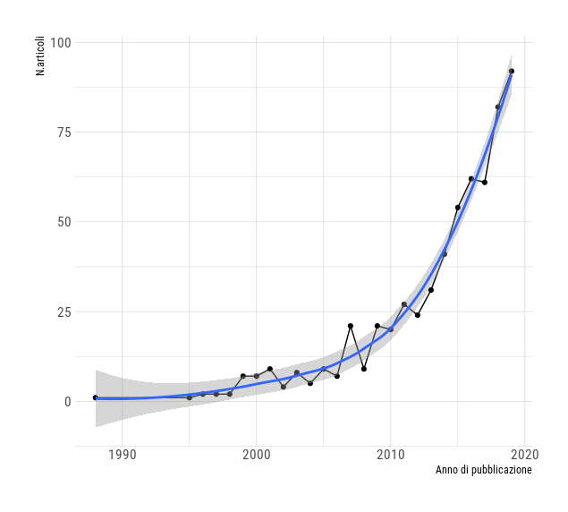
```

```{r echo=FALSE, DDST, fig.align = "center",out.width = '80%', fig.cap="DDST-Test per l'identificazione fenotipica di ceppi ESBL produttori."}
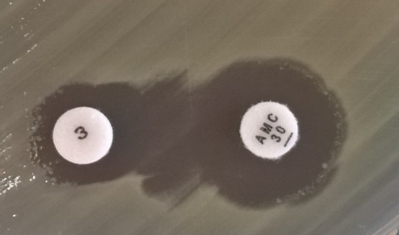
```


```{r echo=FALSE, TDT, fig.align = "center",out.width = '80%', fig.cap="TDT-Test per l'identificazione fenotipica di ceppi ESBL produttori."}
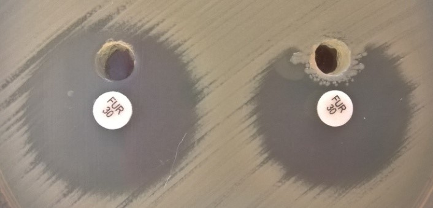
```


```{r echo=FALSE, figB, fig.align = "center",out.width = '70%', fig.cap="DAG-Direct Acyclic Graph: secondo il modello qui specificato, la probabilità di Resistenza è dipendente dalla Specie di provenienza dei campioni, dalla superificie del comune dedicata al Pascolo e dal grado di Urbanizzazione. Sia la Specie che frequenta un determinato comune  sia il Pascolo sono dipendenti dal grado di Urbanizzazione. Specie e Pascolo sono indipendenti condizionalmente al grado di Urbanizzazione."}
knitr::include_graphics("figure/dag.png")
```


```{r echo=FALSE, fig1, fig.align = "center",out.width = '80%', fig.cap="Comuni di provenienza dei campioni"}
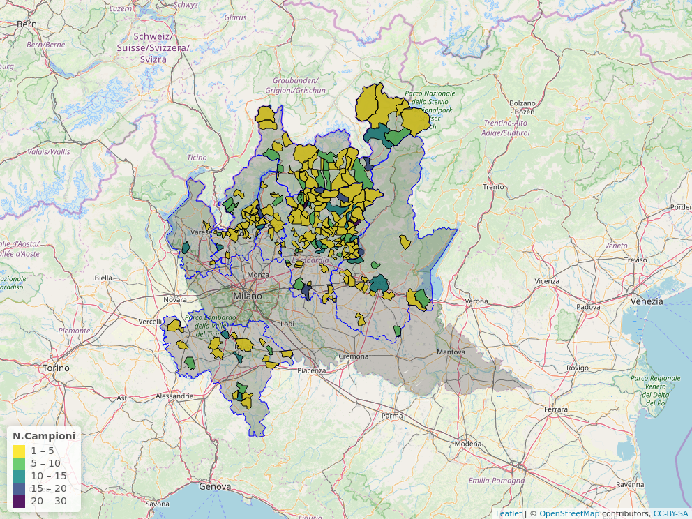
```

```{r echo=FALSE, fig2, fig.align = "center",out.width = '80%', fig.cap="Distribuzione numero di resistenze al panel di antibiotici"}
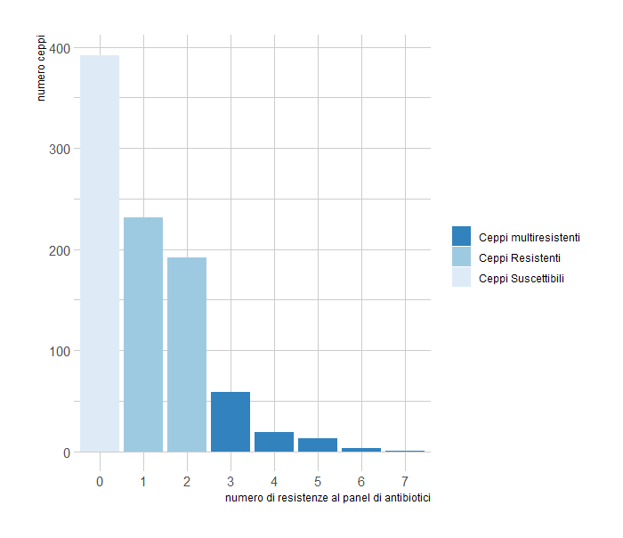
```

```{r echo=FALSE, prev, fig.align = "center",out.width = '85%', fig.cap="Distribuzione a posteriori delle stime di prevalenza di animali carrier di ceppi antibiotico-resistenti nei diversi gruppi-specie"}
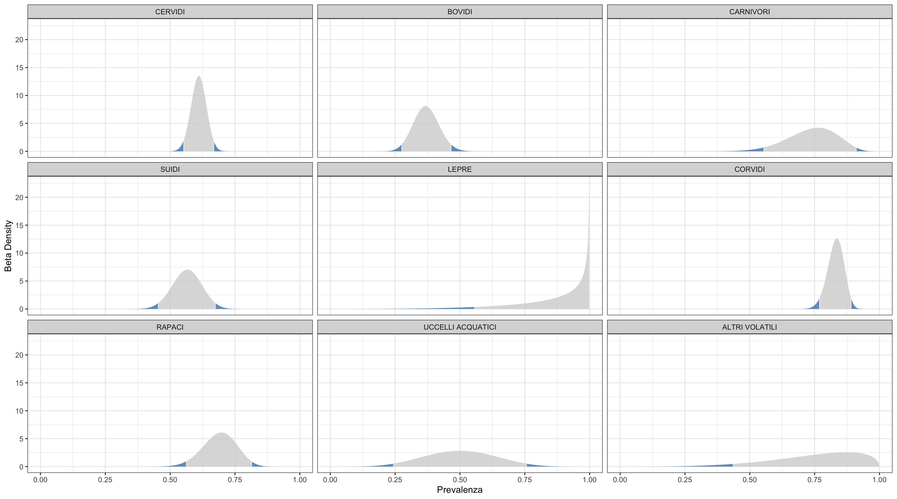
```

```{r echo=FALSE, prev2, fig.align = "center",out.width = '85%', fig.cap="Distribuzione a posteriori delle stime di prevalenza di animali carrier di ceppi multi-resistenti nei diversi gruppi-specie"}

```

```{r echo=FALSE, stimefe, fig.align = "center",out.width = '85%', fig.cap="Distribuzione a posteriori delle stime dei coefficenti di regressione del modello 2"}
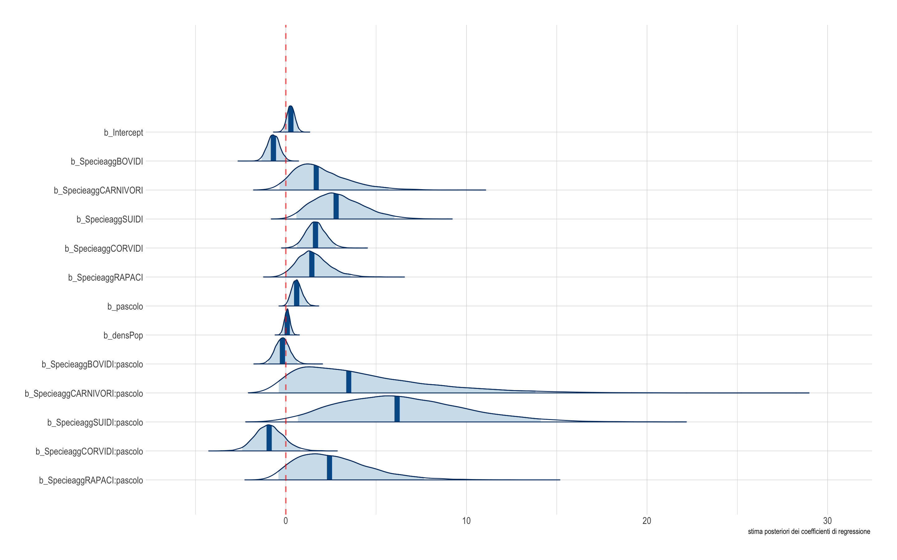
```

```{r echo=FALSE, condplot, fig.align = "center",out.width = '85%', fig.cap="Stima dell'effetto 'Superficie adibita al pascolo' sulla probabilità di un animale di essere carrier di ceppi antibiotico-resistenti, condizionalmente al gruppo-specie di appartenenza"}
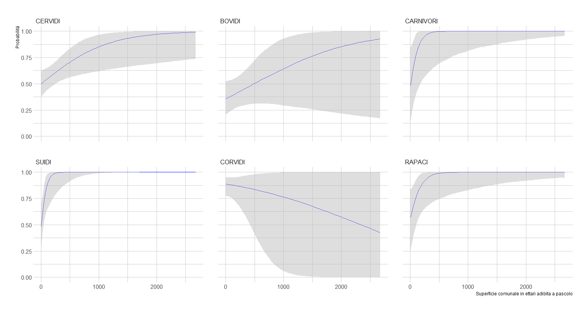
```

```{r echo=FALSE, rabplot, fig.align = "center",out.width = '85%', fig.cap="Distribuzione a posteriori delle stime di prevalenza di ceppi resistenti al panel di antibiotici nei differenti gruppi-specie"}
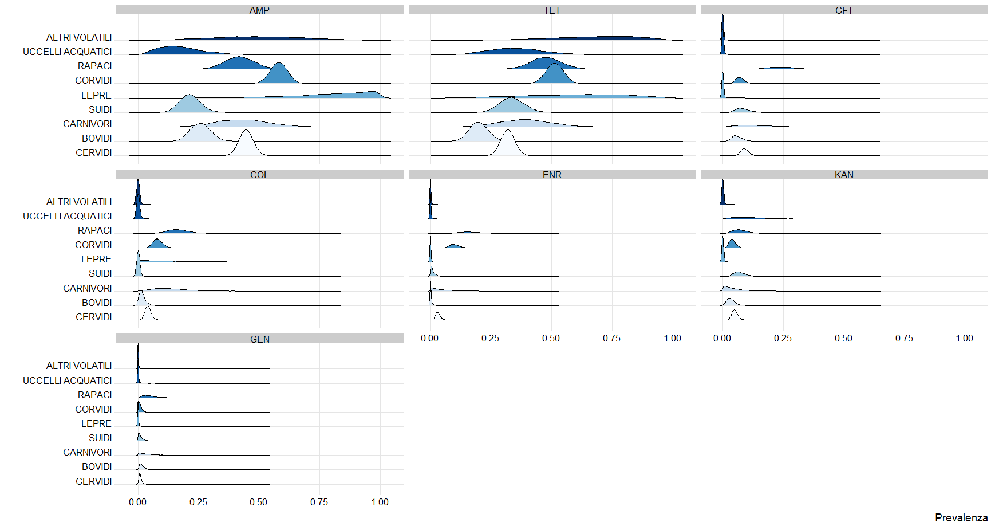
```

```{r echo=FALSE, pcores, fig.align = "center",out.width = '85%', fig.cap="Distribuzione della frequenza dei differenti profili fenotipici di resistenza"}
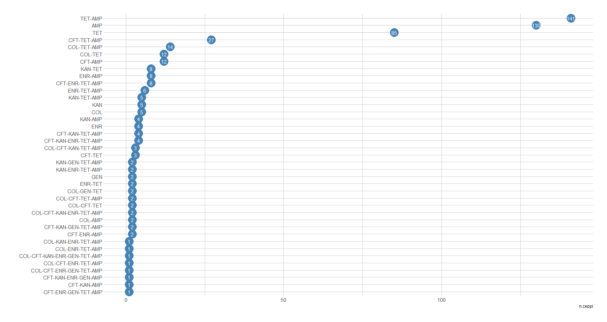
```

```{r echo=FALSE, greny, fig.align = "center",out.width = '85%', fig.cap="Distribuzione della frequenza di fenotipi di resistenza nei diversi gruppi specie"}
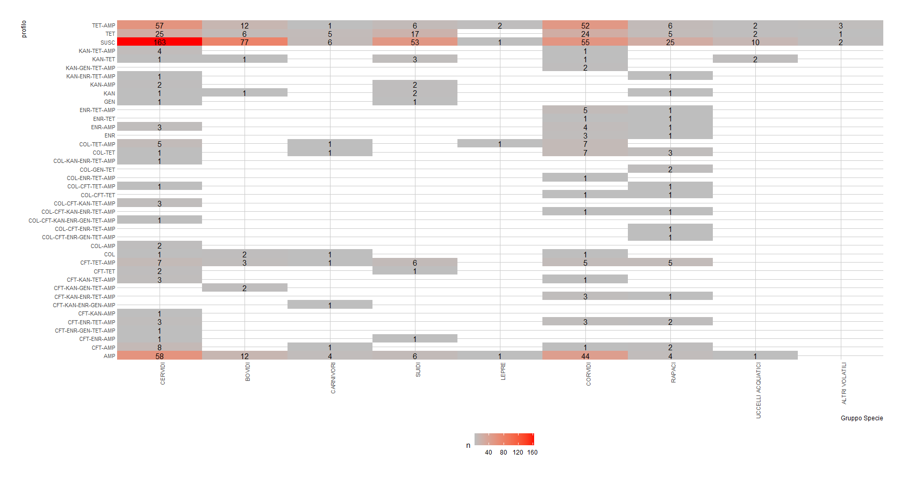
```

```{r echo=FALSE, heatmap, fig.align = "center",out.width = '85%', fig.cap="Profili di diversità dei fenotipi di ceppi resistenti nei diversi gruppi specie (Reny's entropy standardized)"}
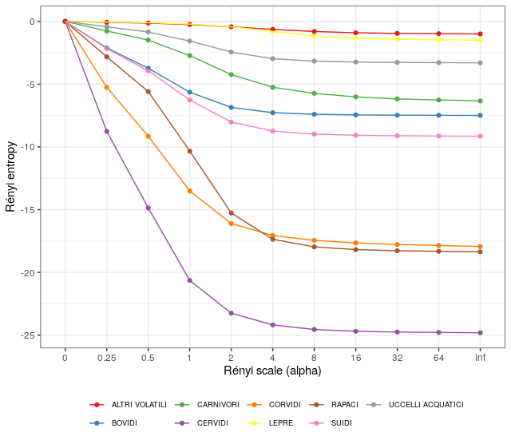
```

\newpage


**ELENCO TABELLE** 

\begin{table}[H]
\caption{\label{tab:tab1}Caratterizzazione territoriale e demografica dei comuni di provenienza dei campioni}
\centering
\begin{tabular}[t]{lrrrrrrr}
\toprule
Parametri & min & 25°perc & mediana & 75°perc & max & media & dev.st\\
\midrule
Superficie (Kmq) & 1.97 & 10.6 & 17.1 & 29.4 & 227 & 29.8 & 44.0\\
Densità di popolazione (Ab/Kmq) & 4.02 & 45.1 & 128.1 & 257.1 & 2210 & 250.0 & 356.9\\
Altitudine mediana & 48.00 & 185.0 & 600.0 & 1120.0 & 2650 & 773.8 & 684.8\\
Superficie al pascolo (ettari) & 0.09 & 11.0 & 60.0 & 170.9 & 2630 & 179.1 & 339.0\\
Aziende con pascolo & 1.00 & 3.0 & 8.0 & 16.0 & 425 & 12.6 & 20.3\\
\addlinespace
Capi al pascolo & 2.00 & 52.0 & 133.0 & 293.0 & 8429 & 307.5 & 603.1\\
\bottomrule
\end{tabular}
\end{table}


\begin{longtable}[t]{llrr}
\caption{\label{tab:tab2}Distribuzione del numero di campioni di feci in base alle differenti specie di fauna selvatica di origine, raggruppati per il gruppo-specie di appartenenza}\\
\toprule
Gruppo & SPECIE & n & prop\\
\midrule
\endfirsthead
\caption[]{Distribuzione del numero di campioni di feci in base alle differenti specie di fauna selvatica di origine, raggruppati per il gruppo-specie di appartenenza \textit{(continued)}}\\
\toprule
Gruppo & SPECIE & n & prop\\
\midrule
\endhead
\
\endfoot
\bottomrule
\endlastfoot
CERVIDI & CAPRIOLO & 191 & 28.51\\
CERVIDI & CERVO & 80 & 11.94\\
CERVIDI & DAINO & 1 & 0.15\\
\addlinespace
BOVIDI & CAMOSCIO & 46 & 6.87\\
BOVIDI & MUFLONE & 43 & 6.42\\
BOVIDI & STAMBECCO & 6 & 0.90\\
\addlinespace
CARNIVORI & TASSO & 4 & 0.60\\
CARNIVORI & VOLPE & 16 & 2.39\\
\addlinespace
SUIDI & CINGHIALE & 76 & 11.34\\
\addlinespace
LEPRE & LEPRE & 3 & 0.45\\
\addlinespace
CORVIDI & CORNACCHIA & 122 & 18.21\\
CORVIDI & GAZZA & 12 & 1.79\\
CORVIDI & GHIANDAIA & 4 & 0.60\\
\addlinespace
RAPACI & ALLOCCO & 3 & 0.45\\
RAPACI & ASSIOLO & 2 & 0.30\\
RAPACI & CIVETTA & 10 & 1.49\\
RAPACI & CIVETTA NANA & 1 & 0.15\\
RAPACI & FALCO PECCHIAIOLO & 5 & 0.75\\
RAPACI & GHEPPIO & 9 & 1.34\\
RAPACI & GUFO REALE & 4 & 0.60\\
RAPACI & NIBBIO BRUNO & 1 & 0.15\\
RAPACI & POIANA & 3 & 0.45\\
RAPACI & SPARVIERO & 11 & 1.64\\
\addlinespace
UCCELLI ACQUATICI & CIGNO REALE & 3 & 0.45\\
UCCELLI ACQUATICI & CORMORANO & 1 & 0.15\\
UCCELLI ACQUATICI & FENICOTTERO & 1 & 0.15\\
UCCELLI ACQUATICI & GABBIANO & 1 & 0.15\\
UCCELLI ACQUATICI & GABBIANO REALE & 1 & 0.15\\
UCCELLI ACQUATICI & GERMANO REALE & 5 & 0.75\\
\addlinespace
ALTRI VOLATILI & FAGIANO & 3 & 0.45\\
ALTRI VOLATILI & PICCIONE & 1 & 0.15\\
ALTRI VOLATILI & STARNA & 1 & 0.15\\
\addlinespace
Totale &  & 670 & 100.00\\*
\end{longtable}

\newpage

\begin{table}
\caption{\label{tab:tab2b}Distribuzione del numero di campioni di feci in base alle caratteristiche territoriali di provenienza per i differenti gruppo-specie di appartenenza (NM= Non Montani, P= Parzialmente Montani, T= Totalmente Montani)}
\centering
\begin{tabular}[t]{lrrrr}
\toprule
Gruppo Specie & NM & P & T & Totale\\
\midrule
CERVIDI & 3 & 5 & 248 & 256\\
BOVIDI & 0 & 4 & 88 & 92\\
CARNIVORI & 5 & 0 & 15 & 20\\
SUIDI & 3 & 1 & 68 & 72\\
LEPRE & 1 & 0 & 2 & 3\\
CORVIDI & 118 & 1 & 19 & 138\\
RAPACI & 24 & 0 & 25 & 49\\
UCCELLI ACQUATICI & 3 & 3 & 6 & 12\\
ALTRI VOLATILI & 4 & 0 & 1 & 5\\
Totale & 161 & 14 & 472 & 647\\
\bottomrule
\end{tabular}
\end{table}

\begin{table}

\caption{\label{tab:tab2c}Distribuzione del numero di campioni di feci in base al grado di urbanizzazione  dei comuni di provenienza per i differenti gruppo-specie di appartenenza (UA= Urbanizzazione Alta, UM= Urbanizzazione Media, UB= Urbanizzazione Bassa)}
\centering
\begin{tabular}[t]{lrrrr}
\toprule
Gruppo Specie & UA & UM & UB & Totale\\
\midrule
CERVIDI & 1 & 70 & 185 & 256\\
BOVIDI & 4 & 19 & 69 & 92\\
CARNIVORI & 0 & 6 & 14 & 20\\
SUIDI & 0 & 24 & 48 & 72\\
LEPRE & 0 & 1 & 2 & 3\\
\addlinespace
CORVIDI & 1 & 58 & 79 & 138\\
RAPACI & 1 & 33 & 15 & 49\\
UCCELLI ACQUATICI & 3 & 6 & 3 & 12\\
ALTRI VOLATILI & 1 & 4 & 0 & 5\\
Total & 11 & 221 & 415 & 647\\
\bottomrule
\end{tabular}
\end{table}

\begin{longtable}[t]{lrr}
\caption{\label{tab:micro}Distribuzione del numero e proporzione di ceppi della famiglia Enterobacteriacee suddivise per genere, isolati dai 670 campioni di feci analizzati}\\
\toprule
Genere & n & prop(\%)\\
\midrule
\endfirsthead
\caption[]{Distribuzione del numero e proprorzione di ceppi della famiglia Enterobacteriacee suddivise per genere, isolati dai 670 campioni di feci analizzati \textit{(continued)}}\\
\toprule
identificazione & n & prop(\%)\\
\midrule
\endhead
\
\endfoot
\bottomrule
\endlastfoot
E.coli & 615 & 67.58\\
Klebsiella & 61 & 6.70\\
Enterobacter & 56 & 6.15\\
Serratia & 40 & 4.40\\
Pantoea & 39 & 4.29\\
Hafnia & 36 & 3.96\\
Proteus & 14 & 1.54\\
Acinetobacter & 13 & 1.43\\
Citrobacter & 12 & 1.32\\
Yersinia & 7 & 0.77\\
Cronobacter & 6 & 0.66\\
Salmonella & 5 & 0.55\\
Providencia & 4 & 0.44\\
Pseudomonas & 1 & 0.11\\
Shigella & 1 & 0.11\\
\addlinespace
Total & 910 & 100.00\\*
\end{longtable}

\begin{table}
\caption{\label{tab:prevalenze}Stime della prevalenza di campioni resistenti suddivisi per gruppo-specie: R= numero di campioni resistenti, N= numero campioni esaminati, Prevalenza = media della distribuzione beta, inf-HPD= valore inferiore dell'intervallo HPD, sup-HPD = valore superiore dell'intervallo HPD}
\centering
\begin{tabular}[t]{lrrrrr}
\toprule
Gruppo Specie & R & N & Prevalenza & inf-HPD & sup-HPD\\
\midrule
LEPRE & 3 & 3 & 0.88 & 0.56 & 1.00\\
CORVIDI & 115 & 138 & 0.83 & 0.77 & 0.89\\
ALTRI VOLATILI & 4 & 5 & 0.75 & 0.44 & 1.00\\
CARNIVORI & 15 & 20 & 0.74 & 0.55 & 0.91\\
RAPACI & 34 & 49 & 0.69 & 0.56 & 0.81\\
CERVIDI & 166 & 272 & 0.61 & 0.55 & 0.67\\
SUIDI & 43 & 76 & 0.56 & 0.45 & 0.67\\
UCCELLI ACQUATICI & 6 & 12 & 0.50 & 0.24 & 0.76\\
BOVIDI & 35 & 95 & 0.37 & 0.27 & 0.47\\
\bottomrule
\end{tabular}
\end{table}

\begin{table}

\caption{\label{tab:prevalenze2}Stime della prevalenza di campioni multi-resistenti suddivisi per gruppo-specie: MR= numero di campioni resistenti, N= numero campioni esaminati, Prevalenza = media della distribuzione beta, inf-HPD= valore inferiore dell'intervallo HPD, sup-HPD = valore superiore dell'intervallo HPD}
\centering
\begin{tabular}[t]{lrrrrr}
\toprule
Specieagg & MR & N & Prevalenza & inf-HPD & sup-HPD\\
\midrule
LEPRE & 1 & 3 & 0.38 & 0.01 & 0.77\\
RAPACI & 15 & 49 & 0.31 & 0.19 & 0.44\\
CORVIDI & 29 & 138 & 0.21 & 0.15 & 0.28\\
CARNIVORI & 3 & 20 & 0.17 & 0.03 & 0.32\\
CERVIDI & 32 & 272 & 0.12 & 0.08 & 0.16\\
\addlinespace
SUIDI & 7 & 76 & 0.10 & 0.04 & 0.16\\
ALTRI VOLATILI & 0 & 5 & 0.08 & 0.00 & 0.31\\
BOVIDI & 5 & 95 & 0.06 & 0.02 & 0.10\\
UCCELLI ACQUATICI & 0 & 12 & 0.04 & 0.00 & 0.15\\
\bottomrule
\end{tabular}
\end{table}
\begin{table}


\caption{\label{tab:kfold}Confronto tra modelli mediante K-fold cross-validation}
\centering
\begin{tabular}[t]{lrrrr}
\toprule
  & elpd\_diff & se\_diff & elpd\_kfold & se\_elpd\_kfold\\
\midrule
mod2 & 0.0 & 0.0 & -354 & 13\\
mod1 & -2.3 & 5.5 & -356 & 12\\
mod3 & -17.6 & 5.2 & -371 & 15\\
\bottomrule
\end{tabular}
\end{table}

\begin{table}

\caption{\label{tab:stimefe}Stime a posteriori dei parametri a effetto fisso del modello 2}
\centering
\begin{tabular}[t]{llrrrrrrr}
\toprule
  & Parametetri & Mediana & CI\_inf& CI\_sup & PD & ROPE\_(\%) & Rhat & ESS\\
\midrule
 &Intercept & 0.28 & -0.06 & 0.63 & 0.91 & 0.31 & 1 & 9547.70\\
 \addlinespace
  & Pascolo & 0.60 & 0.16 & 1.06 & 0.99 & 0.05 & 1 & 8210.34\\
 & Urbanizzazione  & 0.08 & -0.18 & 0.32 & 0.69 & 0.70 & 1 & 9657.94\\
\addlinespace
& Bovidi & -0.69 & -1.23 & -0.16 & 0.98 & 0.06 & 1 & 14802.64\\
 & Carnivori & 1.69 & -0.39 & 4.21 & 0.94 & 0.05 & 1 & 5027.61\\
& Suidi & 2.79 & 0.71 & 5.05 & 1.00 & 0.00 & 1 & 7060.33\\
& Corvidi & 1.64 & 0.79 & 2.52 & 1.00 & 0.00 & 1 & 8092.60\\
& Rapaci & 1.44 & 0.10 & 2.90 & 0.97 & 0.03 & 1 & 6864.94\\
\addlinespace
& Bovidi*Pascolo & -0.19 & -0.84 & 0.45 & 0.68 & 0.32 & 1 & 12027.14\\
& Carnivori*Pascolo & 3.49 & -0.72 & 9.57 & 0.95 & 0.03 & 1 & 4632.93\\
& Suidi*Pascolo & 6.16 & 1.03 & 11.83 & 0.99 & 0.00 & 1 & 7132.00\\
& Corvidi*Pascolo & -0.92 & -2.21 & 0.33 & 0.87 & 0.09 & 1 & 9445.26\\
& Rapaci*Pascolo & 2.42 & -0.53 & 5.67 & 0.94 & 0.04 & 1 & 6025.29\\
\bottomrule
\end{tabular}
\end{table}

\begin{table}

\caption{\label{tab:rab}Stime bayesiane della prevalenza di ceppi resistenti ai differenti antibiotici}
\centering
\begin{tabular}[t]{lrrrrr}
\toprule
Antibiotico & R & N & Prevalenza & inf-HPD & sup-HPD\\
\midrule
AMP & 388 & 910 & 0.43 & 0.39 & 0.46\\
TET & 342 & 910 & 0.38 & 0.34 & 0.41\\
CFT & 77 & 910 & 0.09 & 0.07 & 0.10\\
COL & 49 & 910 & 0.05 & 0.04 & 0.07\\
ENR & 45 & 910 & 0.05 & 0.04 & 0.06\\
KAN & 45 & 910 & 0.05 & 0.04 & 0.06\\
GEN & 12 & 910 & 0.01 & 0.01 & 0.02\\
\bottomrule
\end{tabular}
\end{table}


\begin{table}
\caption{\label{tab:rabprof}Profilo di resistenza dei ceppi ai diversi antibiotici per gruppo-specie di provenienza del campione di feci}
\centering
\begin{tabular}[t]{lrrrrrrr}
\toprule
Specieagg & AMP & CFT & COL & ENR & GEN & KAN & TET\\
\midrule
CERVIDI & 0.45 & 0.09 & 0.04 & 0.03 & 0.01 & 0.05 & 0.32\\
BOVIDI & 0.26 & 0.06 & 0.02 & 0.00 & 0.02 & 0.03 & 0.20\\
CARNIVORI & 0.43 & 0.13 & 0.13 & 0.04 & 0.04 & 0.04 & 0.39\\
SUIDI & 0.21 & 0.08 & 0.00 & 0.01 & 0.01 & 0.07 & 0.34\\
LEPRE & 0.80 & 0.01 & 0.20 & 0.01 & 0.01 & 0.00 & 0.60\\
CORVIDI & 0.58 & 0.07 & 0.08 & 0.10 & 0.01 & 0.04 & 0.51\\
RAPACI & 0.42 & 0.24 & 0.17 & 0.16 & 0.05 & 0.07 & 0.48\\
UCCELLI ACQUATICI & 0.18 & 0.00 & 0.00 & 0.00 & 0.00 & 0.12 & 0.35\\
ALTRI VOLATILI & 0.50 & 0.00 & 0.00 & 0.00 & 0.01 & 0.01 & 0.67\\
\bottomrule
\end{tabular}
\end{table}

\begin{table}
\caption{\label{tab:profab}Profilo di antibiotico-resistenza tra i  diversi generi dei ceppi isolati}
\centering
\begin{tabular}[t]{lrrrrrrrr}
\toprule
Genere & N.ceppi & AMP & TET & CFT & COL & ENR & KAN & GEN\\
\midrule
E.coli & 615 & 32.52 & 34.96 & 9.43 & 2.93 & 4.07 & 6.50 & 1.30\\
Klebsiella & 61 & 68.85 & 22.95 & 1.64 & 0.00 & 8.20 & 0.00 & 0.00\\
Enterobacter & 56 & 87.50 & 67.86 & 0.00 & 7.14 & 5.36 & 1.79 & 1.79\\
Serratia & 40 & 72.50 & 55.00 & 7.50 & 15.00 & 7.50 & 0.00 & 2.50\\
Pantoea & 39 & 15.38 & 5.13 & 0.00 & 2.56 & 0.00 & 0.00 & 0.00\\
Hafnia & 36 & 75.00 & 61.11 & 2.78 & 0.00 & 2.78 & 2.78 & 0.00\\
Proteus & 14 & 14.29 & 100.00 & 21.43 & 100.00 & 0.00 & 7.14 & 14.29\\
Acinetobacter & 13 & 84.62 & 23.08 & 76.92 & 7.69 & 30.77 & 0.00 & 0.00\\
Citrobacter & 12 & 66.67 & 41.67 & 0.00 & 0.00 & 16.67 & 8.33 & 0.00\\
Yersinia & 7 & 42.86 & 0.00 & 0.00 & 0.00 & 0.00 & 0.00 & 0.00\\
Cronobacter & 6 & 66.67 & 16.67 & 0.00 & 0.00 & 16.67 & 0.00 & 0.00\\
Salmonella & 5 & 100.00 & 80.00 & 0.00 & 20.00 & 0.00 & 0.00 & 0.00\\
Providencia & 4 & 0.00 & 25.00 & 0.00 & 100.00 & 0.00 & 0.00 & 0.00\\
Pseudomonas & 1 & 100.00 & 100.00 & 100.00 & 0.00 & 100.00 & 100.00 & 0.00\\
Shigella & 1 & 100.00 & 0.00 & 0.00 & 0.00 & 0.00 & 0.00 & 0.00\\
\bottomrule
\end{tabular}
\end{table}


\begin{table}

\caption{\label{tab:reny}Valori di entropia di Renyi tra i diversi gruppi specie}
\centering
\begin{tabular}[t]{lrrrrrrrrrrr}
\toprule
  & 0 & 0.25 & 0.5 & 1 & 2 & 4 & 8 & 16 & 32 & 64 & Inf\\
\midrule
CERVIDI & 27 & 18.24 & 12.13 & 6.36 & 3.75 & 2.81 & 2.45 & 2.31 & 2.25 & 2.22 & 2.19\\
BOVIDI & 9 & 6.88 & 5.26 & 3.36 & 2.15 & 1.73 & 1.60 & 1.55 & 1.53 & 1.52 & 1.51\\
CARNIVORI & 10 & 9.24 & 8.51 & 7.28 & 5.76 & 4.75 & 4.27 & 3.98 & 3.82 & 3.74 & 3.67\\
SUIDI & 11 & 8.83 & 7.06 & 4.74 & 2.98 & 2.26 & 2.02 & 1.93 & 1.89 & 1.87 & 1.85\\
LEPRE & 4 & 3.95 & 3.90 & 3.79 & 3.57 & 3.20 & 2.84 & 2.66 & 2.57 & 2.54 & 2.50\\
CORVIDI & 22 & 16.75 & 12.85 & 8.49 & 5.89 & 4.94 & 4.55 & 4.35 & 4.22 & 4.14 & 4.05\\
RAPACI & 21 & 18.18 & 15.41 & 10.66 & 5.73 & 3.64 & 3.03 & 2.82 & 2.72 & 2.68 & 2.64\\
UCCELLI ACQUATICI & 5 & 4.57 & 4.16 & 3.44 & 2.56 & 2.03 & 1.83 & 1.76 & 1.73 & 1.71 & 1.70\\
ALTRI VOLATILI & 3 & 2.93 & 2.87 & 2.75 & 2.57 & 2.36 & 2.20 & 2.09 & 2.05 & 2.02 & 2.00\\
\bottomrule
\end{tabular}
\end{table}

\begin{longtable}[t]{rllllll}
\caption{\label{tab:cftres}Caratterizzazione genotipica dei geni di resistenza dei 47 ceppi resistenti a Ceftiofur}\\
\toprule
idceppo & gruppo filogenetico & CTX-M & SHV & CMY & TEM & MCR\\
\midrule
\endfirsthead
\caption[]{Caratterizzazione genotipica dei geni di resistenza dei 47 ceppi resistenti a Ceftiofur \textit{(continued)}}\\
\toprule
ID Ceppo & Gruppo filogenetico & CTX-M & SHV & CMY & TEM & MCR\\
\midrule
\endhead

\endfoot
\bottomrule
\endlastfoot
1 & A & N & N & N & N & N\\
2 & A & N & N & N & N & N\\
3 & F & N & N & N & N & N\\
4 & A & N & N & N & N & N\\
5 & F & N & N & N & N & N\\
6 & E. fergusonii & N & N & N & N & N\\
7 & A & N & N & N & P & N\\
8 & A & N & N & N & N & N\\
9 & A & N & N & N & N & N\\
10 & A & N & N & N & N & N\\
11 & F & N & N & N & N & N\\
12 & E. fergusonii & N & P & N & N & N\\
13 & A & N & N & N & N & N\\
14 & D & N & N & N & N & N\\
15 & A & N & N & N & N & N\\
16 & E. fergusonii & N & N & N & N & N\\
17 & A & N & N & N & N & N\\
18 & A & N & N & N & N & N\\
19 & A & N & N & N & N & N\\
20 & A & N & N & N & P & N\\
21 & A & N & N & N & N & N\\
22 & F & N & N & N & N & N\\
23 & A & N & N & N & N & N\\
24 & A & N & N & N & N & N\\
25 & F & N & N & N & N & N\\
26 & F & N & N & N & N & N\\
27 & E. fergusonii & N & N & N & N & N\\
28 & F & N & N & N & N & N\\
29 & A & N & N & N & N & N\\
30 & A & N & N & N & P & N\\
31 & A & N & N & N & N & N\\
32 & A & N & N & N & N & N\\
33 & A & N & N & N & N & N\\
34 & F & N & N & N & N & N\\
35 & A & N & N & N & N & N\\
36 & E. fergusonii & N & N & N & N & N\\
37 & A & N & N & N & N & N\\
38 & A & N & P & N & N & N\\
39 & A & N & N & N & N & N\\
40 & B1 & N & N & N & P & N\\
41 & A & N & N & N & N & N\\
43 & A & N & N & N & N & N\\
44 & A & N & N & N & N & N\\
45 & E & N & N & N & N & N\\
46 & A & N & N & N & N & N\\
47 & E. fergusonii & N & N & N & N & N\\
48 & E. fergusonii & N & N & N & N & N\\*
\end{longtable}

\newpage

# Bibliografia

<div id="refs"></div>

\newpage

# Allegato 

**Analisi metagenomiche (Responsabile scientifico Dr. Stefano Pongolini- U.O.2)**

**Materiali e metodi**
I pool di isolati sui quali sono state applicate tecniche di metagenomica shotgun sono stati allestiti in modo da valutare eventuali differenze nel corredo di geni di antibioresistenza in _Escerichia coli_ tra gruppi-specie di ospiti differenti e, all’interno dello stesso gruppo-specie , tra aree differenti corrispondenti alle province di Bergamo e Sondrio e a livelli altitudinali differenti all’interno della stessa provincia. In particolare, gli isolati di _Escherichia coli_ ottenuti  da campioni di feci di CERVIDI nella provincia di Bergamo sono stati divisi in tre pool corrispondenti alle prealpi bergamasche (Pool 1), la Val Brembana (Pool 2) e le Valli Seriana e Borlezza (Pool 3). Gli isolati di _Escherichia coli_  da feci di CERVIDI nella provincia di Sondrio sono stati divisi in due pool corrispondenti alla media valle (Pool 4) e l’alta valle (Pool 5). I pool per gli isolati di _Escherichia coli_ da feci da altri gruppi di ospiti sono stati suddivisi tra SUIDI (Pool 6), CORVIDI (Pool 7), BOVIDI (Pool 8) e RAPACI (Pool 9).

In aggiunta ai pool già descritti per valutare i profili di geni di resistenza in _Escherichia coli_ nei selvatici è stato inserito un ulteriore pool (Pool 10) per ricercare i geni di resistenza in _Klebsiella pneumoniae_ in considerazione della particolare importanza nella clinica umana e nelle problematiche di antibiotico-resistenza nosocomiali.  Quest’ultimo pool è composto da isolati ottenuti da feci di  CORVIDI (13 isolati), RAPACI (4 isolati), CERVIDI (2 isolati) e LEPRI (1 isolato).

Il numero massimo di isolati per pool è stato scelto sulla base di prove preliminari con un ceppo a resistenze note in cui si è valutata la quantità di dato necessaria per avere una buona copertura dei geni di antibiotico resistenza (>10x), soglia al di sopra della quale il centro di referenza europeo per l’antibiotico resistenza  del DTU riporta di poter rintracciare con buona confidenza tutti i geni di resistenza presenti (Valeria Bertolaia, comunicazione personale).

\begin{table}[H]
\caption*{Tabella 1: Composizione dei pool di ceppi utilizzati per l'analisi metagenomica}
\centering
\begin{tabular}[t]{rllr}
\toprule
POOL & Specie animale origine & Specie batterica isolata & n.isolati\\
\midrule
1 & CERVIDI & Escherichia coli & 50\\
2 & CERVIDI & Escherichia coli & 50\\
3 & CERVIDI & Escherichia coli & 31\\
4 & CERVIDI & Escherichia coli & 50\\
5 & CERVIDI & Escherichia coli & 35\\
\addlinespace
6 & SUIDI & Escherichia coli & 50\\
7 & CORVIDI & Escherichia coli & 50\\
8 & BOVIDI & Escherichia coli & 50\\
9 & RAPACI & Escherichia coli & 50\\
10 & CERVIDI, RAPACI, CORVIDI, LEPRE & Klebsiella  pneumoniae & 20\\
\bottomrule
\end{tabular}
\end{table}


I pool degli isolati selezionati sono stati preparati come indicato nei punti sottostanti:

  1. preincubazione dei singoli isolati in 3 ml di terreno liquido BHI (Brain Heart Infusion) overnight come verifica di sterilità;

  2. dopo 24h, allestimento delle brodo colture per l’estrazione del DNA in 3 ml di terreno liquido BHI (Brain Heart Infusion) overnight; 
  
  3. dopo 24h  e non oltre, sono stati prelevati 100 $\mu$L di brodocoltura per ciascun isolato e inseriti nella provetta di pool  prelevando solo le brodocolture normalmente sviluppate (fase stazionaria), per evitare di  alterare il bilanciamento del pool nel caso di crescita non adeguate; 

  4. miscelamento accurato del pool mediante vortex e trasferimento del pool al laboratorio di sequenziamento in giornata per evitare degradazione del materiale e risultati non affidabili. 

**Sequenziamento genomico**

Il DNA genomico è stato estratto mediante il kit DNeasy Blood & Tissue Kit (Qiagen) a partire da 1 ml di brodocoltura di ciascun pool di isolati seguendo il protocollo della ditta produttrice per l’estrazione del DNA genomico di batteri gram negativi.

Il DNA estratto è stato quantificato mediante sistema fluorimetrico Quantus (Promega), mentre la purezza del DNA è stata valutata mediante sistema spettrofotometrico Synergy (Biotek) considerando processabili i DNA dei pool con rapporto dell'assorbanza a 260 e 280 nm (A 260/280) compreso tra 1.8 e 2.2.

Partendo dal DNA estratto sono state preparate librerie genomiche utilizzando il kit Nextera XT Flex DNA e le librerie preparate sono state corse mediante sistema Miseq (Illumina) con cartuccia MiSeq Reagent Kit v2 (500 cycles) per la generazione di paired-end 2x250bp reads.

Le reads grezze prodotte dal sequenziatore sono state valutate sulla base di criteri di qualità della sequenza mediante FastQC (http://www.bioinformatics.babraham.ac.uk/projects/fastqc/). Le reads sono state successivamente filtrate per qualità (rimozione di basi iniziali e finali con PHRED <20 considerando finestre di basi di 20 nt con PHRED medio <20) e lunghezza (reads con lunghezza > 50 bp) mediante il software Trimmomatic (Bolger A. et al, 2014)


Le reads filtrate sono state poi utilizzate come input per l’individuazione di geni conferenti antibiotico resistenza utilizzando il database Resfinder ver. 4.0 (Bortolaia V. et al.2020) usando i parametri di default (80% di identità su 60% di lunghezza di un gene target). Tra gli output dell’analisi sono stati considerati e comparati i geni presenti in ciascun pool di campioni associati alle principali classi di antibiotici (Amminoglicosidi, Beta lattamici, Colistina, Fluorochinoloni, Fosfomicina, Acido Fusico, Glicopeptidi, Macrolidi, Lincosamina, Streptomicina A, Nitroimidazolo, Fenicolo, Oxazolidinone, Rifampicina, Sulfonamide, Tetraciclina, Trimetoprim) ed i profili di resistenza in-silico per gli antibiotici considerati.


**Risultati**

**Estrazione del DNA genomico**

Il DNA genomico dei 10 pool analizzati è stato estratto con rese non elevate ma sufficienti per la preparazione delle librerie genomiche (tabella 2). La purezza del DNA è risultata adeguata in tutti i campioni tranne che nel campione n. 11  che perciò non è risultato processabile.

\begin{table}[H]
\caption*{Tabella 2: Elenco dei pool analizzati e relative quantità di DNA genomico estratto.}
\centering
\begin{tabular}[t]{rrr}
\toprule
POOL & Quantificazione (ng/ul) & Rapporto 260/280\\
\midrule
1 & 19.0 & 2.15\\
2 & 12.0 & 2.10\\
3 & 15.0 & 2.13\\
4 & 14.0 & 2.16\\
5 & 7.3 & 2.13\\
6 & 24.0 & 2.19\\
7 & 46.0 & 2.18\\
8 & 13.0 & 2.19\\
9 & 14.0 & 2.18\\
10 & 12.0 & 2.16\\
11 & 6.4 & 3.14\\
\bottomrule
\end{tabular}
\end{table}

**SEQUENZIAMENTO GENOMICO: Preparazione del DNA genomico, delle librerie genomiche, reazione di sequenziamento ed analisi bioinformatiche**

La corsa di sequenziamento in Miseq dei pool di isolati selezionati hanno generato le quantità di dato indicate in tabella 3. La quantità di dato per ogni pool è accettabile poiché produce un coverage medio per isolato >10, soglia al di sopra della quale si è dimostrato di poter rintracciare tutti i geni AMR presenti grazie a prove preliminari a diverse profondità con un ceppo a resistenze note e ad un confronto con gli esperti AMR del DTU (centro di referenza europeo per l’antibiotico resistenza); rimane tuttavia un piccolo sbilanciamento del coverage di alcuni pool che risultano a basso coverage (pool n.7 e 9) mentre altri hanno coverage più elevati (35-36X, pool n. 5 e 6). Il coverage medio delle corse risulta essere di 28X. Tale copertura di sequenziamento e la bontà della qualità dei dati genomici valutata con FastQC ha permesso l’identificazione dei geni di antibiotico-resistenza con sufficiente profondità e precisione.

\begin{table}[H]
\caption*{Tabella 3: Numero di reads e coverage per ciascun pool sequenziato.}
\centering
\begin{tabular}[t]{rrrrrr}
\toprule
POOL & N.isolati & R1 & R2 & R3 & Cov\\
\midrule
1 & 50 & 28336544 & 27250964 & 545019 & 27\\
2 & 50 & 26719066 & 25451148 & 509023 & 25\\
3 & 31 & 22532802 & 21984142 & 709166 & 35\\
4 & 49 & 29934864 & 28806258 & 587883 & 29\\
5 & 35 & 27035084 & 24895484 & 711300 & 36\\
6 & 47 & 33658626 & 32615470 & 693946 & 35\\
7 & 45 & 14550964 & 13832892 & 307398 & 15\\
8 & 49 & 29133736 & 28498164 & 581595 & 29\\
9 & 47 & 15552662 & 13859472 & 294882 & 15\\
10 & 20 & 13250594 & 12846328 & 642316 & 32\\
\bottomrule
\multicolumn{6}{l}{\rule{0pt}{1em}\textsuperscript{R1} N.totali reads}\\
\multicolumn{6}{l}{\rule{0pt}{1em}\textsuperscript{R2} N.totali reads filtrate (bp)}\\
\multicolumn{6}{l}{\rule{0pt}{1em}\textsuperscript{R3} N.reads totali filtrate/isolato (bp)}\\
\multicolumn{6}{l}{\rule{0pt}{1em}\textsuperscript{Cov} Coverage medio/isolato (X)}\\
\end{tabular}
\end{table}

Dal momento che nelle analisi non è possibile associare un profilo di resistenza/sensibilità ad un antibiotico per un singolo isolato dato che si tratta di una valutazione di un pool di isolati è stata considerata la presenza/assenza in-silico di geni AMR per gli antibiotici considerati in ciascun pool di isolati. Tale valutazione qualitativa è stata effettuata partendo dal dettaglio di identificazione dei singoli geni AMR individuati (fig 1)

```{r echo=FALSE, fig.align = "center",out.width = '90%'}
knitr::include_graphics("figure/allfig1.png")
```

mentre una valutazione quantitativa è stata effettuata sul n. di geni AMR totali presenti in ciascun pool e per ciascun antibiomicrobico (fig.2)

```{r echo=FALSE, fig.align = "center",out.width = '90%'}
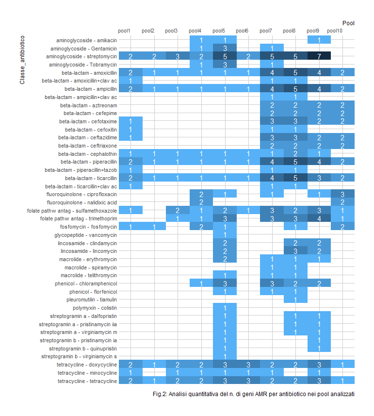
```

e per ciascuna classe di antimicrobici (fig.3)

```{r echo=FALSE, fig.align = "center",out.width = '90%'}
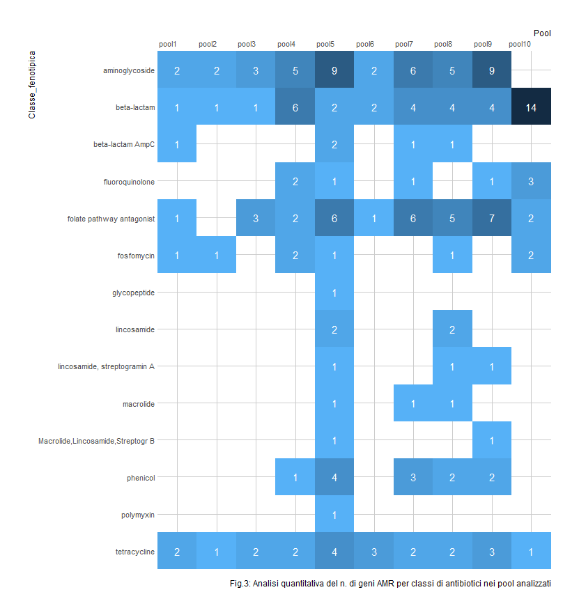
```

Il test di correlazione per ranghi di Kendall tra la frazione di isolati in ogni pool risultati resistenti a un dato antimicrobico nello screening fenotipico e il numero di geni AMR associati allo stesso antimicrobico trovati nel pool tramite analisi metagenomica è risultato molto significativo ($\tau$ = 0.65; p-value = $6*10^{-9}$). Tale risultato suggerisce che l’analisi metagenomica shotgun effettuata sui pool abbia risoluzione sufficiente per individuare i geni ARM presenti negli isolati e responsabili dei fenotipi osservati.I pool di E. coli (POOL 1-9) mostrano tutti la presenza di geni con resistenze a aminoglyoside, beta-lactamici e tetraciclina. Non sono stati trovati geni AMR appartenenti alle classi: oxazolidinone, steroidi antibatterici e psudomonic acid. Nel pool di K. Pneumoniae (POOL 10) si può notare invece l’elevata presenza di geni legati alla resistenza ai beta-lactamici. Nel POOL 5 è stato individuato anche un gene di resistenza alla colistina della classe mcr (mcr-9).
L’analisi metagenomica ha inoltre permesso di evidenziare differenze geografiche nel corredo di geni AMR presenti in E. coli prelevati in cervidi. In particolare, è stato possibile osservare per tutte le classi fenotipiche un maggior numero di geni AMR negli isolati della provincia di Sondrio rispetto alla provincia di Bergamo. 


```{r echo=FALSE, fig.align = "center",out.width = '90%'}
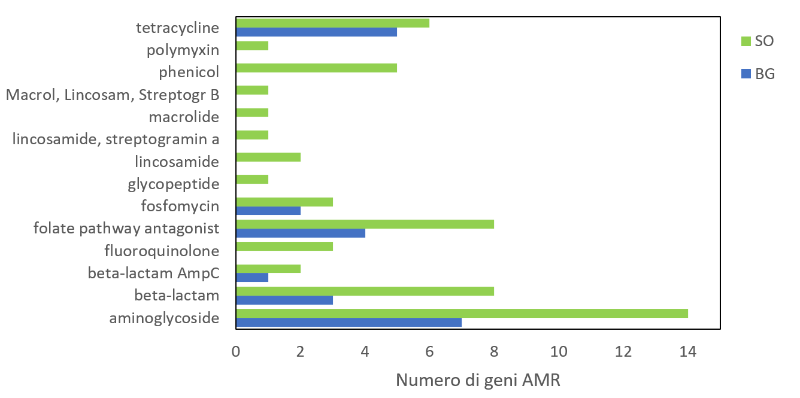
```

Anche all’interno dei pool prelevati nelle singole province di Bergamo e Sondrio sembrano emergere pattern differenti di AMR in funzione dell’altitudine di prelievo. In particolare, i pool prelevati da animali che vivono ad altitudini maggiori mostrano generalmente una maggiore presenza di geni AMR in tutte le classi fenotipiche. 


```{r echo=FALSE, fig.align = "center",out.width = '90%'}
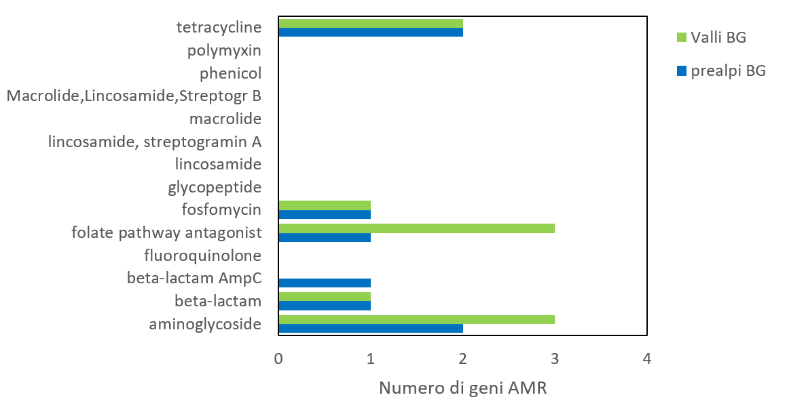
```


```{r echo=FALSE, fig.align = "center",out.width = '90%'}
knitr::include_graphics("figure/allfig6.PNG")
```


**Discussione**
L’analisi metagenomica shotgun mostra una buona corrispondenza con il dato fenotipico (Kendall-tau = 0.65; p-value = 6*10-9). Questo mostra che la metodologia è sufficientemente robusta per individuare con buona confidenza i geni AMR che conferiscono resistenze anche su pool di isolati. 

L’analisi dei pool prelevati a diverse altitudini e in diverse province su E. coli isolati in cervidi sembrano mostrare un aumento della presenza di geni AMR con l’altitudine. Tale risultato deve essere però confermato attraverso una più completa analisi quantitativa della presenza di reads AMR nei diversi pool. 


**Bibliografia**
Anthony M. Bolger, Marc Lohse, Bjoern Usadel, Trimmomatic: a flexible trimmer for Illumina sequence data, Bioinformatics, Volume 30, Issue 15, 1 August 2014, Pages 2114–2120, 

Bortolaia V, Kaas RS, Ruppe E, Roberts MC, Schwarz S, Cattoir V, Philippon A, Allesoe RL, Rebelo AR, Florensa AF, Fagelhauer L, Chakraborty T, Neumann B, Werner G, Bender JK, Stingl K, Nguyen M, Coppens J, Xavier BB, Malhotra-Kumar S, Westh H, Pinholt M, Anjum MF, Duggett NA, Kempf I, Nykäsenoja S, Olkkola S, Wieczorek K, Amaro A, Clemente L, Mossong J, Losch S, Ragimbeau C, Lund O, Aarestrup FM. ResFinder 4.0 for predictions of phenotypes from genotypes. J Antimicrob Chemother. 2020 Aug 11:dkaa345. doi: 10.1093/jac/dkaa345. Epub ahead of print. PMID: 32780112.
