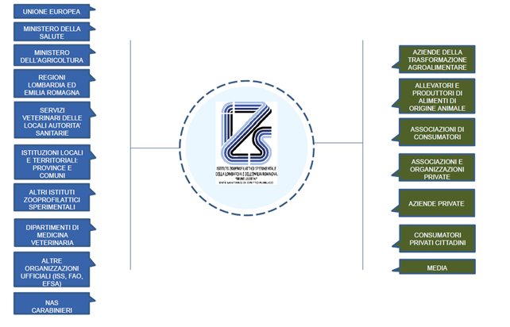

\newcommand*\NewPage{\newpage\null\thispagestyle{empty}\newpage\thispagestyle{empty}}

\newpage

```{r child='frontespizio.Rmd'}
```

<!-- \newpage -->
<!-- \pagenumbering{Roman} -->

<!-- ```{r child='sintesi.rmd'} -->
<!-- ``` -->

```{r eval=FALSE, include=FALSE}
library(tidyverse)
library(readxl)
library(here)
library(kableExtra)

```

\newpage
\tableofcontents


\newpage


# PREMESSA {-}
La Relazione sulla Performance, informata ai principi dell’art. 13, comma 6, lettera b), del D Lgs n.150/2009 e all’art.10, comma 1, lettera b) dello stesso decreto, evidenzia a consuntivo con riferimento all’anno 2020, i risultati organizzativi e individuali raggiunti rispetto agli obiettivi programmati con rilevazione degli eventuali scostamenti.
Il documento chiude il Ciclo di Gestione della Performance avviato con l’approvazione del “Piano della Performance 2020-2022” con deliberazione del Consiglio di Amministrazione n. 2 del 24.02.2020.
La logica sottesa è quella di rendere edotti i diversi portatori di interesse (stakeholders) sui risultati attesi ed alle modalità con cui quei risultati sono stati raggiunti.
 In riferimento alle finalità sopra descritte, si è impostata la Relazione in modo snello e comprensibile raccogliendo le informazioni di maggior interesse ed ispirandosi ai principi di trasparenza, immediata intelligibilità, veridicità e verificabilità dei contenuti, partecipazione e coerenza interna ed esterna.
La presente Relazione della Performance è stata sottoposta alla validazione del Nucleo di Valutazione delle Prestazioni e pubblicata nella sezione «Amministrazione trasparente» del sito internet dell’Istituto, nella sotto sezione “Performance”.


\newpage
# Informazioni d'interesse per i cittadini e gli altri stakeholders esterni

## Gli stakeholders dell'IZSLER
Molteplici sono i soggetti portatori di interesse o stakeholders che hanno correlazioni di diversa natura con l’Istituto. Da quelli che detengono un rapporto diretto, clienti, fornitori, cittadini, a tutti gli attori le cui azioni possono direttamente o indirettamente influenzare le scelte attuate o da porre in essere (collettività, Pubblica Amministrazione, istituzioni pubbliche ecc.)

```{r echo=FALSE, fig.align = "center",out.width = '90%', }

```

\newpage

## Analisi del contesto di riferimento
L’ analisi del contesto di riferimento ci offre la possibilità di valutare i dati qualitativi e quantitativi che caratterizzano gli ambiti di riferimento dell’Istituto, con l’obiettivo di fornire informazioni rilevanti per gli stakeholders, per l’interpretazione dei risultati raggiunti presentati nelle pagine successive.

### Il contesto esterno di riferimento: contesto europeo ed internazionale
Gli Istituti Zooprofilattici costituiscono una struttura sanitaria integrata, unica in Europa, in grado di assicurare una rete di servizi per verificare la salubrità degli alimenti e dell’ambiente, per la salvaguardia della salute dell’uomo. La funzione di raccordo e coordinamento delle attività degli II.ZZ.SS. è svolta dalla Direzione Generale della sicurezza degli alimenti e della nutrizione del Ministero della Salute che ne definisce, mediante il lavoro della Commissione Scientifica Nazionale, le Linee guida e le tematiche principali. 
La rete degli II.ZZ.SS. ben si integra e si riconosce con il valore internazionale “ONE HEALTH” basato su collaborazioni intersettoriali e formalmente riconosciuto dalla Commissione Europea, OMS, FAO, OIE, istituti di ricerca, ONG e a molti altri. Questo approccio riconosce che la salute delle persone, degli animali e degli ecosistemi sono interconnesse, promuovendo una metodologia intersettoriale, e multidisciplinare, in grado di affrontare i rischi potenziali o già esistenti che hanno origine dall’interfaccia tra ambiente, animali e uomo.

### Il contesto nazionale
Gli Istituti Zooprofilattici Sperimentali (II.ZZ.SS.) costituiscono una rete di eccellenza sul territorio nazionale in grado di operare di concerto con il Ministero della Salute a stretto contatto con i Servizi Veterinari Regionali e delle ASL.
Assicurano al Servizio Sanitario Nazionale attività diagnostica di campo e di laboratorio, di sorveglianza epidemiologica, di ricerca e formazione, delle zoonosi, del benessere animale e della sicurezza alimentare, nel rispetto degli standard di qualità e di prevenzione stabiliti dall’Unione Europea. Gli II.ZZ.SS. con le loro 10 sedi centrali dislocate sul territorio nazionale e le 90 sezioni diagnostiche periferiche, sono sottoposti alla vigilanza del Ministero della Salute.

### IL contesto Regionale: Lombardia e Emilia Romagna

L’IZSLER ha sede legale a Brescia e si avvale di 17 sedi territoriali situate nelle regioni Lombardia (Brescia, Bergamo, Mantova, Cremona, Sondrio, Binago (VA), Milano, Pavia e Lodi) ed Emilia-Romagna (Bologna, Piacenza, Parma, Reggio nell’Emilia, Modena, Forlì, Ravenna e Ferrara), che curano e gestiscono i contatti con le realtà territoriali, interessando un’area di circa 46.000 kmq in cui risiedono oltre 14 milioni di abitanti.  I dati di seguito riportati, aggiornati al 31/12/2019 (ISTAT), forniscono un quadro delle dimensioni delle regioni di competenza dell’IZSLER. 

\begin{table}[H]
\begin{tabular}{|c|c|c|c|c|c|}
\hline
\textbf{Regione} & \textbf{Popolazione} & \textbf{Superficie (km²)} & \textbf{Densità (ab/km²)} & \textbf{Comuni} & \textbf{Province} \\ \hline
Lombardia        & 10103969             & 23863,65                  & 423,4                     & 1506            & 12                 \\ \hline
Emilia-Romagna   & 4467118              & 22452,78                  & 198,96                    & 328             & 9                  \\ \hline
\end{tabular}

\end{table}


La **Regione Lombardia** può considerarsi come la “locomotiva d’Italia” essendo la Regione più ricca e popolosa del Paese, nonché una delle aree più industrializzate dell’intero panorama europeo.
 La situazione economica della Regione, come emerso da un recente report della Banca d’Italia, ha risentito pesantemente degli effetti dell’epidemia da COVID-19 che ha colpito l’intera popolazione mondiale nel corso del 2020 e delle restrizioni delle attività disposte dai decreti governativi per contenere la diffusione del contagio. In particolare, secondo le stime basate sull'indicatore trimestrale dell'economia regionale (ITER) della Banca d'Italia, in Lombardia il prodotto interno lordo sarebbe diminuito di circa il 12% nei primi sei mesi del 2020. Il recupero registrato nel terzo trimestre delle componenti del fondo dell’economia regionale non ha compensato i cali della prima parte dell'anno e l'attività economica è rimasta su livelli significativamente inferiori a quelli precedenti alla crisi sanitaria. Nell'industria, la produzione manifatturiera, secondo i dati di Union camere Lombardia, è diminuita in misura marcata nel primo semestre dell'anno, con un calo più accentuato nel secondo trimestre, per poi tornare leggermente a crescere nel corso del terzo trimestre, anche se in riduzione rispetto allo stesso periodo del 2019 (-5,2%). Nei servizi, il fatturato delle imprese del commercio al dettaglio si è ridotto del 7,3% nei primi nove mesi dell’anno rispetto ai dati dello stesso periodo del 2019. L’impatto della pandemia è stato più contenuto nei servizi alle imprese (-8,5% nel primo semestre dell’anno), mentre più intenso per i trasporti (-15,1%) e molto marcato nei settori della ristorazione e dell’alloggio (-34,5%)3. Il settore dell’agricoltura lombarda risulta il meno penalizzato dagli effetti negativi della crisi sanitaria da COVID-19, nonostante la diminuzione del valore aggiunto dell’agricoltura (-4,9%) nei primi 6 mesi dell’anno, dopo un 2019 positivo. Per quanto riguarda gli scambi con l’estero, nel primo semestre del 2020 le esportazioni lombarde di beni hanno subito una forte contrazione rispetto al medesimo periodo del 2019 (-15,9%) e lo stesso dicasi per le importazioni. La crisi sanitaria legata all’epidemia da COVID-19 ha determinato nel corso del 2020 un progressivo peggioramento delle condizioni del mercato del lavoro. Dopo essere stati sostanzialmente invariati durante il primo trimestre dell’anno, gli occupati sono diminuiti in maniera significativa nel secondo trimestre (-1,3%) rispetto allo stato periodo del 2019, soprattutto tra i lavoratori autonomi e tra i dipendenti con contratti diversi dal tempo indeterminato.

La **Regione Emilia-Romagna** rappresenta, nel panorama italiano, una delle più estese dal punto di vista territoriale, nonché più popolose ed è una delle Regioni con il più alto livello di competitività imprenditoriale, grazie ad un sistema economico e produttivo focalizzato sui mercati internazionali.
La crisi innescata dalla pandemia da COVID-19 ha colpito anche l’economica delle Regione Emilia, già in recessione dal 2019, soprattutto nei primi due trimestri dell’anno, come evidenziato dall’indicatore trimestrale dell’economia regionale (ITER) elaborato dalla Banca d’Italia. La riduzione della produzione industriale della Regione (-14,9% nella prima metà del 2020 rispetto al medesimo periodo del 20196), ha riguardato tutti i settori della manifattura. In tale contesto solo le imprese farmaceutiche e alimentari hanno registrato una dinamica migliore. Nel settore dei servizi si registra un calo generalizzato delle attività. Nel terziario, la diminuzione dei volumi di attività è stata più evidente per il commercio dei beni non alimentari, soprattutto al dettaglio, e per i servizi di alloggio. Tra gennaio e settembre anche le esportazioni di merci sono diminuite significativamente (- 14,2%), soprattutto nell’ambito della meccanica, dei mezzi di trasporto, dell’abbigliamento e dei prodotti di metallo. Dopo una prolungata fese espansiva in atto dal 2014, anche il tasso di occupazione si è ridotto, soprattutto nel secondo trimetre dell’anno (-69,1%), interessando principalmente la componente femminile e quella a tempo determinato.
Di seguito sono riportati alcuni dati significativi a rappresentare il patrimonio zootecnico e le aziende che operano nel territorio di competenza dell’Istituto.

\begin{center}
\begin{table}[H]
\begin{tabular}{|l|c|c|l|l|c|c|}
\cline{1-3} \cline{5-7}
\multicolumn{3}{|c|}{\textbf{Lombardia}}                                                               &  & \multicolumn{3}{c|}{\textbf{Emilia-Romagna}}                                    \\ \cline{1-3} \cline{5-7} 
\textbf{Specie}   & \multicolumn{1}{l|}{\textbf{N.Allevamenti}} & \multicolumn{1}{l|}{\textbf{N.Capi}} &  & \multicolumn{1}{c|}{\textbf{Specie}} & \textbf{N.Allevamenti} & \textbf{N.Capi} \\ \cline{1-3} \cline{5-7} 
Bovini e bufalini & 15446                                       & 1543959                              &  & Bovini e bufalini                    & 6448                   & 572512          \\ \cline{1-3} \cline{5-7} 
Ovini e caprini   & 13130                                       & 209308                               &  & Ovini e caprini                      & 3342                   & 71487           \\ \cline{1-3} \cline{5-7} 
Suini             & 8382                                        & 4407955                              &  & Suini                                & 3779                   & 1126379         \\ \cline{1-3} \cline{5-7} 
Avicoli           & 3427                                        & 21180545                             &  & Avicoli                              & 1170                   & 41729415        \\ \cline{1-3} \cline{5-7} 
Equidi            & 20605                                       & 61085                                &  & Equidi                               & 10744                  & 35000*          \\ \cline{1-3} \cline{5-7} 
\end{tabular}
\tiny Fonte Banca Dati Nazionale dell’Anagrafe Zootecnica (BDN) per bovini, ovini, caprini e suini – BDR per avicoli ed equini al 31/12/2020  \\
*ultima stima disponibile al 2018, dato non più presente in banca dati nazionale.

\end{table}
\end{center}

Le Regioni Lombardia ed Emilia-Romagna trattano più del 50% del latte italiano (300 caseifici in Emilia-Romagna e 167 in Lombardia) e oltre il 30 % delle carni italiane con 150 impianti di macellazione in Emilia-Romagna e 1243 in Lombardia.


# L'Amministrazione

## Un po' di storia: Che cosa è l’Istituto Zooprofilattico Sperimentale della Lombardia ed Emilia Romagna (IZSLER)

_Ente Sanitario di Diritto Pubblico_, nato nel 1921, _svolge attività di supporto tecnico-scientifico in materia di salute e tutela animale, sicurezza alimentare, salute e integrità dell’ambiente attraverso attività analitiche, attività di analisi del rischio e di ricerca specialistica_ La rete di relazioni di IZSLER si colloca primariamente nel tessuto sociale ed economico delle Regioni Lombardia ed Emilia-Romagna, ma si estende a livello nazionale con le attività istituzionali connesse con il Ministero della Salute e l’opera dei Centri di Referenza Nazionali, nonché a livello internazionale la collaborazione costante con organizzazioni come OIE, EFSA e FAO
_L’interconnessione tra salute umana e animale_ oltre gli animali da compagnia e di allevamento e si estende alla salute degli animali selvatici, della biosfera e degli ecosistemi in essa presenti trova nelle molteplici competenze di IZSLER nel settore sicurezza alimentare e sanità pubblica la possibilità di contribuire, come testimoniato dalla situazione attuale, a creare _sinergie utili per affrontare le emergenze riguardanti la salute dell’uomo e degli animali e le emergenze ambientali sviluppando collaborazioni e punti di incontro tra salute umana e veterinaria_, e favorendo la connessione dei diversi attori della salute pubblica applicando l’approccio “One Health”. 

## IZSLER oggi: organi, funzioni e settori di competenza 

L’IZSLER opera come **strumento tecnico-scientifico** dello Stato, della regione Lombardia e della regione Emilia Romagna nell’ambito del Servizio Sanitario nazionale, garantendo, in tal modo, al Ministero della Salute, alle Regioni stesse alle aziende sanitarie le prestazioni e la collaborazione tecnico scientifica necessarie all’espletamento delle funzioni in materia di sanità pubblica veterinaria e sicurezza alimentare.
L'Istituto Zooprofilattico Sperimentale della Lombardia e dell'Emilia Romagna (IZSLER) è un **Ente Sanitario di Diritto Pubblico**, dotato di autonomia gestionale, amministrativa e tecnica, che opera nell'ambito del Servizio Sanitario Nazionale come strumento tecnico scientifico dello Stato, delle Regioni e delle Province Autonome, garantendo ai Servizi Veterinari le prestazioni e la collaborazione in materia di sanita animale, controllo di salubrità e qualità  degli alimenti di origine animale, igiene degli allevamenti e corretto rapporto tra insediamenti umani, animali ed ambiente.


La mission dell'IZSLER è:

 **"Operare a favore della salute pubblica e delle attività produttive del settore agro-alimentare nel rispetto dei valori etici, al fine dello sviluppo socio-economico del paese"**
 
**L’organizzazione attuale** dell’Istituto trova il suo fondamento normativo nel D. Lgs n.106 del 28.06.2012, recante la _“Riorganizzazione degli enti vigilati dal Ministero della Salute, ai sensi dell’art.2 della L. n. 183 del 04.11.2010”_, delineati poi nelle leggi regionali della Lombardia n.22 del 24.07.2014 e dell’Emilia-Romagna n.9 del 30.06.2014. 
Con Deliberazione della Giunta Regionale della Regione Lombardia n. XI/2622 del 16.12.2019 è stato nominato il direttore generale, **Dr. Piero Frazzi**. L’attuale Direttore Generale, con proprio decreto n.25 del 07.02.2020 incaricava Direttore Amministrativo il Dott. Giovanni Ziviani e con proprio decreto n.24 del 07.02.2020 Direttore Sanitario, il Dott. Giuseppe Diegoli. A seguito delle personali dimissioni del Dott. Diegoli il Direttore Generale, con proprio decreto n.243 del 30.07.2020 incaricava Direttore Sanitario, il **Dott. Giuseppe Merialdi**.

Gli organi dell’Istituto sono:

- DIRETTORE GENERALE: Dr. Piero Frazzi  

- CONSIGLIO DI AMMINISTRAZIONE:
  Dott. Paolo Cozzolino – Presidente, 
  Dott. Mario Chiari - Vicepresidente, 
  Dott. Marco Delledonne - Membro, 
  Dott.ssa Flavia Piccinelli – Membro, 
  Dott. Maurilio Giorgi - Membro. 

- COLLEGIO DEI REVISORI DEI CONTI: 
Dott. Alberto Parzani – Presidente, 
Dott. Marco Domenicali - Componente, 
Dott. Lino Pietrobono - Componente.  

Il Nucleo di Valutazione delle Prestazioni (NVP), composto da: 
D.ssa Simonetta Fedeli – Presidente
Dott. Sergio Valentini – Componente
D.ssa Giuseppina Cruso - Componente, 
con funzioni analoghe a quelle degli organismo indipendente di valutazione (OIV) è un soggetto nominato in ogni Amministrazione Pubblica e svolge in modo indipendente alcune importanti funzioni nel processo di misurazione e valutazione della performance, tra cui la validazione del presente documento ai sensi dell’art. 10 lettera b) del D. Lgs 150/2009 e s.m.i..
 
\newpage

In particolare, all’IZSLER sono affidate le seguenti **funzioni istituzionali**: 

- erogazione del servizio diagnostico delle malattie degli animali e delle zoonosi;
- supporto tecnico-scientifico ed operativo all'azione di farmaco-vigilanza veterinaria;
- sorveglianza epidemiologica nell'ambito della sanità animale, igiene delle produzioni zootecniche, igiene degli alimenti, anche mediante l'attivazione di centri epidemiologici;
- attuazione di iniziative statali o regionali, anche in collaborazione con le università, per la formazione, l'aggiornamento e la specializzazione di veterinari e di altri operatori; 
- cooperazione tecnico-scientifica con istituti del settore veterinario anche esteri, previe intese con il Ministero della Salute;
- esecuzione degli accertamenti analitici necessari alle azioni di polizia veterinaria e all'attuazione dei piani di profilassi, risanamento ed eradicazione;
- esecuzione degli esami necessari all'attività di controllo sugli alimenti di origine animale, nonché degli esami necessari all'attività di controllo sull'alimentazione animale; 
- ricerca sperimentale sulla eziologia, patogenesi e profilassi delle malattie infettive diffusive degli animali; 
- ricerca in materia di igiene degli allevamenti e delle produzioni zootecniche;
- supporto tecnico-scientifico ed operativo per le azioni di difesa sanitaria e di miglioramento delle produzioni animali;
- ricerca di base e finalizzata per lo sviluppo delle conoscenze in materia di sicurezza alimentare e sanità veterinaria, secondo programmi e mediante convenzioni con università e istituti di ricerca italiani e stranieri, nonché su richiesta dello Stato, delle Regioni ed altri enti pubblici; 
- studio e sperimentazione di tecnologie e metodiche necessarie al controllo sulla salubrità degli alimenti e dell’alimentazione animale;
- formazione di personale specializzato nel campo della zooprofilassi e salubrità degli alimenti anche presso istituti e laboratori di Paesi esteri; 
- elaborazione ed applicazione di metodi alternativi all’impiego di modelli animali nella sperimentazione scientifica;
- consulenza ed assistenza agli allevatori per la bonifica zoosanitaria, per lo sviluppo e il miglioramento igienico delle produzioni animali; 
- produzione, commercializzazione e distribuzione di medicinali e prodotti necessari per la lotta alle malattie degli animali e per l’espletamento delle funzioni di sanità pubblica veterinaria.


I settori di competenza istituzionale dell’IZSLER sono: 

-  **Sanità Animale**: l’IZSLER garantisce in questo settore un servizio diagnostico attivo negli ambiti di maggior interesse zootecnico (bovino, suino, ovicaprino, avicolo, cunicolo, ittico, apistico e della selvaggina allevata) e nelle specie di affezione (cani, gatti, rettili, animali selvatici, uccelli esotici, etc.). Le prestazioni non si limitano alle sole analisi di laboratorio ma comprendono anche interventi in allevamento. 

- **Sicurezza Alimentare**: come previsto dalle programmazioni sanitarie regionali e dalla politica dell’Unione Europea, l’IZSLER svolge funzioni di supporto nell’ambito dei piani nazionali e 15 Cfr “Piano delle Performance 2020-2022” adottato con Delibera del Consiglio di Amministrazione n.2/2020. 25 regionali di controllo sugli alimenti nella filiera produttiva e di commercio. Tale attività è assicurata anche a supporto delle azioni dei Nuclei Antisofisticazioni e Sanità (NAS) dell’Arma dei Carabinieri e degli organi periferici del Ministero della Salute.
- **Benessere Animale** : l'accertamento dei livelli del benessere animale è funzionale all'attività di certificazione delle filiere alimentari, in linea con le attuali direttive dell'Unione Europea sulla qualità delle produzioni zootecniche (intesa come qualità totale del processo produttivo) e sulla valorizzazione delle produzioni locali tipiche. I parametri che caratterizzano lo stato di benessere sono la sintesi di un approccio combinato, multidisciplinare, basato su competenze di clinica, etologia, immunologia, immunobiochimica e sull'applicazione di tipologie analitiche di biochimica clinica. 
- **Formazione**: si configura come una delle mission più importanti e comporta la formazione di personale specializzato nel campo della zooprofilassi e salubrità degli alimenti anche presso istituti e laboratori di paesi esteri. L’IZSLER pianifica strategicamente le attività in tale settore, al fine di soddisfare il fabbisogno formativo in coerenza con le performance aziendali, progettando interventi formativi ad hoc e corsi accreditati ECM. Inoltre, mediante convenzioni, vengono accolti in Istituto, ogni anno, tirocinanti, frequentatori volontari e ricercatori, ed è fornita loro l’opportunità di svolgere attività di supporto tecnico-scientifico nell’ambito del corso di studi o del percorso post-laurea, delle scuole di specializzazione e dei dottorati di ricerca. 
- **Ricerca**: tra i compiti istituzionali principali dell’IZSLER figura l’attività di Ricerca.

I principali programmi di ricerca finanziati dal Ministero della Salute, ai quali partecipa l’IZSLER sono: 

- **la Ricerca Corrente** (è l’attività di ricerca scientifica diretta a sviluppare nel tempo le conoscenze fondamentali in settori specifici della biomedicina e della sanità pubblica); 

- **la Ricerca Finalizzata** (è uno dei principali strumenti per il conseguimento degli obiettivi delle politiche del Servizio Sanitario Nazionale). 
 
L’Istituto partecipa, inoltre, a progetti di ricerca europei e ad altri programmi di ricerca diversi da quelli finanziati dal Ministero della Salute, a progetti finanziati dalle Regioni Lombardia ed Emilia Romagna. L’Istituto, nell’ambito dei propri compiti istituzionali, può sviluppare anche attività di ricerca autofinanziate (progetti autofinanziati). 

Nella seguente tabella sono riportati i dati suddivisi per tipologia dei progetti di ricerca relativamente al 2020.

\begin{center}
\begin{table}[H]
\begin{tabular}{ccccc}
\multicolumn{5}{c}{\textbf{Progetti di Ricerca Anno 2020}}                                                                                     \\ \hline
\multicolumn{1}{|c|}{\textbf{Tipologia}} &
  \multicolumn{1}{c|}{\textbf{In corso}} &
  \multicolumn{1}{c|}{\textbf{Conclusi}} &
  \multicolumn{1}{c|}{\textbf{Nuovi}} &
  \multicolumn{1}{c|}{\textbf{Totale}} \\ \hline
\multicolumn{1}{|c|}{Corrente}       & \multicolumn{1}{c|}{88}  & \multicolumn{1}{c|}{12} & \multicolumn{1}{c|}{14} & \multicolumn{1}{c|}{114} \\ \hline
\multicolumn{1}{|c|}{Autofinanziato} & \multicolumn{1}{c|}{8}   & \multicolumn{1}{c|}{3}  & \multicolumn{1}{c|}{8}  & \multicolumn{1}{c|}{19}  \\ \hline
\multicolumn{1}{|c|}{Altro tipo}     & \multicolumn{1}{c|}{3}   & \multicolumn{1}{c|}{6}  & \multicolumn{1}{c|}{4}  & \multicolumn{1}{c|}{13}  \\ \hline
\multicolumn{1}{|c|}{Istituzionale}  & \multicolumn{1}{c|}{4}   & \multicolumn{1}{c|}{5}  & \multicolumn{1}{c|}{4}  & \multicolumn{1}{c|}{13}  \\ \hline
\multicolumn{1}{|c|}{Europeo}        & \multicolumn{1}{c|}{3}   & \multicolumn{1}{c|}{3}  & \multicolumn{1}{c|}{1}  & \multicolumn{1}{c|}{7}   \\ \hline
\multicolumn{1}{|c|}{Finalizzato}    & \multicolumn{1}{c|}{4}   & \multicolumn{1}{c|}{1}  & \multicolumn{1}{c|}{0}  & \multicolumn{1}{c|}{5}   \\ \hline
\multicolumn{1}{|c|}{Regionali}      & \multicolumn{1}{c|}{1}   & \multicolumn{1}{c|}{1}  & \multicolumn{1}{c|}{3}  & \multicolumn{1}{c|}{5}   \\ \hline
\multicolumn{1}{|c|}{CCM*}           & \multicolumn{1}{c|}{2}   & \multicolumn{1}{c|}{0}  & \multicolumn{1}{c|}{0}  & \multicolumn{1}{c|}{2}   \\ \hline
\multicolumn{1}{|c|}{Totale}         & \multicolumn{1}{c|}{113} & \multicolumn{1}{c|}{31} & \multicolumn{1}{c|}{34} & \multicolumn{1}{c|}{178} \\ \hline
\multicolumn{5}{l}{*Centro Controllo Malattie}                                                                                                
\end{tabular}
\end{table}
\end{center}


## L’attività analitica 

L’Istituto si occupa di diagnosi delle malattie degli animali e delle zoonosi, di controllo sugli alimenti e mangimi riguardo la presenza di contaminanti chimici, biologici e fisici degli alimenti, di sorveglianza epidemiologica, di ricerca e sperimentazione su tutte le materie indicate, di formazione permanente, di supporto tecnico scientifico .La nostra organizzazione attuale prevede l’esecuzione di diversi tipi di attività nei laboratori della sede centrale e nelle sedi territoriali dislocate nella regione Lombardia ed Emilia Romagna. Per ogni ulteriore approfondimento si rimanda agli ambiti di attività presenti sulla home page dell’Istituto.


## Centri di referenza nazionali, internazionali e i laboratori di riferimento

I Centri di referenza sono strutture di eccellenza che rappresentano uno strumento operativo di elevata e provata competenza nei settori della sanità animale, dell’igiene degli alimenti e dell’igiene zootecnica.
In IZSLER sono attivi **9** Centri di Referenza Nazionali, **8** Centri di referenza o di Collaborazione Internazionale, **4** Centri di Riferimento Regionali e un Laboratorio Nazionale di Riferimento. 

Al seguente [link](https://www.izsler.it/chi-siamo/per-chi-e-con-chi-lavoriamo/centri-di-referenza/) si accede alla pagina istituzionale dei Centri di Referenza dell'IZSLER per maggiori dettagli.

Nell'arco del 2020 si sootolineano le seguenti attività di rilievo che ha visto il coinvolgimento del CR.....


## Le risorse umane
Le risorse umane rappresentano il capitale primario per dell’Istituto che investe nell’acquisizione di diverse professionalità anche ad alto livello di specializzazione.
Alla data del 31.12.2020 l’IZSLER ha nel su organico n. 704 unità così suddivise:
- 584 dipendenti assunti a tempo indeterminato;
-  57 dipendenti assunti a tempo determinato;
-  50 borse di studio;
-  13 personale addetto alla ricerca;


 **mettere tabelle o grafico vedi pag 15 docu word**


## Pari opportunità e bilancio di genere

Già da tempo l’Istituto ha promosso politiche ed interventi atti alla promozione delle pari opportunità.
Con deliberazione del Direttore Generale n. 408 del 12.7.2011, l’ente si è dotato di un organismo che vigilasse sul rispetto della Legge n.125 del 10.04.1991 e ss.ii.mm., costituendo il “**Comitato Unico di Garanzia per le Pari Opportunità, la Valorizzazione del Benessere di chi lavora e contro le Discriminazioni**”.
Tale organismo persegue i seguenti obiettivi:

- assicurare, nell'ambito del lavoro pubblico, parità e pari opportunità di genere;
- garantire l'assenza di qualunque forma di violenza morale o psicologica o di discriminazione;
- favorire l'ottimizzazione della produttività del lavoro pubblico, migliorando l'efficienza delle prestazioni lavorative;
- razionalizzare e rendere efficiente ed efficace l'organizzazione della Pubblica Amministrazione anche in materia di pari opportunità.
L’Organismo è stato rinnovato con Decreto del Direttore Generale n. 272 del 13/12/2017.
In Istituto lavorano 458 donne e 245 uomini, così suddivisi:

```{r echo=FALSE, fig.align = "center",out.width = '90%', } 
knitr::include_graphics("figure/genere.png")
```

## Le risorse finanziarie: raggiungimento annuale equilibrio di bilancio

Si riporta di seguito la sintesi del bilancio consuntivo anno 2019 con le informazioni più rilevanti di carattere economico-finanziario, la proposta di Bilancio consuntivo anno 2020 è in fase di fine istruttoria. Nel bilancio si evidenzia un utile di esercizio pari a € 11.105.153. Per ogni ulteriore approfondimento si rimanda alla pagina della sezione “Amministrazione Trasparente”, sotto sezione “Bilanci”.
ll Bilancio è stato adottato con delibera del Consiglio di Amministrazione n. 6 del 22.07.2020, il Collegio dei Revisori dei Conti ha espresso parere favorevole con verbale n. 12 del 19.06.2020.

```{r echo=FALSE, fig.align = "center",out.width = '90%', }
knitr::include_graphics("figure/f6.png")
```


## Il patrimonio immobiliare

Le tabelle che seguono riportano il patrimonio immobiliare dell’Istituto distribuito nel territorio delle due regioni di competenza.

```{r echo=FALSE, fig.align = "center",out.width = '90%', }
knitr::include_graphics("figure/imm.png")
```


## La produzione scientifica 

## La formazione

L’Istituto in virtù del mandato istituzionale e della propria mission, considera strategica l’attività della formazione e la utilizza come strumento essenziale per favorire lo sviluppo culturale e professionale del proprio personale. L’IZSLER è riconosciuto come provider per il sistema di Educazione Continua in Medicina (ECM) e Centro di Referenza Nazionale per la Sanità Pubblica Veterinaria, come tale collabora con il Ministero della Saluta e con le Regioni di competenza per la formazione dei veterinari e degli operatori sanitari del settore agroalimentare. Le attività di formazione sono erogate direttamente in aule dedicate e attrezzate e attraverso una piattaforma di Formazione a Distanza (FAD) per corsi online, webinar e videoconferenze.  La collaborazione con Scuole superiori e Università attraverso specifiche convenzioni, permette l’accesso ai laboratori e agli uffici di studenti delle scuole superiori per l’alternanza scuola lavoro, degli studenti di vari percorsi di laurea, scuole di specialità e dottorati per completare la preparazione scolastica con la formazione sul campo.
Dal 18 maggio 2012 ha conseguito la certificazione secondo la norma “UNI EN ISO 9001:2008”, sistemi di gestione per la qualità-Requisiti” e un aggiornamento alla norma “UNI EN ISO 9001:2015” dal 18 maggio 2016.


## La ricerca

L’attività di Ricerca figura tra i compiti istituzionali prioritari dell’IZSLER, delineata nella legge 23 giugno 1970, n.503 (art. 3) si attua attraverso i **_programmi di ricerca finanziati dal Ministero della Salute_**(Ricerca Corrente e Ricerca Finalizzata), ma anche attraverso la **_competizione con altri centri di ricerca per l’accesso ai fondi europei, ai fondi dei programmi di ricerca regionali per lo sviluppo del territorio di competenza e ai fondi di progetti finanziati da privati_**. A sostegno delle esigenze territoriali delle Regioni di competenza e del Ministero della salute, e per lo sviluppo di nuovi settori IZSLER **_sostiene progetti di ricerca con finanziamento proprio_**. 

IZSLER è attualmente ricercatore principale in 63 progetti dei 102 in corso attualmente, gran parte e dei progetti sono finanziati dal Ministero della Salute e in collaborazione con altri IIZZSS o Università

Nonostante le attività di esecuzione di migliaia di tamponi ogni giorno ii ricercatori di IZSLER hanno collaborato con altri centri di ricerca a livello italiano per sviluppare metodiche e approfondire le conoscenze del virus causa di Covid 19 come ad esempio nel progetto **_Coves - Sviluppo e validazione di una metodica rapida per la rilevazione di SARS-CoV-2 su superfici ambientali_**, ma ha contribuito anche a ricerche di base quali quella sulle potenzialità evolutive del coronavirus, capace di modificarsi resistendo alle difese organiche  e quella sulla possibilità di trasmissione dell’infezione da madre a feto attraverso la placenta .

## Il Sistema di Gestione Integrato di Qualità 

La politica dell’Istituto è orientata al miglioramento continuo della qualità, per la creazione di un sistema di gestione dell’intera organizzazione finalizzato al valore delle prestazioni erogate e delle produzioni finalizzata alla soddisfazione del cliente, sia pubblico che privato. La Direzione considera la Qualità una strategia competitiva e parte della missione aziendale, inserendola come uno degli obiettivi da perseguire. La qualità all’interno dell’Istituto, si traduce in un miglioramento continuo dei servizi resi in relazione alle esigenze del cliente e contemporaneamente alla valutazione dei costi, al fine di soddisfare i requisiti previsti dalla legislazione nazionale e comunitaria. A tal fine è stata definita anche una politica di trattamento dei reclami e della soddisfazione del cliente che assicuri che le informazioni siano comunicate alle parti direttamente coinvolte in modo facilmente accessibile.
L’Istituto sta implementando un sistema di gestione integrato nell’ambito della qualità delle prove, delle produzioni certificate, della sicurezza e della Biosicurezza.
Gli strumenti che l’Istituto ha individuato e di cui si avvale per il raggiungimento di questi obiettivi sono molteplici, i principali sono: 

- un sistema organizzato di documenti (documenti del sistema di gestione della Qualità) che descrivono l’applicazione degli standard di riferimento per la qualità all’interno dell’Ente e definiscono i criteri di competenza e responsabilità dei diversi ruoli deputati alla stesura e all’approvazione di tali documenti; 
- un sistema di comunicazione e diffusione per l’informazione e la formazione che coinvolge a cascata tutto il personale, 
- un sistema integrato di Audit interno che prevede una programmazione annuale approvata dalla Direzione Generale su proposta del RAQ e della Direzione Sanitaria e che contempla in un unicum le diverse tipologie e finalità di Audit interno.  

La funzione di auditing interno integrato oltre che agire a tutela della conformità dichiarata verso i requisiti di norma e/o legge,  è  per la Direzione Generale uno strumento sistematico di conoscenza  del dettato dalle norme di riferimento per le prove e le produzioni certificate che coadiuva l’integrazione di tali vincoli specifici con le regole degli altri diversi sistemi che coesistono in IZSLER  (Es. Biosicurezza, Controllo di Gestione, Anticorruzione) per l’obiettivo di una maggiore efficacia ed efficienza del Sistema di gestione inteso nell’insieme della sue complessità e articolazioni.   

Sono da segnalare nel 2020 i seguenti rilevanti cambiamenti di organizzazione e di contesto, che hanno comportato un riesame generale degli strumenti e dei criteri alla base della gestione per una nuova definizione degli stessi in parte ancora da consolidare: 

- la transizione alla nuova norma di accreditamento ISO/IEC 17025:2017 che presenta un’importante novità con l’introduzione della gestione basata sul rischio;
- l’applicazione della nuova organizzazione dipartimentale e le relative deleghe di funzioni assegnate dalla Direzione Generale ai nuovi Direttori di Dipartimento secondo il relativo Regolamento;
- la proposta, approvata nel febbraio del corrente anno, della nuova organizzazione di Ente con la creazione di una nuova struttura complessa per il controllo di gestione per lo sviluppo dello strumento di budgeting dipartimentale;
- l’applicazione della separazione fisica tra attività ufficiali e non ufficiali nell’ambito della Sicurezza Alimentare tra le diverse sedi territoriali/Reparti dell’Ente;
- la prima applicazione, su quattro strutture sanitarie pilota, dell’attività di Auditing interno gestionale istituita con il Decreto del Consiglio di Amministrazione n.9/2020 finalizzata alla verifica in campo del buon governo organizzativo inclusa l’applicazione delle misure di contrasto alla corruzione individuate nella relativa mappatura del PTPCT.  
- l’integrazione della verifica delle misure di regolamentazione del PTPCT relative all’anonimizzazione del campione nel processo di prova negli Audit SAQ per la conformità ai requisiti dell’accreditamento.  

Alla data del 31.12.2020 il numero totale di prove accreditate riferito a tutte le sedi IZSLER (LAB 0148 L) è pari a 1372.

E’ stata avviata ed è in corso di consolidamento  una rimodulazione della politica di accreditamento delle prove nell’ambito della Sicurezza Alimentare, finora rivolta  ove possibile alla concentrazione delle prove accreditate per la migliore efficienza, avendo la separazione delle attività ufficiali e  di Autocontrollo,  a maggiore garanzia dell’imparzialità,  comportato  in alcuni casi  il trasferimento delle prove erogate prima nella stessa sede in regime di controllo ufficiale e di autocontrollo ad altra sede presso la quale la stessa prova non veniva eseguita.  Tale maggiore impegno è compensato da un innalzamento complessivo della qualità dei servizi erogati nelle diverse sedi dell’Ente e di conseguenza anche dalla crescita delle competenze del personale addetto alle attività di prova.  


# Principali attività e risultati raggiunti dall'IZSLER nell'anno 2020

## IZSLER: In prima linea a supporto dell'emergenza da COVID-19

A seguito della pandemia da covid19 che ha colpito l’Italia e il mondo, l’Istituto è stato fin da subito in prima linea per la tutela e la difesa della salute del cittadino, mettendo a disposizione competenze specifiche, personale specializzato, attrezzature e ambienti idonei a trattare patogeni ad alto rischio.
Con nota prot.n. 0005086/P del 02.03.2020 il Ministero della Salute ha formalizzato il supporto diagnostico dell’Istituto nel contrastare l’emergenza sanitaria, individuandolo come laboratorio autorizzato per eseguire analisi, grazie alla comprovata esperienza in campo diagnostico e alla presenza di un Sistema di Gestione della qualità.

Già a partire da marzo 2020, l’IZSLER ha supportato il Sistema Sanitario Nazionale nell’analisi dei tamponi nasofaringei (TNF) per la ricerca di Sars-CoV-2 in campioni umani. 
Il 5 marzo è stato attivato il primo laboratorio presso il Reparto Tecnologie Biologiche Applicate della sede centrale di Brescia, diretto dalla dott.ssa Beatrice Boniotti, al quale si sono aggiunti dopo pochi giorni il laboratorio presso la sede territoriale di Pavia, diretto dalla dott.ssa Paola Prati, e successivamente nel mese di agosto, un ulteriore laboratorio presso la sede territoriale di Modena, diretto dalla dott.ssa Elena Carra. 
Ad Ottobre è stato attivato un quarto laboratorio presso la Sede Territoriale di Brescia, diretto dal Dr. Alborali, dedicato all’analisi di campioni animali e che ha supportato il primo laboratorio di Brescia durante la seconda ondata dell’emergenza pandemica.
L’IZSLER ha codificato e validato un metodo di prova interno, MP 09/314 “Metodo di prova interno per la ricerca del virus Sars-CoV-2 in campioni biologici umani mediante “RT PCR Real Time”, sulla base dei protocolli pubblicati sul sito del WHO e ha tenuto sotto controllo le performance del metodo, partecipando a circuiti esterni di laboratorio promossi da Regione Lombardia e LGC Standards.
Dal 5 marzo 2020 al 31 dicembre 2020, l’IZSLER ha analizzato n. 659.670 tamponi nasofaringei per la ricerca di Sars-CoV-2, provenienti dalle seguenti 4 regioni:

- per la Lombardia sono stati analizzati n. 565.278 TNF;
- per l’Emilia Romagna sono stati analizzati  n.93.405;
- per il Piemonte sono stati analizzati n.7;
- per la Valle d’Aosta sono stati analizzati n. 980.

I tamponi provenienti da queste ultime 2 regioni sono stati analizzati nelle primissime fasi dell’emergenza Covid, quando le Regioni, il SSN e molti laboratori ospedalieri erano ancora in fase di organizzazione e il numero di analisi richieste superava la capacità analitica di quelli attivi. 
Mediamente sono stati analizzati 2440 tamponi al giorno con picchi fino 5100 durante le settimane più acute della seconda ondata nei mesi di ottobre e novembre. 
Per quanto riguarda le province lombarde, il maggior numero di TNF analizzati dall’IZSLER proveniva dalla provincia di Brescia, per un totale di 190.268 TNF, seguita dalla provincia di Mantova con 114.546 TNF, quindi la provincia di Milano con 62.384 TNF. 
Per l’Emilia Romagna invece la provincia con più TNF analizzati è stata Bologna con 41.372, seguita dalla provincia di Parma con 21.301 e la provincia di Piacenza con 18.515 TNF analizzati.
L’IZSLER ha analizzato tamponi provenienti da 227 diversi conferenti, la maggior parte dei quali appartenenti a strutture ospedaliere come ASST del Garda, ASST della Franciacorta, ASST di Mantova, ASST di Crema, Spedali Civili di Brescia, ASST Santi Paolo e Carlo, ASST di Cremona, ASST Bergamo Ovest, ASST di Lodi, ASST Valle Olona, ASST Ovest Milanese e ASST Lariana; tra i conferenti anche le principali ATS locali, come ATS della Valpadana, ATS Brescia, ATS Bergamo, ATS Pavia, ATS Brianza, ATS della Montagna; tra i restanti conferenti numerose RSA del territorio, Fondazioni Onlus, case di cura, strutture e cliniche private
Entrando nel dettaglio per ogni singolo laboratorio, in tutto il 2020 il laboratorio dedicato della sede di Brescia ha refertato n.412.158 tamponi provenienti da tutte le province della Lombardia, il laboratorio della sede territoriale di Pavia n. 170.640 tamponi provenienti da Lombardia, Piemonte, Valle d’Aosta ed Emilia Romagna, e la sede territoriale di Modena ha analizzato n. 76.872 tamponi, provenienti da Lombardia ed Emilia Romagna.
La sede di Brescia ha avuto 163 diversi conferenti, tra i quali ATS della Valpadana con 13001 tamponi analizzati, ASST del Garda con 56.215 analisi, ASST di Crema con 25713 analisi, ASST della Franciacorta con 20.526 analisi, Spedali Civili di Brescia con 42.650 tamponi, ASSt Santi Paolo e Carlo con 19.698 tamponi, ASST di Mantova con 81.688 analisi, ATS Bergamo con 12.275 tamponi, ATS Brescia con 2572 tamponi. 
La sede di Pavia ha registrato 63 diversi conferenti, tra cui ATS Pavia con 51.918 tamponi analizzati, Ospedale di Vigevano con 12.277 analisi, ASST Lariana con 12.259 analisi e ASST Ovest Milanese con 17.124 analisi, AUSl di Piacenza con 18.500 analisi, ICS Maugeri-IRCCS Pavia con 11.019 tamponi. 
La sede di Modena ha avuto 20 diversi conferenti, tra cui AUSl di Bologna con 40.626 tamponi analizzati, AUSL di Parma con 11.432 analisi, AUSL Romagna con 11.874 tamponi, ATS della Valpadana con 7.748 tamponi analizzati e ASST di Mantova con 1.582 analisi.

E’ da sottolineare che l’Istituto per far fronte all’emergenza sanitaria ha dovuto prontamente riprogrammare le proprie attività, alcune delle quali sono state momentaneamente sospese e qualche laboratorio è stato riconvertito, per dare spazio all’esecuzione urgente di analisi dei campioni da covid19.
A tal proposito per supportare le ingenti attività laboratoriale l’intera organizzazione dell’istituto è stata coinvolta a vario titolo mettendo in campo le seguenti azioni:

- l’ UO gestione personale ha  assunto  n.26 personale tecnico sanitario dedicato al campionamento;
- l’UO Provveditorato ha gestito numerose gare per l’acquisizione del materiali necessario all’esecuzione dei campioni;
- i Sistemi Informativi hanno supportato i laboratori dal punto di vista tecnico-informatico;
- sono state revisionate tutte le procedure di sicurezza e biosicurezza per il personale e per garantire l’accesso in sede da parte dell’utenza;
- sono state riviste le procedure di accettazione dei campioni, di acquisizione di beni e servizi specifici;
- si è garantito un costante flesso informativo dei dati epidemiologici verso il Ministero  della Salute e delle regioni;
- si è provveduto ad organizzare corsi di formazione specifici per gli addetti ai servizi di laboratorio;
Il grande lavoro di equipe/squadra dell’Istituto ha permesso di fronteggiare l’emergenza sanitaria con prontezza ed efficacia, dimostrando notevoli capacità organizzative e spirito di servizio.

## Un importante riconoscimento: Laboratorio Nazionale di Riferimento per le Tossine Vegetali Naturali negli alimenti

Con la nota n° 0033302 DGISAN-MDS-P del 23/09/2020, in conformità all’articolo 100 del Regolamento UE 625/2017, il Ministero della Salute ha designato il Reparto Chimico degli Alimenti di Bologna dell’Istituto Zooprofilattico Sperimentale della Lombardia e dell’Emilia-Romagna (IZSLER) quale Laboratorio Nazionale di Riferimento per le tossine vegetali naturali negli alimenti in condivisione con il Dipartimento di Sicurezza Alimentare, Nutrizione e Sanità Pubblica Veterinaria dell’Istituto Superiore di Sanità (ISS). 
Il Reparto Chimico e l’ISS lavoreranno secondo le rispettive competenze coordinandosi e condividendo periodicamente i programmi di lavoro, in accordo con il comma 5 dell’articolo 100 del Regolamento UE 625/2017.
L’attività degli LNR è incentrata sullo sviluppo e sull’applicazione di metodi di analisi per la determinazione delle tossine vegetali naturali in diverse matrici di origine vegetale quali cereali, baby food, miele, polline, erbe infusionali, spezie, semi di lupino e derivati, prodotti da forno a base di semi di papavero, mandorle e armelline, olii e grassi vegetali, prodotti alimentari a base di canapa, solanacee e integratori alimentari a base di aloe. 
Le tossine vegetali su cui i laboratori operano sono: gli alcaloidi del tropano e le calistegine, gli alcaloidi pirrolizidinici, gli alcaloidi chinolizidinici, gli alcaloidi dell’oppio, l’acido cianidrico, l’acido erucico, i cannabinoidi, i glicoalcaloidi, l’idrossiantracene.
Ciascun laboratorio partecipa annualmente a prove comparative inter-laboratorio organizzate dall’EURL “Mycotoxins & plant toxins” di Wageningen (Paesi Bassi) e programma la partecipazione a circuiti di interesse organizzati da altri enti riconosciuti con lo scopo di valutare e monitorare la competenza tecnica del laboratorio.
Inoltre entrambi i laboratori pianificano e organizzano secondo una programmazione concordata ed in base alla specifiche competenze prove comparative inter-laboratorio tra laboratori ufficiali per metodi di screening e per metodi di conferma assicurando un adeguato follow-up delle attività. 
I laboratori operano a stretto contatto con la rete dei laboratori ufficiali e forniscono informazioni e supporto ai laboratori del controllo ufficiale. 

## Progettazione e realizzazione
Nel corso dell’anno 2020 l’attività di costruzione ha avuto un rallentamento per la pandemia da Covid-19. I primi mesi dell’anno l’attività si è concentrata sull’esecuzione di lavori per la predisposizione di due laboratori per l’analisi dei tamponi Covid-19 mentre gli altri cantieri hanno visto un sostanziale fermo. Nonostante quanto sopra precisato nell’anno 2020 si sono realizzate le seguenti attività:

- la progettazione per la realizzazione della nuova accettazione unica presso la sede di Brescia;
- la trasformazione del seminterrato dello stabulario a deposito libri;
- l’inizio del cantiere per la realizzazione del nuovo laboratorio di Batteriologia;
- la realizzazione del nuovo laboratorio entomologico di Reggio Emilia;
- la realizzazione dell’ampliamento della sede di Bologna ha avuto un rallentamento ma si ritiene che l’attività si concluderà nell’anno 2021;
- l’inizio della progettazione definitiva ed esecutiva per la nuova sede territoriale di Cremona.
 Si sono approvate inoltre le seguenti progettazioni: 
- progetto di fattibilità tecnico- economica la ristrutturazione della sede territoriale di Parma; 
- progetto di fattibilità tecnico-economica degli ambienti lasciati liberi per il trasferimento della sede di Bologna per il reparto chimico;
- completamento progettazione per la trasformazione a laboratorio dell’ex magazzino della sede territoriale di Reggio Emilia.

Nel 2020 si sono attivate due importanti convenzioni, una con la Centrale Unica di Committenza (CUC) della Provincia di Brescia per l’esperimento di alcune procedure di gara e l’altra con Infrastrutture Lombarde (ora AREA spa) per la completa realizzazione di due importanti interventi previsti presso la sede di Brescia.

Con la CUC della Provincia di Brescia si sono esperite le procedure di gara come da tabella sottostante:

```{r echo=FALSE, fig.align = "center",out.width = '90%', }
knitr::include_graphics("figure/gare1.png")
```


Con Infrastrutture Lombarde (ora AREA SPA) l’Istituto ha sottoscritto una convenzione per la realizzazione di due importanti interventi affidandone alche la funzione di Stazione Appaltante:

```{r echo=FALSE, fig.align = "center",out.width = '90%', }
knitr::include_graphics("figure/gare2.png")
```


## Aspetti organizzativi

### Attauazione dei dipartimenti{-}
Con deliberazione n.  del   è stato attuato un nuovo modello organizzativo, che ha permesso di porre le basi per perseguire la finalità di creare un’unica identità e integrare, capitalizzandole, le esperienze passate, mettendo a fattore comune le buone pratiche, con il desiderio di vivere una nuova realtà organizzativa.
I criteri utilizzati per la definizione dell’organizzazione sono:
- valorizzare le funzioni dell’IZSLER in tema di prevenzione, analisi della domanda, valutazione dei bisogni e governo dell’offerta;
- delineare un’organizzazione snella ma adeguata alla complessità dell’IZSLER;
-	governare le tematiche e i processi con un’attenzione particolare all’articolazione territoriale;
-	essere garante per la salute dei cittadini, integrandosi con gli enti sanitari e nazionali e tutti gli attori del territorio, in sinergia con le istituzioni locali.
Il nuovo modello ha comportato l’attuazione dei seguenti Dipartimenti:

- DIPARTIMENTO SICUREZZA ALIIMENTARE 
- DIPARTIMENTO TUTELA SALUTE ANIMALE 
- DIPARTIMENTO AREA TERRITORIALE EMILIA ROMAGNA
- DIPARTIMENTO AREA TERRITORIALE LOMBARDIA 
- DIPARTIMENTO AMMINISTRATIVO


## Piramide della ricerca

A seguito dell’emanazione del Decreto Ministeriale 20 novembre 2019, n.164 “Regolamento recante la valutazione del personale della ricerca sanitaria“ (GU serie generale n.2 del 03.01.2020) con Delibera n.  del  sono stati stipulati nell’arco del 2020 n. contratti di collaboratore professionale di ricercatore e n. collaboratore professionale di supporto alla ricerca, secondo le previsioni dell’art. 1 comma 423 della Legge n.205/2017. Con decreto del Direttore Generale n.  del   è stato istituito il Nucleo di valutazione della Piramide della ricerca


# La Performance in sintesi
Il Consiglio di Amministrazione con Deliberazione n. del  ha adottato il Piano Performance 2020-2022, individuando gli indirizzi e i compiti istituzionali dell’Istituto, successivamente sono stati declinati gli obiettivi operativi con delibera del Direttore Generale n  del 

Gli obiettivi strategici, raggruppati all’interno di diverse “prospettive di analisi”, secondo un approccio della Balanced Scorecard, individuati dalla Direzione sono i seguenti: 

**PROSPETTIVA ISTITUZIONI CITTADINI E CONSUMATORI** Prospettiva orientata a misurare l’impatto delle azioni in termini di valore prodotto con riferimento ai diversi portatori di interesse, valutando la capacità dell’ente di garantirne la piena soddisfazione delle aspettative di questi ultimi. 

- 1.IMPLEMENTAZIONE DELLE ATTIVITA’ RELATIVE ALLA RICERCA NAZIONALE E INTERNAZIONALE
- 2.IMPLEMENTAZIONE DELLE ATTIVITA’ ISTITUZIONALI NEL SETTORE DELLA SICUREZZA  ALIMENTARE, SANITA’ ANIMALE E IGIENE VETERINARIA


**PROSTETTIVA ECONOMICA FINANZIARIA** prospettiva orientata al monitoraggio degli aspetti economico-finanziari in relazione alla programmazione strategica volta, quindi, a valutare la gestione dell’ente in ragione della sua capacità di perseguire adeguati margini. 

- 3. SOSTENIBILITA' ECONOMICA E FINANZIARIA

**PROSPETTIVA PROCESSI INTERNI**

- 4. REINGEGNERIZZAZIONE DEI PROCESSI

**PROSTETTIVA INNOVAZIONE, CRESCITA E SVILUPPO ORGANIZZATIVO**

- 5. AMMINISTRAZIONE TRASPARENTE ED ANTICORRUZIONE
- 6. VALORIZZAZIONE DEL CAPITALE UMANO

Tale approccio ha supportato il processo di redazione del Piano della Performance, in cui gli obiettivi dell’Istituto sono stati declinati in una logica multidimensionale. 


## La Mappa Strategica

```{r echo=FALSE, fig.align = "center",out.width = '90%', }
knitr::include_graphics("figure/f2.png")
```

La Mappa Strategica dell’Istituto, si identifica in una fotografia sintetica della Performance conseguita per l’anno 2020, la declinazione della Vision  dell’Ente  in  Aree  Strategiche  e  relativi  Obiettivi  Strategici, tra  loro collegati da specifiche relazioni di causa effetto. L’Istituto nell’analisi della Performance si è dotato di un altro strumento che è il «Livello sintetico di Performance di Ente», il quale rappresenta il risultato complessivo raggiunto dall’Istituto. Nell’anno 2020 il Livello Sintetico di Performance di Ente presenta una percentuale dell’86%, rispetto ad un dato atteso dell’83%, ma in netta diminuzione rispetto all’anno precedente (90%).

**E’ necessario precisare che l’intero processo del ciclo di gestione delle performance ha subito non poche difficoltà a causa dell’emergenza sanitaria da COVID-19, che ha comportato un ritardo delle sue fasi e un impatto sul raggiungimento di alcuni obiettivi. Nel corso dell’anno 2020 l’Istituto è stato impegnato principalmente nel fronteggiare la pandemia, destinando risorse, capacità e competenze a tal fine, ritardando progetti e sospendendo altre attività.**

## Il Cascading: dagli obiettivi strategici agli obiettivi operativi

Dagli obiettivi strategici sono stati «costruiti» gli obiettivi operativi inseriti all’interno dell’ Albero  della  Performance   in un processo definito di «cascading»,  declinati in indicatori, target e strutture assegnatarie, suddivisi nella  quattro principali  prospettive di analisi.
Nella dimensione **Istituzioni, cittadini e consumatori**  l’Ente  mette in evidenza il rafforzamento dell’IZSLER nel settore della PA centrale, l’ampliamento delle attività  nell’ambito della collaborazione con le Regioni e gli Enti locali, il potenziamento dell’integrazione con il Ministero e le Regioni, l’ aumento del network scientifico e della collaborazione scientifica sia a livello nazionale ed internazionale, la partecipazione a progetti di ricerca, twinning  e il potenziamento dell’attività diagnostica e delle produzioni. Una dimensione strategica dell’IZSLER che pone le basi per lo sviluppo di scenari futuri, declinati in ben n. 95 indicatori di mantenimento/potenziamento di attività.
Nella dimensione **economico-finanziario** l’IZSLER analizza la gestione economica-finanziaria in un’ottica di contenimento delle uscite, di razionalizzazione dell’utilizzo delle risorse,  improntati al perseguimento dell’efficienza, assicurando  la massima efficacia.
Nella dimensione dei  **processi interni*»**  l’Ente  valuta il modo in cui  raggiungere un migliore efficienza dell’amministrazione,  attraverso l’adeguamento dei processi produttivi dei servizi alle “migliori pratiche” (modelli di eccellenza e standard internazionali e nazionali), mediante l’ottimizzazione della gestione, delle procedure e dei processi, con particolare riferimento al contenimento ed alla riduzione dei tempi di TDF/TDR , nonché all'ottimizzazione dei tempi dei procedimenti amministrativi. 
Nella dimensione della **Innovazione , crescita e sviluppo organizzativo** rientrano gli indicatori relativi alla qualità totale e soddisfazione delle aspettative dell’utenza, che si declinano  nella qualità e la quantità delle prestazioni e dei servizi erogati, dello sviluppo qualitativo e quantitativo delle relazioni con i cittadini,  gli utenti , i destinatari dei servizi e la rilevazione del grado di soddisfazione dei destinatari delle attività. 
Lo sviluppo organizzativo viene supportato dalla costante innovazione  dei sistemi informativi e dalla  valorizzazione del capitale umano mediante percorsi di promozione delle competenze. Vista la necessaria integrazione tra gli obiettivi del Piano della Performance e il PTPCT, in questa sezione vengono riportati anche gli obiettivi in tema di trasparenza, anticorruzione e conflitto di interessi. 
In questa sezione si realizza l’effettiva pianificazione, il controllo delle performance e dei processi, analizzati da diverse prospettive.
Le  quattro  dimensioni vengono valutati sia dal punto di vista del singolo indicatore rispetto al suo trend storico, sia rispetto alla scala dei valori/dimensione a cui appartengono , sia rispetto al grado di performance della singole struttura .
Utilizzando opportuni strumenti di indagine è possibile fare un’analisi su molti livelli; i grafici qui di seguito riportati sono un esempio della valutazione fatte periodicamente dall’IZSLER, anche al fine di un continuo e costante monitoraggio.


## I risultati raggiunti

Di seguito in tabella sono riportati i risultati raggiunti nel 2020 sia per quello che riguarda gli Obiettivi Strategici sia per gli Obiettivi Operativi.


```{r echo=FALSE, fig.align = "center",out.width = '90%', }
knitr::include_graphics("figure/f8.png")
```


## Cruscotto dell'ente anno 2020 
Di seguito per ogni obiettivo strategico sono riportati i rispettivi obiettivi operativi/azioni e una tabella che sintetizza gli indicatori adottati, il target , il grado di raggiungimento e una breve descrizione del risultato raggiunto


###  Obiettivo strategico 1: **Implementazione delle attività relative alla ricerca nazionale e internazionale** {-}

Questo obiettivo è  declinato in due azioni principali (obiettivi operativi): 

-1 Rafforzamento della competitività nell'ambito della progettualità e della ricerca sperimentale nazionale ed internazionale 

-2 Sviluppare sinergie per valorizzare le competenze dei CRN

```{r echo=FALSE, fig.align = "center", out.width = '110%', }
knitr::include_graphics("figure/ob1.png")
```

\newpage

### Obiettivo strategico 2: **Implementazione delle attività istituzionali nel settore della sicurezza alimentare, sanità animale e igiene veterinaria** {-}

Questo obiettivo è  declinato in tre azioni principali (obiettivi operativi):

-1 Sviluppo di sistemi di analisi del dato sanitario; 

-2 Potenziamento dell'attività di diagnostica, produzione, supporto tecnico scientifico 

-3 Attuazione nuove strategie per l'incremento degli interventi di conoscenza e competenza verso l'esterno 

```{r echo=FALSE, fig.align = "center", out.width = '110%', }
knitr::include_graphics("figure/ob2.png")
```


\newpage

### Obiettivo strategico 3: **Sostenibilità economica finanziaria**{-}

Questo obiettivo è declinato in un'unica azione (obiettivo operativo):

- 1 Ottimizzare l'uso di risorse per aumentare l'efficienza


```{r echo=FALSE, fig.align = "center", out.width = '110%', }
knitr::include_graphics("figure/ob3.png")
```


\newpage

### Obiettivo strategico 4: **Reingegnerizzazione dei processi**{-}

Questo obiettivo è declinato in un'unica azione (obiettivo operativo): 

-1 Sviluppare il processo di pianificazione,
programmazione e controllo con l’ottimizzazione dei processi trasversali tecnico scientifico ed amministrativi


```{r echo=FALSE, fig.align = "center", out.width = '110%', }
knitr::include_graphics("figure/ob4.png")
```

\newpage

### Obiettivo strategico 5: **Amministrazione trasparente ed anticorruzione**{-}

Questo obiettivo è declinato in un'unica azione (obiettivo operativo) e un solo indicatore: 

-1 Adozione misure previste dalla normativa in materia di trasparenza e prevenzione della corruzione  


```{r echo=FALSE, fig.align = "center", out.width = '110%', }
knitr::include_graphics("figure/ob5.png")
```

\newpage 

### Obiettivo strategico 6: **Valorizzazione del capitale umano**{-}

Questo obiettivo è declinato in due azioni (obiettivi operativi): 

-1 Qualificazione e formazione del capitale umano; 

-2 Efficacia ed efficienza degli interventi per la valorizzazione del capitale umano


```{r echo=FALSE, fig.align = "center", out.width = '110%', }
knitr::include_graphics("figure/ob6.png")
```


## I project
Cosa sono????

**PROJECT N.1: Realizzazione network nazionale ed internazionale della Biobanca Veterinaria** 

_Significato strategico_: 

- L’Istituto è sede di un biobanca veterinaria e centro di referenza OIE ”Veterinary Biobank”; 
- Il Ministero della Salute e l’OIE hanno ritenuto strategico realizzare a livello nazionale ed internazionale un network tra gli istituti di ricerca ed i centri di referenza nazionali ed internazionali; 
- L’Istituto ha avviato attività di pianificazione e programmazione per la realizzazione delle aspettative nazionali ed internazionali. 

_Sviluppo_:

- Azioni da realizzare a livello di Istituto e quindi di carattere trasversale alle strutture sanitarie ed amministrative; 
- Azioni di coordinamento nazionale con gli altri IIZZSS; 
- Azioni di pianificazione delle attività concordate con il Ministero e l’OIE.

_Risultati attesi_: 

- Realizzazione di un network nazionale; 
- Realizzazione della struttura informatica nazionale; 
- Integrazione del network nazionale con il progetto pilota internazionale; 
- Realizzazione della struttura informatica per la realizzazione del network internazionale 
- Disponibilità ai paesi terzi del modello di struttura informatica nazionale per l’integrazione con la piattaforma internazionale. 

_Attività realizzate nel 2020_:


**PROJECT N.2: Emissione e revisione metodi di prova**

_Significato strategico_:  

- L’Istituto persegue la politica della qualità da oltre vent’anni; 
- L’Unità Assicurazione Qualità è il supporto tecnico alle decisioni strategiche della direzione aziendale; 
- La decisione di avviare nuove attività, metodi di prova o variare il campo di applicazione degli stessi deve essere presa in coerenza con una strategia organizzativa. 

_Sviluppo_:

- Analisi dello stato attuale dell’accreditamento delle prove; 
- Analisi del grado di copertura dell’Istituto in relazione alle esigenze dei portatori di interesse istituzionali; 
- Definizione di una strategia operativa per il miglioramento del grado di copertura. 

_Risultati attesi_:  
- Definizione di un sistema di verifica costante del grado di copertura territoriale delle esigenze; 
- Ridistribuzione dei metodi analitici ed eventuale revisione; 
- Programmazione delle modifiche dell’offerta analitica dell’IZSLER 

_Attività realizzate nel 2020_:


**PROJECT N.3: Classyfarm** 

_Significato strategico_:  

- Il Ministro della Salute ha identificato tra le linee prioritarie l’applicazione del sistema Classyfarm a livello nazionale; 
- L’IZSLER ha sviluppato per conto del Ministero della Salute il sistema classyfarm; 
- L’applicazione del sistema deve essere diffuso a livello nazionale ma deve avere la piena condivisione delle opportunità offerte anche all’interno di IZSLER. 

_Sviluppo_:

- Azioni da realizzare a livello di Istituto e quindi di carattere trasversale alle strutture sanitarie ed amministrative per l’applicazione del sistema; 
- Definizione delle azioni necessarie per consolidare il sistema all’Interno di IZSLER; 
- Azioni di coordinamento nazionale con gli altri IIZZSS; 
- Azioni di pianificazione delle attività concordate con il Ministero.

_Risultati attesi_: 

- Condivisione con tutte le strutture dell’IZSLER della strategicità delle azioni definite; 
- Creazione di percorsi operativi attraverso i quali sviluppare le attività dell’IZSLER; 
- Soddisfare le esigenze strategiche del Ministero per l’applicazione a livello nazionale. 

_Attività realizzate nel 2020_:


**PROJECT N.4: Gestione centralizzata delle richieste dell’utenza** (integrato con il Project applicazione della lean alla gestione centralizzata delle richieste dell’utenza) 

_Significato strategico_:  

- L’Izsler ha definito nel piano di riorganizzazione una struttura strategica di gestione dell’interfaccia utente-IZSLER presso la sede centrale; 
- È opportuno razionalizzare l’utilizzo di risorse umane e strumentali dedicate; 
- È opportuno ridurre i punti di accettazioni presenti presso la sede di Brescia; 
- È opportuno separare le responsabilità accettazione e gestione conflitto di interessi. 

_Sviluppo_:

- Azioni da realizzare a livello di Istituto e quindi di carattere trasversale alle strutture sanitarie ed amministrative per la realizzazione della sede operativa unica; 
- Acquisizione di ulteriori fasi comuni utili alla razionalizzazione del processo di gestione e circolazione di campioni e dati; 
- Realizzazione di sistemi di monitoraggio e feedback verso i reparti di dati di gestione ed analisi dei tempi di realizzazione dei processi produttivi; 
- Semplificazione di procedure informatiche e di gestione del sistema qualità; 
- Collegamento operativo con le attività della biobanca. 

_Risultati attesi_: 

- Realizzazione della sede unica per l’accettazione dei campioni, semplificazione nei rapporti con i clienti: front office unico e Uniformità di comportamenti; 
- Controllo quali-quantitativo flusso campioni e dati e alimentazione sistema informativo aziendale uniforme e coerente; 
- Realizzazione di un sistema di monitoraggio attività e tempi, feed back ai reparti e supporto per il miglioramento degli stessi; 
- Semplificazione dei processi e applicazione di sistemi di eliminazione delle attività non a valore per l’organizzazione. 

_Attività realizzate nel 2020_:


**PROJECT N.5: Pianificazione delle strategie di comunicazione dell’Istituto** 

_Significato strategico_:  

- L’Izsler ha definito nel piano di riorganizzazione un ufficio dedicato alla comunicazione; 
- Gli strumenti di comunicazione disponibili devono essere utilizzati in modo organizzato strutturato e secondo politiche predefinite; 
- La comunicazione verso l’esterno e verso l’esterno rappresenta un elemento determinante per valorizzare le attività svolte. 

_Sviluppo_:

- Realizzare azioni per pianificare e migliorare la comunicazione verso l’esterno; 
- Realizzare azioni per pianificare e migliorare la comunicazione verso l’interno; 
- Attivare un servizio interno di analisi e produzione delle informazioni. 

_Risultati attesi_: 

- Revisione aggiornamento e pianificazione redazionale del sito istituzionale; 
- Attivazione della presenza sui social media; 
- Attivazione ed aggiornamento di una APP istituzionale; 
- Nuove modalità di interazione tra uffici e reparti.

_Attività realizzate nel 2020_:


# Gli Obiettivi Individuali: Direzione Generale, Sanitaria ed Amministrativa

La  Giunta  della  Regione  Lombardia  con  deliberazione  n.  XI/2110 del  09.09.2019,  ha  definito,  di concerto  con  la  Regione  Emilia  Romagna,  gli  obiettivi  aziendali  di  interesse  regionale  per l’anno di riferimento del Direttore Generale  dell’Istituto.
Con  Decreto    n.  305  del  24.09.2019 il  Direttore  Generale,  prende atto del coinvolgimento del Direttore Amministrativo e del Direttore Sanitario nel raggiungimento degli obiettivi per l’anno 2020.Al  Direttore  Sanitario  e al Direttore Amministrativo,  oltre  agli  obiettivi  aziendali  di  interesse  regionali, sono  stati  assegnati  anche   gli  obiettivi  strategici  che  per  i  diversi  ambiti  di  competenza   li riguardavano.
Con nota prot. N. 1967 del 31/01/2020 è stata trasmessa alle Regione la rendicontazione attestante l’attività svolta per ciascun obiettivo. Al momento non è ancora stato comunicato dalle Regioni la valutazione sul raggiungimento degli obiettivi assegnati per l’anno 2020

## Gli elementi di valutazione quantitativa e qualitativa
Le schede di valutazione individuale sono state redatte in conformità alle metodologie indicate nel Sistema di Misurazione e Valutazione dell’IZSLER anno 2020, approvato con delibera del direttore generale n.__ del___. In base alla normativa vigente e agli accordi aziendali, i responsabili di struttura hanno regolarmente provveduto alla valutazione del personale dirigente e di comparto. Si presenta qui di seguito gli elementi costitutivi della schede di valutazione del personale del comparto e della dirigenza.


```{r echo=FALSE, fig.align = "center",out.width = '90%', }
knitr::include_graphics("figure/f3.png")
```


### Elementi di valutazione qualitativa: le aree di attenzione

**Valutazione  Qualitativa**:  relativa  alla  qualità  del  contributo  dato  e  dell’impegno  assicurato  al  raggiungimento  degli obiettivi assegnati.
I criteri di valutazione sono differenziati tra personale  del  Comparto e della  Dirigenza,  ed all’interno  di quest’ultima tra Dirigenti Responsabili di Struttura e Professional, come di seguito illustrato.
**Personale del  Comparto**:  La valutazione qualitativa  del  contributo  dato  e  dell’impegno  assicurato  nell’anno  di  riferimento  è valutata  con  riferimento  alle  aree  di  attenzione  previste  per  la  categoria  di  appartenenza  e  specificate  nella  scheda  di assegnazione  come  sotto  riportate.  Il  Valutatore  descrive  brevemente  il  contributo  atteso  in  relazione  ad  ognuna  delle  aree identificate ed agli obiettivi assegnati e il giudizio finale deve essere oggettivabile anche documentalmente.

```{r echo=FALSE, fig.align = "center",out.width = '90%', }
knitr::include_graphics("figure/f4.png")
```

**Dirigenti delle aree Veterinaria - Sanitaria - Tecnica - Professionale - Amministrativa.** Sono state individuate n. 9 aree di attenzione, tra le quali il Valutatore può scegliere per il Dirigente valutato non meno di 3 e non più di 5 aree tra le n. 9 elencate. Anche in questo caso il Valutatore descrive brevemente il contributo atteso in relazione ad ognuna delle aree identificate ed agli obiettivi assegnati e il giudizio finale complessivo per tutte le aree individuate deve essere oggettivabile anche documentalmente.

```{r echo=FALSE, fig.align = "center",out.width = '90%', }
knitr::include_graphics("figure/f5.png")
```


# Azioni svolte nell'ambito del PTPCT
Il quadro normativo sulla prevenzione della corruzione e sulla trasparenza ha sempre evidenziato l’importanza di integrare il ciclo della Performance con gli strumenti ed i processi relativi alla qualità dei servizi, alla trasparenza, all’integrità e in generale alla prevenzione della corruzione. 
Per rendere efficace tale collegamento nel PTPCT è stato inserito un cronoprogramma di obiettivi da perseguire nel Piano Performance 2020-2022. Tali obiettivi sono stati assegnati alle varie strutture.
Si riporta qui di seguito il cronoprogramma:

INSERIRE IL CRONOPROGRAMMA

Inoltre, In applicazione della L. n. 190/2012 in materia di prevenzione della corruzione e del D. L.gs n. 33/2013 di riordino degli obblighi di pubblicità, trasparenza e diffusioni di informazioni da parte delle Pubbliche Amministrazioni, l’IZSLER ha adottato i seguenti provvedimenti: 

- con deliberazione n. 7 del 5.7.2016 il Consiglio di Amministrazione ha nominato la dott.ssa Lauretta Cocchi, Responsabile della Prevenzione della Corruzione e della Trasparenza; 
- con delibera del Consiglio di Amministrazione  n. 13 del 30.10.2017 ha recepito il Codice di Comportamento dei dipendenti dell'IZSLER; 
- con delibera del Consiglio di Amministrazione n. 1 del 29.01.2018 ha approvato il  Piano Triennale di Prevenzione della Corruzione e della Trasparenza 2018 – 2020;
La sezione Amministrazione Trasparente del sito istituzionale è stata regolarmente aggiornata. In particolare si segnala la pubblicazione dei seguenti documenti:
- in data 31.0.1.2019: Relazione annuale al 31/12/2018 del Responsabile della Prevenzione della Corruzione - Art.  Comma 14, Legge 6.11.2012/190;
in data 10.04.2018: Attestazione del Nucleo di Valutazione delle Prestazioni dell’Istituto sull’assolvimento degli obblighi di pubblicazione ex Delibera ANAC 141/2018 al 31/03/2018.
Integrazione del sistema anticorruzione con il sistema qualità


# Il processo di redazione della relazione sulla performance

```{r echo=FALSE, fig.align = "center",out.width = '90%', }
knitr::include_graphics("figure/f7.png")
```
Il supporto al funzionamento del ciclo di gestione delle performance è assicurato dall’U.O. Gestione del Personale, il quale assicura inoltre le attività connesse al Sistema di Valutazione del Personale.
Il   supporto   informatico   è   assicurato   dai   Sistemi   Informativi   che   cominciando dal   2013   hanno implementato la prima sperimentazione del cruscotto per la gestione del ciclo delle performance. Dal  2014  in  sinergia  tra  l’U.O.  Gestione  del  Personale  e  Sistemi  Informativi  si  è  sviluppato  una  nuova tipologia di cruscotto denominato «Obiettivi Strategici» e sono state predisposte le basi dati di appoggio per il caricamento dei target da parte delle strutture assegnatarie degli obiettivi/indicatori.Lo stesso è stato accompagnato da un altro applicativo che ha consentito, anche se in modo sperimentale, di  implementare  lo  stato  d’avanzamento  delle  attività  e  le  percentuali  di  conseguimento dei  target rispetto a quelli prefissati, dandone anche un evidenza grafica.

# Conclusioni

La Relazione sulla Performance è un documento di sintesi dell’intero ciclo di gestione della performance riferito ad un ciclo amministrativo. E’ anche un’opportunità per analizzare la validità e l’efficacia del processo e per fornire possibili input di miglioramento.

Il 2020 è stato un anno di difficile attuazione per la situazione pandemica mondiale che ha visto l’Istituto impegnato in prima linea nell’affrontare tale emergenza, comportando un ritardo nella negoziazione, nell’assegnazione degli obiettivi e negli steps successivi.

E’ da evidenziare lo sforzo compiuto da tutto il personale fin dall’inizio dell’emergenza, che ha saputo riadattare le proprie attività lavorative, anche con la sperimentazione di nuove modalità di lavoro “smart working” con risultati positivi, reagendo con prontezza e disponibilità al periodo difficile che abbiamo vissuto.

								            	IL DIRETTORE GENERALE
										              Dr. Piero Frazzi
