```{r include=FALSE}
library("knitr")
library("tidyverse")
library("readxl")
library("RColorBrewer")
library("shiny")
library("shinydashboard")
library("here")
library("janitor")
library("here")
library("flextable")
library("shinyBS")
library("officer")
library("DT")
library("lubridate")
library("fmsb")
library("readr")
library("directlabels")
library("ggrepel")
library("broom")
library("forcats")
library("patchwork")
library("hrbrthemes")
```

## PROGETTI DI RICERCA IN CORSO


```{r echo=FALSE, fig.align="center", fig.height=12, fig.width=12, message=FALSE, warning=FALSE, out.width='90%'}
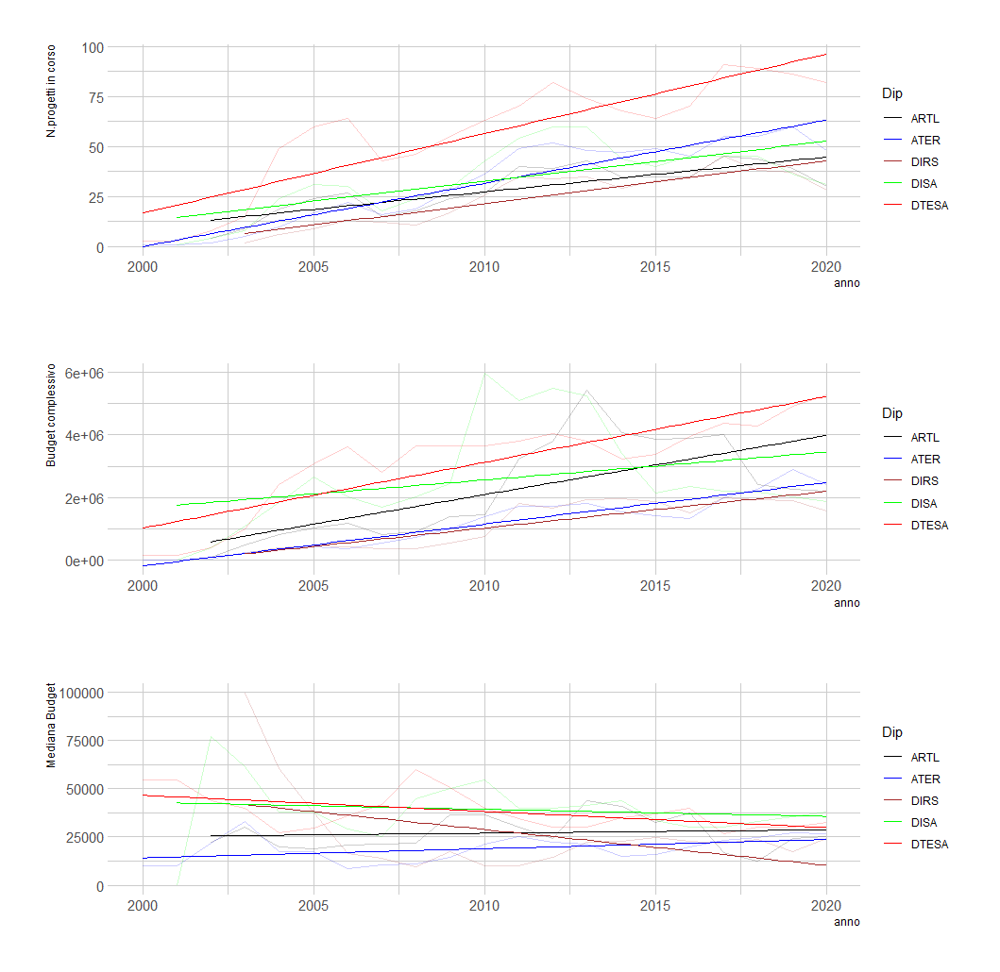
```


```{r echo=FALSE, fig.align="center", message=FALSE, warning=FALSE}
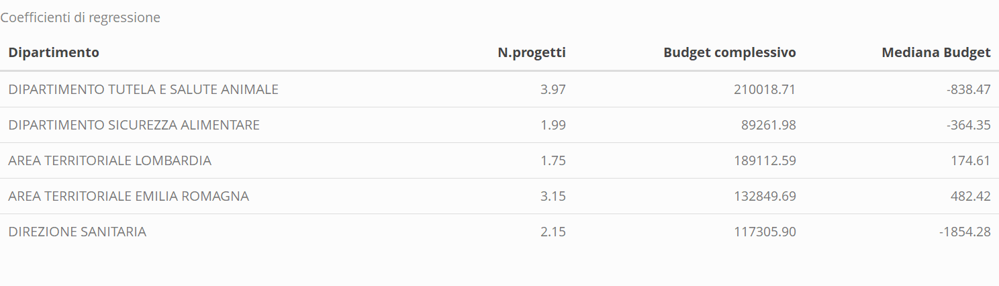
```


```{r echo=FALSE, fig.align="center" ,message=FALSE, warning=FALSE, paged.print=TRUE}
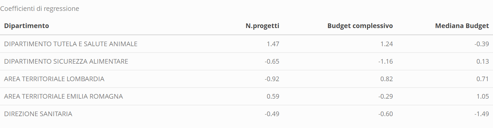
```


## NUOVI PROGETTI DI RICERCA
```{r echo=FALSE, fig.align="center", fig.height=12, fig.width=12, message=FALSE, warning=FALSE, out.width='90%'}
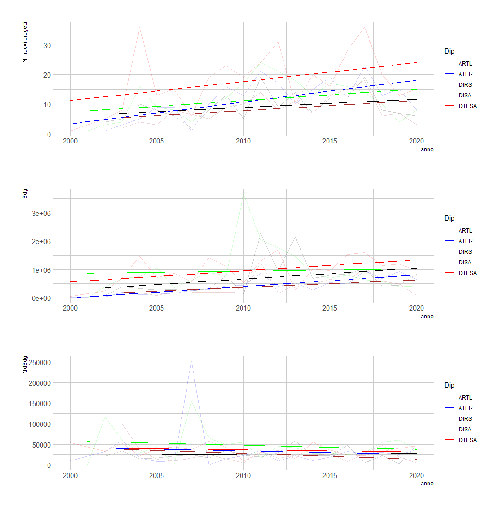
```


```{r echo=FALSE, fig.align="center" ,message=FALSE, warning=FALSE, paged.print=TRUE}
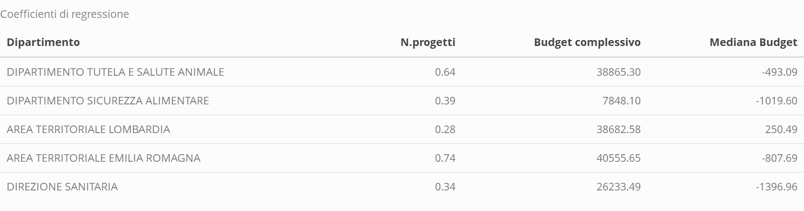
```


```{r echo=FALSE, fig.align="center" ,message=FALSE, warning=FALSE, paged.print=TRUE}
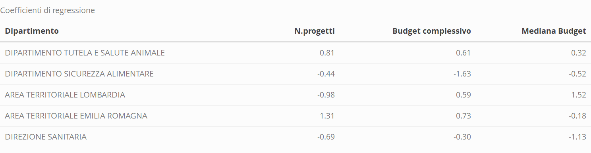
```


## DATI CITAZIONALI (CARRIERA RICERCATORE)

```{r echo=FALSE, fig.align="center", fig.height=15, fig.width=15, message=FALSE, warning=FALSE, out.width='90%'}
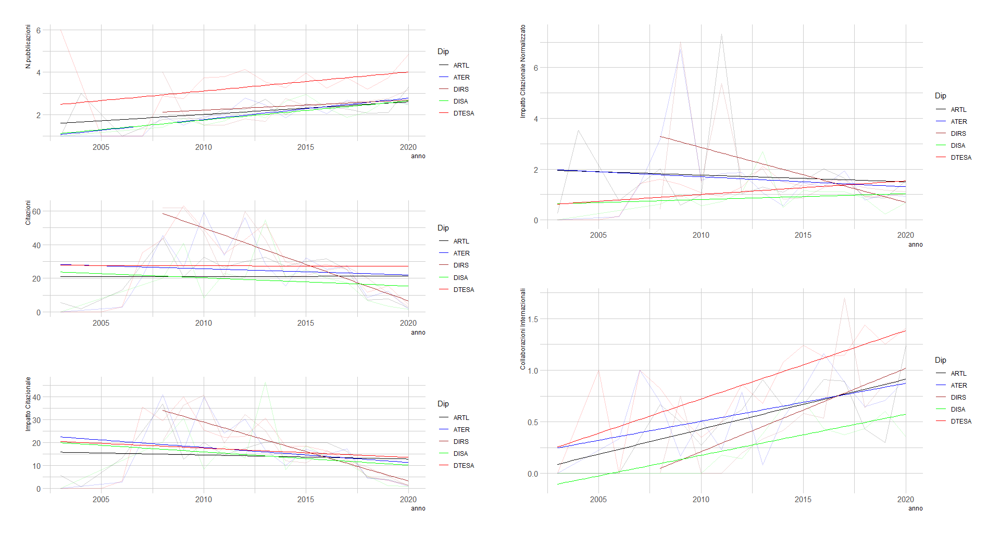
```


```{r echo=FALSE, fig.align="center" ,message=FALSE, warning=FALSE, paged.print=TRUE}
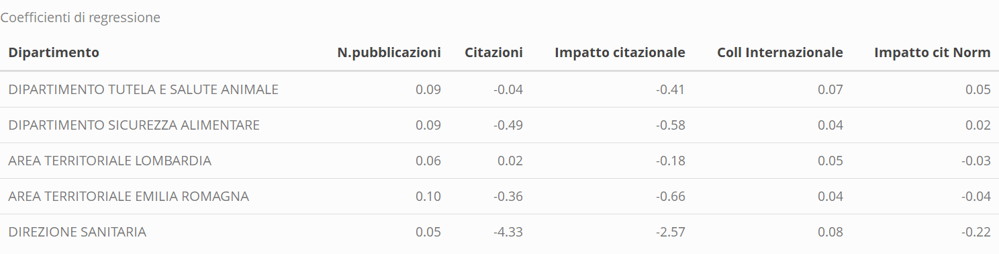
```


```{r echo=FALSE, fig.align="center" ,message=FALSE, warning=FALSE, paged.print=TRUE}
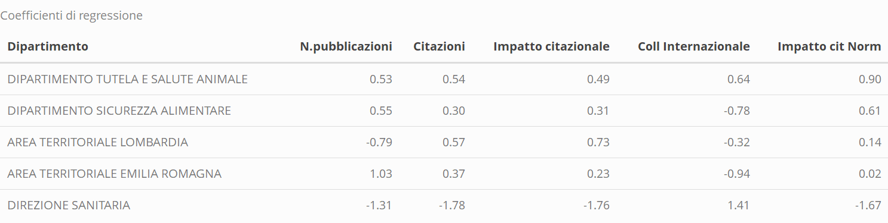
```

```{r echo=FALSE, fig.align="center" ,message=FALSE, warning=FALSE, paged.print=TRUE}
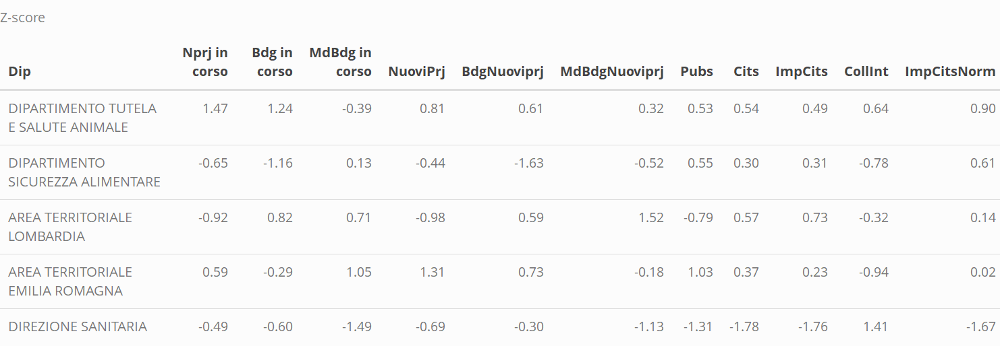
```

```{r echo=FALSE, fig.align="center" ,message=FALSE, warning=FALSE, paged.print=TRUE}
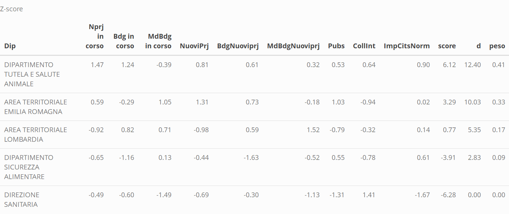
```